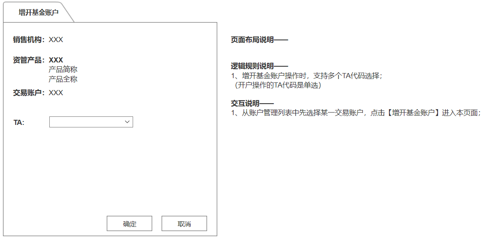
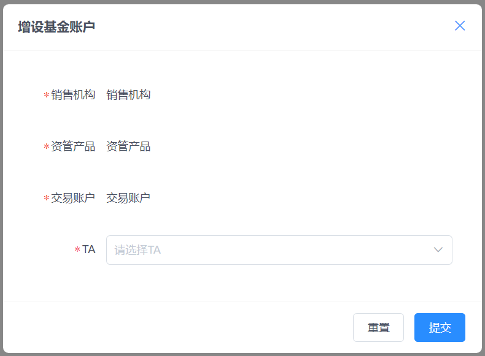

<!--More-->

## 上午

1. 会议
   - 任务分配
   - kpi详情

2. 学习HUI相关组件

## 下午

1. 完成增开基金账户页面

   - 原型：

     

   - 效果：

     

   - 遗留问题：
     1. 本页面为父页面弹窗页，需要杨鑫做完调用
     2. 本页面提交的后台接口还没有做完

   - 解决方案：
     	1. 等待杨鑫调用接口，提供实际数据
      	2. 继续学习后台业务逻辑
      	3. 继续学习后端框架技术流程

   2. 了解了前端代码组成
   3. 学习了数据库相关表内容，了解业务逻辑

   ## 明日计划

   1. 完成今日遗留问题
   2. 对接接口，完成后端开发和前端页面对接
   3. 了解前后端完整流程
   4. 等待作棒布置新任务
