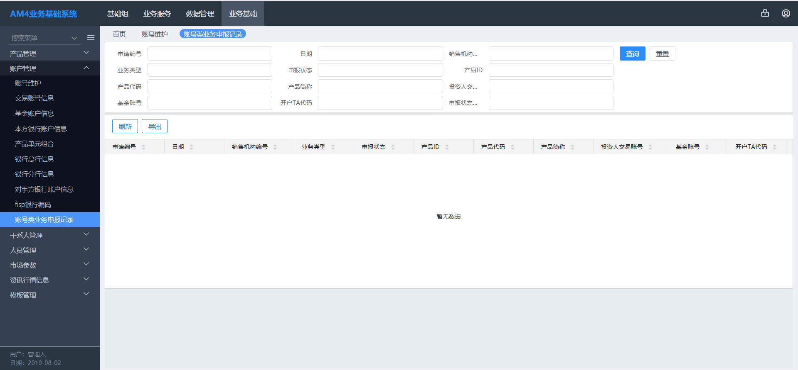

<!--More-->

# 今日总结

## 1.账户类业务申报记录前后端全部实现

> 只是搜索和数据展示

### 1.1遗留问题解决

#### 1.1.1 菜单问题

> 最好的办法是使用Excel修改，但是目前条件不允许，可以使用以下方法，但是要在使用后找其他人更新Excel

1. 修改`application.properties`中的配置

   ```json
   system.table.change.mode=upgrade
   ```

2. 修改数据库`bgb_tsystemversion`： 删除其中的记录，重新运行程序，就会做一次`menu`的更新
3. 直接修改`bg_tmenu`,复制其他的数据自己修改

**后续操作**:

1. 在基础组中的`菜单模板管理`中拖拽相应的菜单到指定区域
2. 在`人员信息`中分配指定权限即可

#### 1.1.2 原型确认

早晨找海龙确认前端原型,以祥哥昨天指定的字段为准

### 1.2 前端

> 1. 前端页面在昨天完成一大半,确认UI后做了一定的修改,加上了对应的接口
>
> 2. 实现页面方法



### 1.3 后端

#### 1.3.1 完成搜索功能

```java
/**
     * 查询对应查询条件的所有场外代销账户
     * @param agentAccountAppDTO 场外代销账户类申报表
     * @return 所有满足条件的场外代销账户类
     */
    @CloudFunction(functionId = Functions.QUERY_AGENT_ACCOUNT, desc = "查询对应查询条件的所有场外代销账户")
    ApiResult<Page<AgentAccountAppDTO>> queryAgentAccountApp(@NotNull AgentAccountAppDTO agentAccountAppDTO);
```

#### 1.3.2 `BaseCommonQueryMapper`的后端使用学习

> `Mapper`通过`extends BaseCommonQueryMapper<Type, Type>`可以获得很多非常方便的封装好的函数

## 2.遗留问题

1. 关于`h-query-grid`使用效果的问题,建议之后自己写代码完成,不依赖封装过度的组件
2. 关于搜索选项的问题和原型,海龙还要更新新的UI,到时候做细微调整,本页面基本完成

## 3.字典维护

> 任务: 把`excel`中的字典转化为指定数据类型的`json`

1. 工具
2. 自己写代码读取