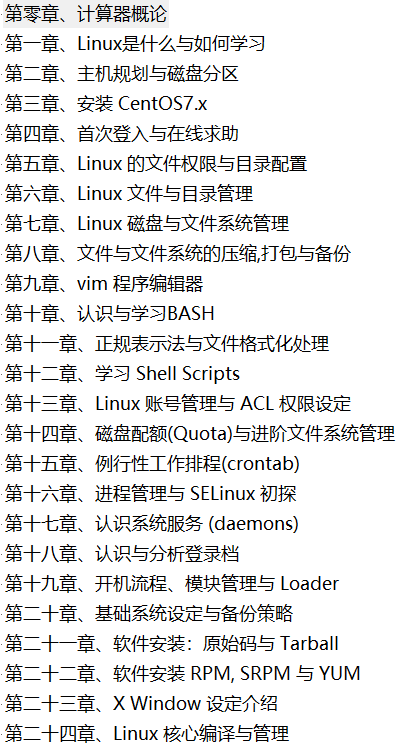
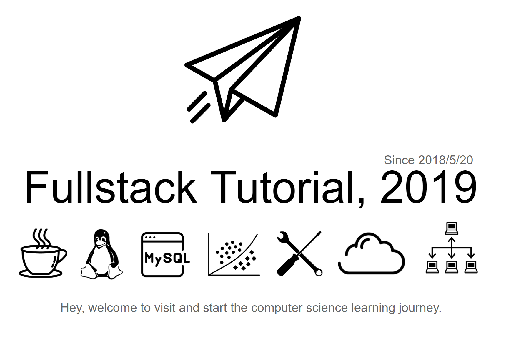
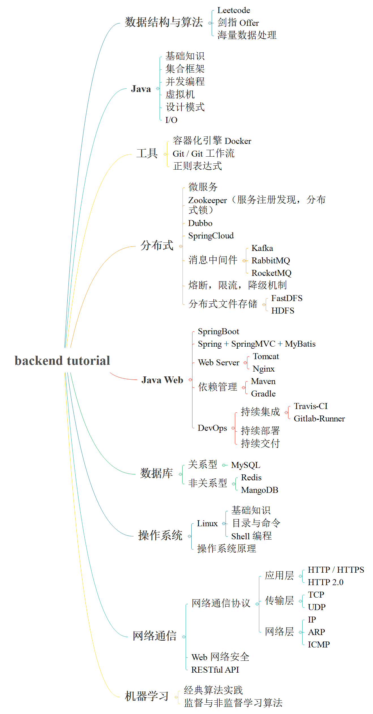

// 需要置顶的话：top: true

## 鸟哥的Linux私房菜

《鸟哥的Linux私房菜-基础篇》第四版学习

目录：

计划每天去看，并且将心得体会放到博客中去，完成对Linux的深入理解。

## Springboot高级知识

- Redis缓存技术

  深入理解Redis结构，剖析Redis底层机制和储存结构以及Redis分布式缓存机制

- MessageQueue消息队列

  RabbitMQ（即服务于Springboot的AMQP高级消息队列框架）

  消息队列处理高并发的机制

  消息队列深入原理

- Spring Security && Spring Shiro

- Spring微服务架构

- Spring分布式架构

- 如何写出健壮规范的业务代码

## Java架构师成长

- Java基础

  - [Java 基础概念](notes/JavaArchitecture/01-Java基础.md)

  　　基本概念、面向对象、关键字、基本数据类型与运算、字符串与数组、异常处理、Object 通用方法

  - [Java 集合框架](notes/JavaArchitecture/02-Java集合框架.md)

  　　数据结构 & 源码分析：ArrayList、Vector、LinkedList、HashMap、ConcurrentHashMap、HashSet、LinkedHashSet and LinkedHashMap

  - [Java 并发编程](notes/JavaArchitecture/03-Java并发编程.md)

  　　线程状态、线程机制、线程通信、J.U.C 组件、JMM、线程安全、锁优化

  - [Java I/O](notes/JavaArchitecture/04-Java-IO.md)

  　　磁盘操作、字节操作、字符操作、对象操作、网络操作、NIO

  - [Java 虚拟机](notes/JavaArchitecture/05-Java虚拟机.md)

  　　运行时数据区域、垃圾收集、内存分配机制、类加载机制、性能调优监控工具

  - [Java 设计模式](notes/JavaArchitecture/06-Java设计模式.md)

  　　Java 常见的 10 余种设计模式，全 23 种设计模式逐步更新

  - [Java Web](notes/JavaArchitecture/07-JavaWeb.md)

  　　包含 Servlet & JSP、Spring、SpringMVC、Mybatis、Hibernate、Structs2 核心思想，如 IOC、AOP 等思想。SSM 更详细请转向：[Spring](notes/JavaWeb/Spring.md) | [SpringMVC](https://github.com/frank-lam/SpringMVC_MyBatis_Learning) | [MyBatis](

- fullStack知识图谱

  

- 后台技术图谱

  

- 分布式

1. [Docker]

容器化引擎服务

2. [微服务]

微服务简介、API 网关、服务注册发现、服务通信

3. 分布式锁

基于 Redis、MySQL、Zookeeper 的分布式锁实现

4. FastDFS

轻量级分布式文件管理系统