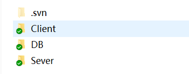
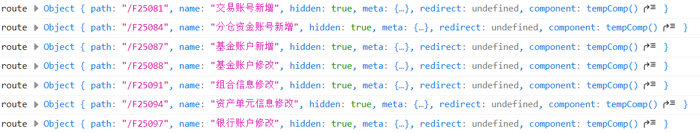
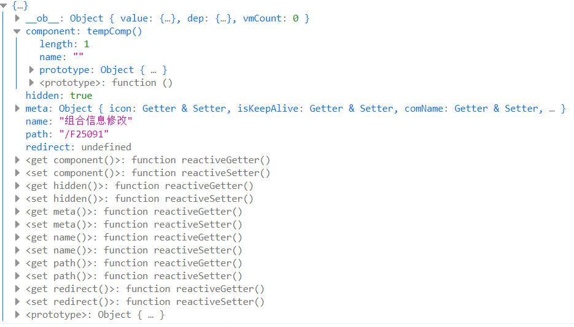
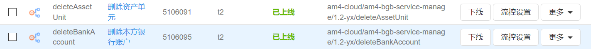

2019.7.30日报

<!--More-->

## 一日概述

>  主要内容记录在【问题记录】中

### 1.上午

上午主要进行学习：

- `svn`
- 前后台对接流程
- 管理控制台工作原理
- 前端模板
- 其他

### 2.下午

- 业务逻辑探究
- 后端接口书写
- 其他

## 问题记录

> 【发现问题】：学习过程中发现的新问题
>
> 【计划任务】：前一天计划要完成的任务
>
> 【学习记录】：记录备忘

### 1.【发现问题】没有使用svn检出项目，导致无法更新和上传代码。

- **产生原因：**

  刚来的时候没有域账号，大家复制代码给我，没有直接从svn检出代码

- **技术问题：**

  之前使用Git，没有使用过SVN

- **解决方案**：

  - 学习svn的具体使用方法——使用TortoiseSVN

  - 正确检出所有源代码文件，就可以看到当前代码的状态，有svn的图标标注

- svn源代码地址：https://192.168.57.155/HZYY/FIS1.0/trunk/Sources/0_FIS/



### 2.【计划任务】前后端对接问题+管理控制台协同工作原理

**问题驱动学习**

#### 2.1左边栏菜单如何生成

##### 2.1.1后台定义

业务基础（BGB）中菜单首先在`/initData/BGB_TMENU.json`中定义，数据格式为：

```json
{
    "company_id": 0,
    "menu_code":"050409",
    "menu_name":"产品单元组合",
    "menu_parent_code":"0504",
    "subsys_no":3340,
    "menu_name_eng":"FundunitCombineView",
    "url":"/baseinfo/general/unitgrid/index",
    "window_show":"fundunitCombineView",
    "create_type":"",
    "sort_no":9,
    "field_status":"1",
    "icon":"",
    "operator_mode":0,
    "group_code":"",
    "custom_industry_code":"",
    "authorize_code":"",
    "custom_id":"",
    "bizframeurl":"/bgb/#/baseinfo/general/unitgrid/indexM050409"
}
```

里面定义了一些关键信息，如名称`menu_name`，前端文件路由`url`，等。

后端会在运行时，根据这些信息，进行初始化菜单操作。


##### 2.1.2前端动态路由表

> `src\store\modules\permission.js`下的`permission.js`文件用于动态生成路由表,**根据后台传回的可用menus或者业务标识,递归过滤异步路由表，返回符合用户角色权限的路由表**

根据输出,可以看到动态生成的路由的一部分:



**详细内容**

- 获取url的api为:

  ```js
  import { filedir } from '@/api/url';
  ```

  而`filedir`的内容主要就是一个对应关系

  ```js
  export const filedir = {
    3339: '/bg/',
    3349: '/bm/',
    3344: '/liq/',
    3348: '/zx/',
    3343: '/jys/',
    3346: '/yhj/',
    3345: '/otc/',
    3342: '/intb/',
    3347: '/der/',
    3341: '/ins/',
    3340: '/bgb/',
    3354: '/bgs/',
    3355: '/bgb/',
  };
  ```

- 针对的是两个路由表:

  ```js
  let asyncRouterMap = new Map();
  const asyncMenuPathMap = new Map();
  ```

  这两个Map用于储存对应的Router和Menu,具体的方法为:

  ```js
  /**
   * 根据后台传回的可用menus或者业务标识,递归过滤异步路由表，返回符合用户角色权限的路由表
   * @param router
   * @param menus
   * @param type  过滤类型  1菜单过滤，2业务标识过滤
   */
  function filterRouterByArr(router, menus) {
      ...
  }
  ```

  这个方法是通过一个递归,对Menus中的所有Menus中的所有children进行遍历,对每一个menu中的item的属性进行处理和存放:(部分代码)

  ```js
  let tempComName = `M${menu.menuCode}`;
  let tempUrl = menu.url;
  let tempName = menu.menuName;
  let tempId = menu.menuCode;
  let tempHidden = menu.url.trim() === '';
  ```

  处理好后封装到一个route里面

  ```js
  const route = {
              path: tempUrl + tempComName,
              name: tempName,
              hidden: tempHidden,
              meta: {
                icon: menu.icon,
                isKeepAlive: true, //  或者直接置为true
                comName: tempComName,
                rootId: menu.subsysNo,
                id: tempId, // 用于tabs切换时可以定位到菜单栏
                windowShow: menu.windowShow,
                createType: menu.createType,
                sysPre: `${filedir[menu.subsysNo]}#`,
                // subsysNo: menu.subsysNo,
              },
              redirect: menu.redirect,
              component: tempComp, // resolve => require([`@/views${tempUrl}.vue`], resolve),
            };
  ```

  这就一个动态route了,我们只需要把这个route放到router和两个Map中即可

  ```js
  router.push(route);
  asyncRouterMap.set(tempId, route);
  asyncMenuPathMap.set(route.path, tempId);
  ```

  可以看到,最后得到的一个完整的是route:

  

  这个函数的功能就是返回一个`return router;`

- persimmon.js的功能不仅仅是做这样一个router,这只是一个工具,,我们真正需要返回的是一个permission的对象,他应该拥有哪些属性了?

  ```js
  const permission = {
    state: {
      // routers: constantRouterMap,
      addRouters: [],
      searchRoute: [],
      // general: {},
      routerMap: [],
      gridflash: {},
      menuPathMap: [],
    },
    mutations: {
        ...
    },
    action: {
        ...
    }
  }
  ```

  在`action`中就做了一些和刚才函数有关的操作:

  ```js
  // 根据服务端菜单生成路由
  GenerateRoutesByMenus({ commit }, data) {
      return new Promise((resolve) => {
          asyncRouterMap = new Map();
          const accessedRouters = filterRouterByArr([], data);
          commit('ADD_GRIDFLASH', accessedRouters);
          commit('SET_ROUTERS', accessedRouters);
          commit('SEARCH_ROUTE', accessedRouters);
          commit('SET_ROUTERMAP', asyncRouterMap);
          commit('SET_MENUPATH', asyncMenuPathMap);
          resolve();
      });
  }
  ```

  - 如何理解这里使用Promise的方法,首先通过廖雪峰大神对Promise的理解入手:https://www.liaoxuefeng.com/wiki/1022910821149312/1023024413276544 ,这种“承诺将来会执行”的对象在JavaScript中称为Promise对象,可见Promise最大的好处是在异步执行的流程中，把执行代码和处理结果的代码清晰地分离了,在做多个任务的时候,尤为有用，`job1.then(job2).then(job3).catch(handleError);`
  - 在这里我们给的第一个参数`router`是`[]`,第二个参数`menu`就是`data`
  - 返回这个Promise

#### 2.2后台Api+管理控制台

##### 2.2.1POM定义的SpringClod模块

```xml
<modules>
    <module>am4-bgb-service-manage</module>
    <module>am4-bgb-service-manage-api</module>
</modules>
```

##### 2.2.2后台为什么没有Controller？

- `am4-bgb-service-manage-api`中定义了`Api`的定义，主要以接口`interface`为主

- `am4-bgb-service-manage`主要为实现类，实现了具体的业务逻辑

关键在于`am4-bgb-service-manage-api`中`Service`使用的自定义注解：

`@CloudFunction(functionId= Functions.INSERT_FUNDACCOUNT, desc = "新增基金账户")`

和`@CloudService`，他们都来自`com.hundsun.jrescloud.rpc.annotation`这个包下，他们的作用是协同管理控制台，注册`Service`，从而省去了`Controller`模块，由管理控制台统一管理`Api`



通过可视化的上下线和流控，能够更好地进行`Api`的管理，同时当`Api`较多时也方便查找和控制。

而前端则通过`Api`的名字进行调用：

```js
async insertFundAccountInfo(FundAccount) {
    return this.post('insertFundAccount', FundAccount);
}
```

### 3.【学习记录】国际化

#### 3.1国际化配置

- `src\assets\locale\default\zh-CN.js`

- `src\assets\locale\default\en-US.js`

- 入口文件配置中文：

  ```js
  import VueI18n from 'vue-i18n';
  import zhHuiLocale from 'h_ui/dist/locale/zh-CN';
  import zhLocale from '@/assets/locale/default/zh-CN';
  ```

#### 3.2国际化使用
- 具体使用：

  ```js
  <h-button type="ghost"
      size="small"
      @click="addFispBankCode"
      >{{$t('fans.common.add')}}</h-button>
  ```

  使用`$t('fans.common.add')`来显示`添加`文字，如果配置为英文则显示`add`

- 如何切换语言？

  `this.$i18n.locale=zh-CN`或`this.$i18n.locale=en-US`进行切换

- `vue-i18n` 数据渲染的模板语法

  `$t('fans.common.add')`

### 4.【学习记录】后台接口规范与逻辑

#### 4.1接口规范

##### 4.1.1@Valid 验证规范

用于验证注解是否符合要求，直接加在变量之前，在变量中添加验证信息的要求，当不符合要求时就会在方法中返回message 的错误提示信息。

##### 4.1.2@NotNull/@NotBlank/@NotEmpty的区别和约束

- `@NotNull`
	CharSequence, Collection, Map 和 Array 对象不能是 null, 但可以是空集（size = 0）。  
- `@NotEmpty`
	CharSequence, Collection, Map 和 Array 对象不能是 null 并且相关对象的 size 大于 0。  
- `@NotBlank`
	String 不是 null 且去除两端空白字符后的长度（trimmed length）大于 0。 

所以说对于一般的`DTO`而言，我们可以使用`@NotNull`，如果是`String`，我们可以使用`@NotBlank`。

##### 4.1.3注释规范

- 函数功能注释
- 函数参数注释
- 函数返回值注释

### 5.【计划任务】新增基金账号业务逻辑

#### 5.1接口数据

- 销售机构
- 资管产品
- 交易账户
- TA

#### 5.2相关数据表

- `otc_tagentaccountApp（第三方代销账号申报表）`

  1. 此表位于`BG`数据库

  2. 表备注

     **字段命名大部需要与外部接口规定字段名统一**

  3. `unique`约束字段

     | Name               | Type         | NULL | Default | Extras | Comment                                                      |
     | ------------------ | ------------ | ---- | ------- | ------ | ------------------------------------------------------------ |
     | company_id         | int(11)      | No   |         |        |                                                              |
     | agentaccountapp_id | int(11)      | No   |         |        | 需要和`otc_ttradeorder`表，共用自增序列。 申请编号，至少保证当天内不能重复。 |
     | date               | numeric(8,0) | No   |         |        |                                                              |

     **问题：**找不到`otc_ttradeorder`表？？

- `otc_TAGENTINVESTFUNDINFO（代销基金表—获取TA代码）`
  
1. **问题：**找不到这张表？？
  
- `hisotc_tagentaccountApp（归档表）`
  
1. **问题：**找不到这张表？？
  
- `bgb_ttradeaccount（交易账号表）`
  1. 此表在`BGB`和`BG`中都有
  2. **问题：**为什么`BGB`数据库表的编码集是`GBK`而不是`UTF-8`?

#### 5.3业务逻辑

1. 首先通过代销基金表—获取TA代码，拿到TA代码和其他的接口数据，填写到`otc_tagentaccountApp`(三方代销账号申报表)中
2. 申报成功后，基金账号回填到`bgb_tfundaccount`

## 明日计划

1. 继续研究业务逻辑
2. 看懂后台封装的持久层代码逻辑
3. 前端有页面就继续做
4. 等待新任务布置

