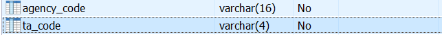
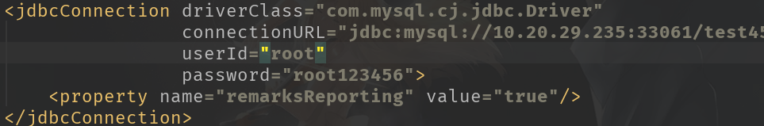

2019.7.31日报

<!--More-->

# 日报

## 1.增开基金账户显示taCodes

### 1.1 数据库表

`bgb_ttradeaccount`、`otc_ttradeaccount_ex`、`bgb_tfund`、`bgb_tinvestfundinfo（TA下拉数据）`

### 1.2 页面处理说明

- 页面初始化：交易账号来源于`bgb_ttradeaccount`、产品数据来源`bgb_tfund`、TA数据来源于`bgb_tinvestfundinfo`表（需要去重）。

- 【确认】按钮：页面数据保存与`otc_tagentaccountapp`表，只保存交易账号字段、渠道、TA代码、业务类型（009:增开基金账户）。

### 1.3 后端业务逻辑

#### 1.3.1 DTO/DO/Query修改

对`bgb_tinvestfundinfo`表新增了`agency_code`字段



在DTO/DO/Query中添加`agency_code`

```java
/** 
* 销售渠道代码 
*/
@Column(name = "agency_code", length = 16, nullable = false)
private String agencyCode;
```

#### 1.3.2 具体实现

- 在`Service-Api`中和`Impl`中实现其对应方法
- 管理平台上线`Api`
- 前端调用,获取数据,显示所有`taCode`

## 2.保存增开账户信息

### 2.1 数据库要求

页面数据保存与`otc_tagentaccountapp`场外代销账户类申报表，只保存交易账号字段、渠道、TA代码、业务类型（009:增开基金账户）。

- 表:`otc_tagentaccountapp`
- 保存字段:
  - 交易账号`fundTradeAccount`
  - 销售渠道`agencyCode`
  - TA代码`taCode`
  - 业务类型(009)`businType`

### 2.2 后台接口实现

#### 2.2.1 代码生成器

- 配置数据源

  

- 配置数据表

  ```java
  <table tableName="otc_tagentaccountapp" domainObjectName="AgentAccountApp">
         <property name="subPackage" value="agentaccountapp"/>
  </table>
  ```

- 配置生成的文件位置

  先都搞到`/src/generated`,然后按需导入项目,随后删掉无用文件

- 第一次失败原因:没有写对数据源地址
- 第二次失败原因:`Integer`和`BigDecimal`生成有错误,需要手动改正
- **特别感谢**:邓斯学长

#### 2.2.2 书写业务逻辑

- 按照上述数据库要求,匹配字段
- 使用默认生成的`insert`方法即可快速插入

#### 2.2.3 逻辑漏洞

##### 2.2.3.1 有问题的逻辑:

- 作为一个插入操作,如果不存在应当插入
- 如果已经存在 (做`Update`操作)
  - 不同: 更新
  - 相同: 不更新

##### 2.2.3.2 正确的逻辑

- 在用户选择的时候就用该剔除已经用过的TA段
- 用户选择好的一定是不存在的

#### 2.2.4 共同维护自增序列

**问题:**`otc_tagentaccountapp.agentaccountapp_id`和`otc_ttradeorder.tradeorder_id`共同维护自增序列

1. 创建`OperatorNoSequence`类,定义其中的表明和自增字段名
2. 使用他的`nextValue()`函数获得下一个值

# 明日计划

1. 做新任务
2. 多学学业务,看看专业名词