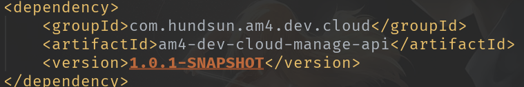

## 前言

> 目录

[TOC]

<!--More-->

## 1. 任务与任务进度/工时说明

### 1.1 字典表维护

- **任务描述**:

  将待申报字典表添加到数据库对应表中

- **进度说明**: 100%
- **投入工时**: 2.5工时

### 1.2 开户文件上传

- 进度说明: 100%
- 投入工时: 6工时

### 1.3 资金调整及复核(前端)

- 进度说明: 70%
- 投入工时: 1工时

## 2. 已解决的问题

### 2.1 字典表维护

- 新增882条字典项
- 自主设计程序运行,之后新增的字典项可以复用此程序

### 2.2 开户文件上传

- 前端使用`HUI组件`上传文件
- 前端使用`BG`的`upload()`接口上传到临时文件夹
- 提交时对文件进行规范的重命名后转存到客户的`FTP`服务器

### 2.3 资金调整及复核(前端)

- 前端代码已经完成
  - 仅限于显示效果,对应字段的对应关系和具体功能还没有完成

- 生成菜单栏的`JSON`完成
  - 后端运行不起来,具体效果需要测试

## 3. 未解决的问题

### 3.1 资金调整及复核(前端)

- **菜单栏没添加成功**,导致前端页面效果还没能测试

## 4. 进度延迟原因说明

### 4.1 资金调整及复核(前端)

- 怀疑是**依赖的版本更新**后,后端代码没有及时更新,导致后端跑不起来

  

- 需要明天问一下涛哥~

