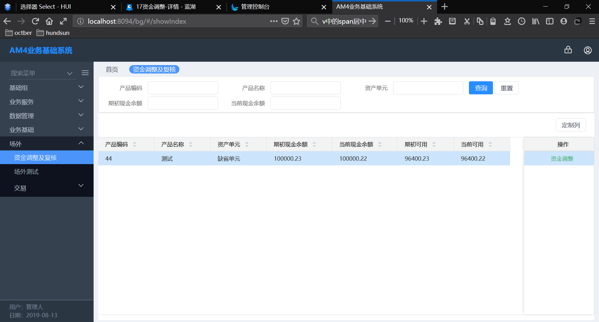
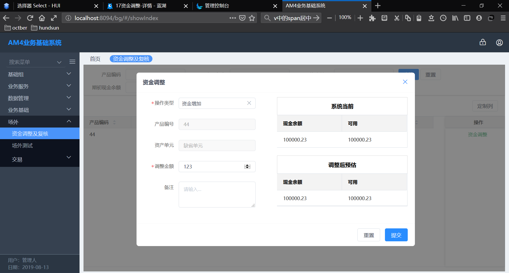

## 前言

> 2019.8.13日报 目录

[TOC]

<!--More-->

## 1. 任务与任务进度/工时说明

### 1.1 开户代码测试与调试

- 进度: 100%
- 工时: 1.5h
- 代码不符合`validate`修改/代码测试与发现问题

### 1.2 [昨日遗留]资金调整及复合(前端)

- 进度: 100%
- 工时: 3.5h
- 主要是`otc`需要`bgb`更新代码,按照代码规范改了一些代码,再`install`花时间多

### 1.3 资金调整及符合(后端)

- 进度: 70%
- 工时: 4.5h
- 前端页面显示多表查询/按条件查询/前端数据提交后处理

## 2. 已解决的问题

#### 2.1 资金调整及符合前端(全部完成)

以及**操作弹窗**:

#### 2.2 资金调整及符合后端(完成部分)

- 完成前端显示表格数据支持接口
- 完成部分提交资金调整后接口

## 3. 未解决的问题

后端:资金调整确认提交后处理

## 4. 进度延迟原因说明

- 有些坑和bug废了点时间,比如前端中文乱码,前端菜单生成(第二次搞不熟练),otc后台正常运行起来等等不重要却很花费时间的工作
- 项目重新运行/编译等太费时间了,太慢了
- 修改自己和别人代码中validate的代码不规范的地方比较忙,代码不规范的地方太多了
- 业务不熟悉,需要做笔记消化再上手

## 5. [记录]资金调整及复核(后端)

### 5.1 前端显示表格数据支持

 表格对应字段

1. 产品编码

   otc_tassetday(资产单元日信息表)的fund_id

2. 产品名称

   根据otc_tassetday(资产单元日信息表)的fund_id去bgb_tfund(产品信息表)中拿到fund_name

3. 资产单元

   根据otc_tassetday(资产单元日信息表)的asset_id去bgb_tassetunit(资产单元表)中拿到asset_name

4. 期初现金余额

   `otc_tassetday`(资产单元日信息表)的`begin_cash`

5. 当前现金余额

   `otc_tassetday`(资产单元日信息表)的`current_cash`

6. 期初可用

   期初可用=期初现金余额(`begin_cash`)－冻结(`frozen_balance`)＋解冻(`unfrozen_balance`)

7. 当前可用

   当前可用=当前现金余额(`current_cash`)－冻结(`frozen_balance`)＋解冻(`unfrozen_balance`)

### 5.2 提交修改

> 按照没有复核时的情况处理

1. 首先插入`otc_tcashbusiness(资金业务表)`,标记已处理状态
1. 更新资产单元日信息表的当前资金余额
1. 插入到证券资金流水表

