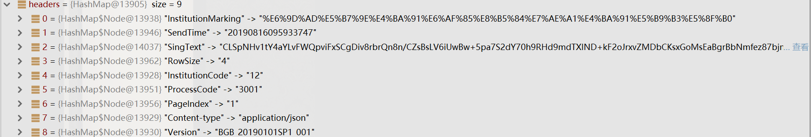
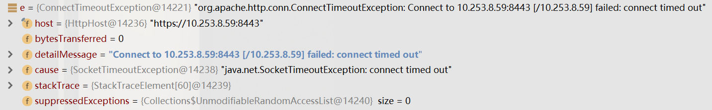
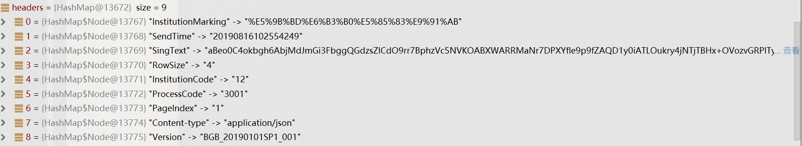
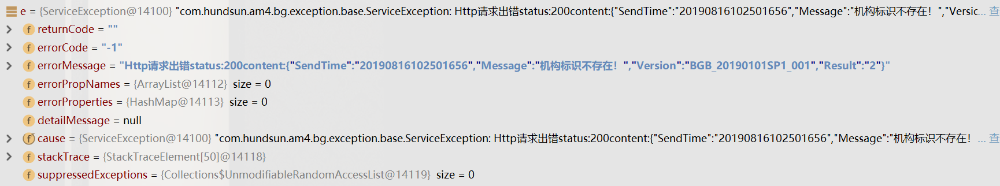
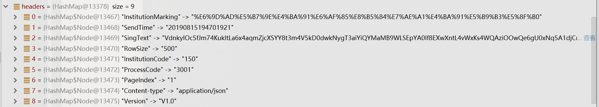
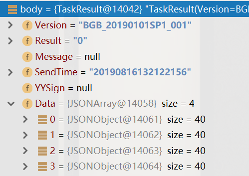

## 前言

2019.8.16日报

<!--More-->

## 1. 任务与任务进度/工时说明

### 1.1 行情转换机定时任务

- 进度: 80%
- 工时: 一天
- 备注: 对应字段填入,处理好otc->bgb的转移,就能很快搞完的

## 2. 已解决的问题

行情转换机定时任务

## 3. 未解决的问题

- 对应字段填入

## 4. 进度延迟原因说明

- otc转移到bgb问题
- 格式校验错误,改了很多大家的代码


# 第一次Debug记录

> 发现问题: 
>
> 1. URL 错误
> 1. “机构标识” 错误

## Header



## Body


## Url


## ProcessCode


## Exception



# 第二次Debug记录

> 问题
>
> 1.  "机构标识" 还是错误

## Header



## Url


## Body


## Exception



# 第三次Debug记录

> 完全使用正确



```java
        headers.put("Content-type", "application/json");
        headers.put("Version", "机密");
        headers.put("InstitutionCode", "机密");

        //机构标识暂时先写死为汇林保大 加密串、后续调用接口获取该值
        headers.put("InstitutionMarking", "机密");
        headers.put("SendTime", "机密");
        headers.put("ProcessCode", "机密");
        headers.put("PageIndex", "机密");
        headers.put("RowSize", "机密");
		headers.put("机密");

```

# 获得真实数据



