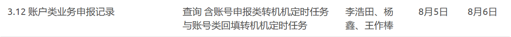
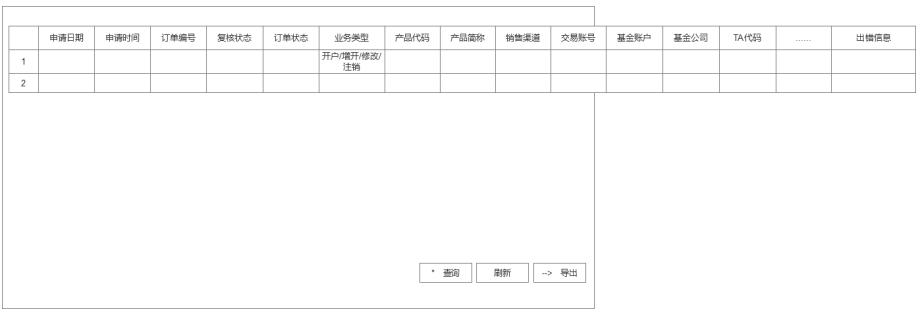
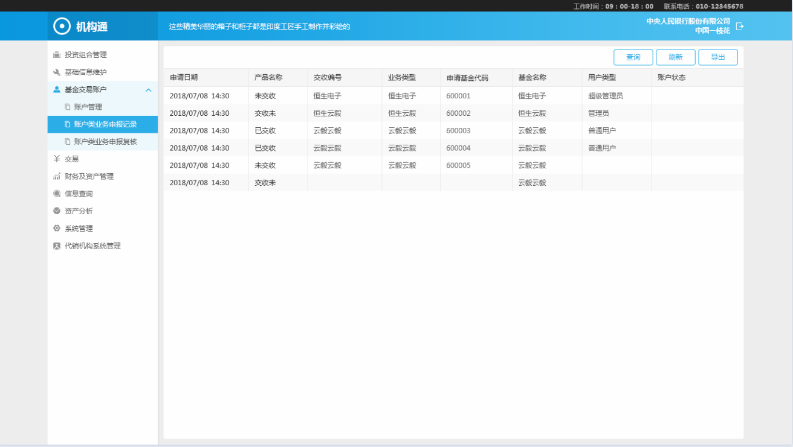
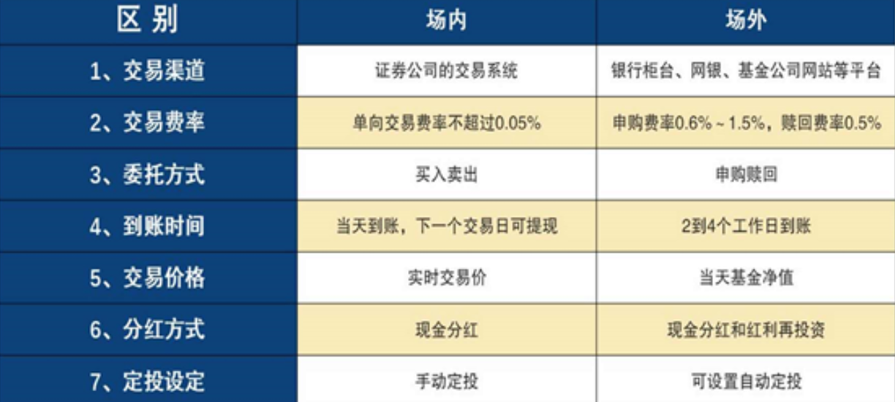

2019.8.1日报

<!--More-->

# 今日总结

> 概述:
>
> 1. 积累了专业名词
> 2. 基本完成了账户类业务申报记录前端页面(表格字段需要再确认)
>
> 进步:
>
> 1. 不确定的东西要尽早确认
> 2. win10更新禁止掉,省的浪费时间
> 3. 原型和UI和字段要仔细确认好

## 1.任务概述

> **3.1.2** **账户类业务申报记录**: 查询账户申报订单
>
> **概述**:完成前端页面和部分后端开发,定时任务交给作棒完成
>
> 1. 前端开发
>    1. 菜单=>杨鑫帮忙开设菜单
>    2. 原型确定=>海龙帮忙确认
>    3. 基础页面开发
>
> 2. 后端开发
>    1. 未定

**任务描述**:



### 1.1 原型问题

> 原型存在冲突,需要确定

#### 1.1.1 文档中原型



#### 1.1.2 蓝湖UI原型(**确定为以此为准**)



### 1.2 主要流程

1. 查询确认数据，维度：`申报日期`，`确认日期`，`销售渠道`，`产品名称`，`产品代码`，`状态（注：可多选）`，`TA代码`等；

2. 状态更新：

   1. 查询账户确认数据；

   2. 按销售机构返回的数据匹配申报记录，以“申请日期+订单编号”；

3. 开户订单归档条件：

   1. T+1开户成功或失败归档；

   2. T+5强制归档；

   3. 页面列表中“...”不展示，详情双击查看；

## 2.数据表设计

### 2.1 涉及到的数据表

- `otc_tagentaccountapp`
  - name: 场外代销账户类申报表
  - desc: 字段命名大部需要与外部接口规定字段名统一
- `otc_topenaccountfilesapp`
  - name: 场外开户文件资料明细申报表
- `otc_tamlsuitableapp`
  - name: 反洗钱与适当性信息明细申报表
  - desc: 反洗钱与适当性信息明细申报表，存放反洗钱基本信息和适当性的内容
- `otc_tamlbeneficiaryapp`
  - name: 反洗钱受益人申报明细表
- `otc_tamlshareholderapp`
  - name: 反洗钱股东信息申报明细表
- `otc_tcrsmaininfoapp`
  - name: CRS信息主信息明细申报表
- `otc_tcrscontrollerapp`
  - name: CRS控制人信息明细申报表
- `otc_tcrstaxpayerapp`
  - name: CRS纳税人信息明细申报表
- `otc_tcrsmaiTotaxpayerapp`
  - name: CRS信息主信息与纳税人明细申报的关系
- `otc_tcrscontrollerTotaxpayerapp`
  - name: CRS控制人信息与纳税人明细申报的关系
- 等

#### 2.1.1 分析记录

1. `otc_tcrsmaiTotaxpayerapp`和`otc_tcrscontrollerTotaxpayerapp`是对应关系表

   `otc_tcrsmaiTotaxpayerapp`结构:

   ```sql
   create table otc_tcrsmaiTotaxpayerapp
   (
      company_id           int(11) not null,
      crsmaininfoapp_id    int(11) not null,
      crstaxpayerapp_id    int(11) not null,
      date                 numeric(8) not null,
      primary key (company_id, crsmaininfoapp_id, crstaxpayerapp_id, date)
   );
   ```

   `otc_tcrscontrollerTotaxpayerapp`结构

   ```sql
   create table otc_tcrscontrollerTotaxpayerapp
   (
      company_id           int(11) not null,
      crscontrollerapp_id  int(11) not null,
      crstaxpayerapp_id    int(11) not null,
      date                 numeric(8) not null,
      primary key (company_id, crscontrollerapp_id, crstaxpayerapp_id, date)
   );
   ```

## 3.专业名词积累

### 3.1 什么是场内？什么是场外？



1. “场”，是**证券交易场所**的意思

2. 我们内地有两个证券交易场所，分别是**上海证券交易场所**和**深圳证券交易场所**

3. **场内**购买，就是需要在**券商**那里开户

4. **券商**有中信证券，海通证券，广发证券，华泰证券，华泰证券等等

5. 一个人可以开三个证券账户

6. **场外**是第三方APP，一些**代销平台**，比如**支付宝，理财通，蛋卷基金，且慢，天天基金**等

7. 如何选择?

   1. 如果是**短期投资**，走场内，**费率低**。如果是长期投资，场内场外都差不多。场外收取的是申购赎回费，虽然申购费一般比场内的费用贵，但是赎回费的话，一般持有2年之后就不用收取了。而且场内的买卖佣金费，无论持有多久都是要收取的。

   2. 如果场内的**交易额不大，建议场外申赎**。因为场内交易额不大的话，可能买不了或者卖不出去。**场外是跟基金公司直接交易的，不会出现这个问题**。

### 3.2 反洗钱

#### 3.2.1 什么是洗钱

- 巴塞尔银行: 

  犯罪分子及其同伙利用金融系统将资金从一个帐户转向另一个账户，以掩盖款项的真实来裸和受益所有权关系;或者利用金融系统提供的资金保管服务存放款项，就是常说的“洗钱"

- 央行对洗钱的解释是:

  洗钱是指毒品犯罪、黑社会性质的组织犯罪、恐怖活动犯罪、走私犯罪或者其他犯罪的违法所得及其产生的收益，通过各种手段掩饰、隐瞒其来源和性质，使其在形式上合法化，这样的行为就是洗钱。也就是说把来路不正“不干净“的非法收人变成“千净”的钱，就叫做“洗钱“，又称.洗黑钱”。

#### 3.2.2 如何通过基金洗钱?

> 来源博客[小曹反洗钱的博客](http://blog.sina.com.cn/joeyaml)

​      境外资金通过银行直接购买A股基金，不仅违背了境外个人投资国内A股基金应通过合格境外机构投资者办理的相关规定，甚至可能成为海外资金洗钱的一个通道.

​      据上海一家基金公司监察稽核部人士表示，目前监管层要求基金公司和所有代销机构签署反洗钱补充协议，但因为一些大型代销渠道过于强势且不愿意签署反洗钱补充协议，因此该公司签署反洗钱条款情况不太理想。据他透露，这一情况在小基金公司内比较普遍。

​      他介绍，反洗钱补充条款主要是针对客户身分识别、可疑交易报告、交易记录等多方面内容，其中最重要的是对反洗钱责任划分的条款。“**如果不签署反洗钱补充条款，一旦出现问题，基金公司要负主要责任**。不过，即使签署了这类条款，**大银行在某些条款上也非常苛刻，尽量将责任推给基金公司**。”因此他认为，这是银行对境外资金买A股基金开绿灯的一个重要原因。

​       据证券时报记者了解，目前多数基金公司已签署了反洗钱补充条例，这类协议条款基本符合监管层的要求，但在某些具体环节上划分得不够仔细。深圳一家基金公司人士分析，境外资金直接购买A股基金，其中核心是对客户资料的核实。“**这主要是银行所进行的工作，目前绝大部分银行不将客户资料提供给基金公司，基金公司想查很难**。”

#### 3.2.3 如何防止洗钱

> 中华人民共和国反洗钱法

1. 制定完整的反洗钱内部控制制度；
2. 建立健全客户身份识别(know your client)体系；
3. 制定客户身份资料和交易记录保存制度；
4. 进行大额交易和可以交易报告。

### 3.2 CRS(共同申报准则)

**CRS起源和目的**

1. CRS的提出者是经济合作与发展组织，也就是OECD（经合组织）。而概念是来自美国的美国海外账户税收遵从法（FATCA）。

2. CRS旨在推动国与国之间税务信息自动交换

3. CRS在中国:中国2015年已经加入了CRS，到去年9月份第一次跟别的国家交换信息，所以这事儿最近几个月才火起来。
4. 历史了解：略

## 4.页面处理

- **页面初始化**：数据来源`otc_tagentaccountapp`。查询条件为**申请日**。排序申请日、申报编号降序

- **查询**：查询

- **导出**：按照查询条件导出excel，字段同一览表

## 5.任务流程

### 5.1 添加菜单

```json
{
    "company_id": 0,
    "menu_code":"050415",
    "menu_name":"账号类业务申报记录",
    "menu_parent_code":"0504",
    "subsys_no":3340,
    "menu_name_eng":"AccountRecord",
    "url":"/account/accountRecord/index",
    "window_show":"",
    "create_type":"",
    "sort_no":15,
    "field_status":"1",
    "icon":"",
    "operator_mode":0,
    "group_code":"",
    "custom_industry_code":"",
    "authorize_code":"",
    "custom_id":"",
    "bizframeurl":"/bgb/#/account/accountRecord/indexM050415"
}
```

执行`clean`然后`install`,添加菜单,然后添加权限:

**然而今天杨鑫没搞成功，一直没添加上，先写出来，之后拷贝进来吧**

### 5.2 页面表格字段(需再确认)

> 数据来源`otc_tagentaccountapp`

- 申请编号 `otc_report_seq`
- 日期 `create_user`

- 销售机构编号 `agency_code`

- 业务类型 `busin_type`

- 申报状态 `status`

- 产品ID `fund_id`

- 产品代码 `fund_code`

- 产品简称 `fund_name`

- 投资人交易账号 `fund_trade_account`

- 基金账号 `fund_account`

- 开户TA代码 `ta_code`

- 申报状态的错误信息 `erro_info`

### 5.3 账号申报类转机机定时任务说明

未进行到这一步

### 5.4 账号类回填转机机定时任务说明

未进行到这一步