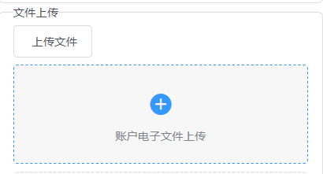

2019.8.5日报

<!--More-->

# 今日内容

## 1.待定内容

> 由于本周四到周日需要去芜湖参加2019年全国计算机设计大赛的答辩,所以安排在周四周五的任务,需要提前了解完成

> **任务内容:** 3.27资金交收复核

| 3.27 资金交收复核      |      | 李浩田 | 8月7日 | 8月9日 |
| ---------------------- | ---- | ------ | ------ | ------ |
|  |      |        |        |        |

但是由于目前还没有确定,所以现在做不了咯

## 2.文件上传任务

> 帮助作棒学长完成页面的一部分较为独立的内容:文件上传的功能

### 2.1 需求分析

1. 前端使用`HUI`组件上传
2. 后端首先接收文件并存放到一个临时文件夹内(可配置)
3. 再点击提交后将文件夹内的内容统一存放到指定的服务器上
4. **注意: **文件命名有相应的规范
5. **注意:** 同一个文件上传框,可能上传多次,只保留最后一次上传的最新版本

### 2.2 前端实现

> HUI有相关示例代码,根据HUI中的Demo,我们可以快速构建用于我们需求的组件

```html
<template>
    <div>
        <h-upload
            multiple
            type="drag"
            action="//jsonplaceholder.typicode.com/posts/">
            <div style="padding: 20px 0">
                <h-icon type="ios-cloud-upload" size="52" style="color: #3399ff"></h-icon>
                <p>点击或将文件拖拽到这里上传</p>
            </div>
        </h-upload>
    </div>
</template>
```

前端实现效果:



### 2.3 后端

遇到了一些问题，主要是逻辑和源代码的理解，遇到一些`bg`和`bgb`之间`Api`调用的问题

在`config/index.js`中,由于`js`是脚本语言,所以根据执行顺序,下面顺序不能有错,否则会出现上传接口不能使用的问题:

```js
'/bgb/file': {
        target: 'http://10.20.29.235:8088',
        changeOrigin: true,
        onProxyReq(proxyReq, req) {
        proxyReq.setHeader('Content-Type', req.headers['content-type']);
	},
	pathRewrite: { '^/bgb': '' },
},
'/bg': {
    // target: 'http://10.20.39.153:10086',
    target: 'http://10.20.29.235:8088',
    // target: 'http://10.20.30.5:10086',
    changeOrigin: true,
    autoRewrite: true,
},
```

## 其他

作棒学长继续布置的其他任务

# 明日

继续协助作棒学长把他那一块比较复杂的内容搞完，我负责`Api`的支持，前端复杂的对应关系，有学长完成。

