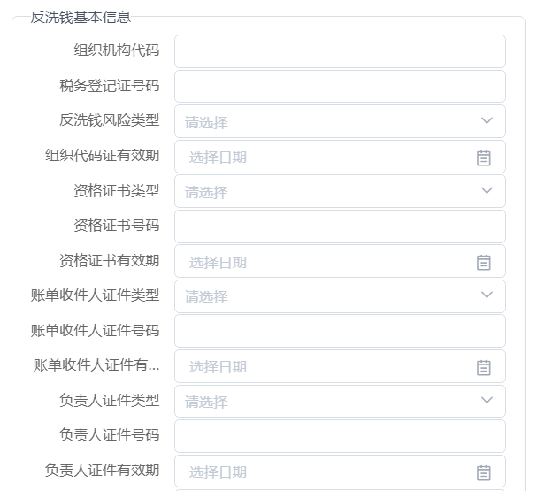
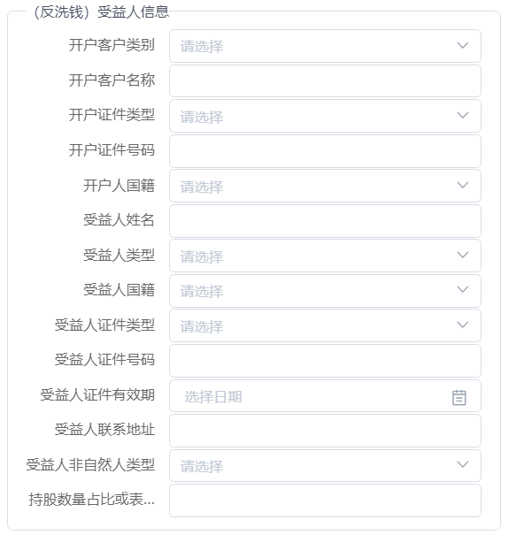
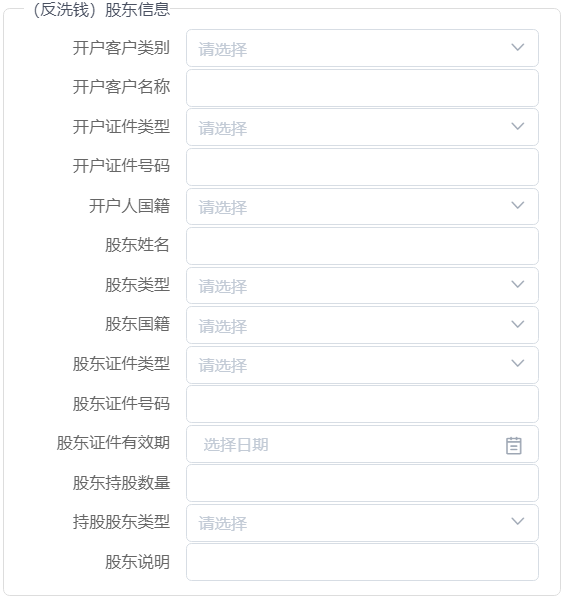
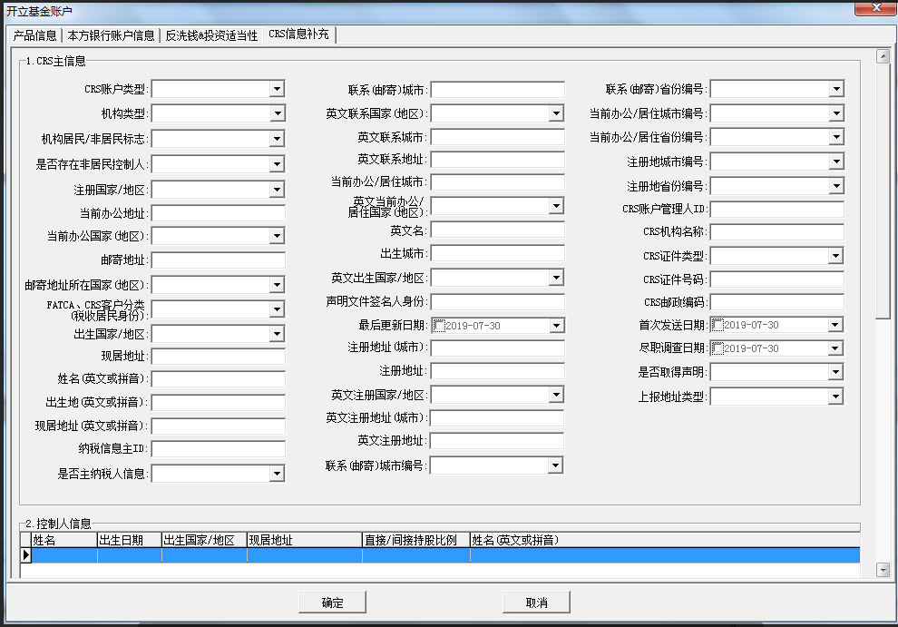

## 前言

2019.8.6日报

<!--More-->

# 1.反洗钱基本信息录入

## 1.1 前端

> 前端字段较多,需要仔细核对,截图展示一部分

### 1.1.1 前端页面



### 1.1.2 页面说明

#### 1.1.2.1【开户-确认】按钮说明

页面必须输入项目检查成功后，把数据分别存入:

- 场外代销账户类申报表`otc_tagentaccountapp`(会有字段冗余，页面上有项目保存到对应字段即可)
- `otc_tamlsuitableapp`
- `otc_tamlbeneficiaryapp`
- `otc_tamlshareholderapp`
- `otc_tcrsmaininfoapp`
- `otc_tcrscontrollerapp`
- `otc_tcrstaxpayerapp`
- `otc_tcrsmaiTotaxpayerapp`
- `otc_tcrscontrollerTotaxpayerapp`

页面上的文件先通过`bg`的文件上传接口临时保存到ftp上以当前日期命名的文件夹里，点【开户-确认】时正式上传到销售机构的ftp上（文件名需要按照文件规则重名称，注意有2个ftp，一个是机构通临时存放文件的ftp）。

## 1.2 后端

### 1.2.1 数据库

> 所有数据针对`申报表`

- 数据库表: 反洗钱与适当性信息明细申报表
- 表名: `otc_tamlsuitableapp`
- 表备注: 反洗钱与适当性信息明细申报表，存放反洗钱基本信息和适当性的内容。

### 1.2.2 DTO/DO/Convertor...

> 使用生成工具`mybatis-generator`

```xml
<table tableName="otc_tamlsuitableapp" domainObjectName="AmlSuitablAapp">
	<property name="subPackage" value="business.basis"/>
</table>
```

### 1.2.3 业务逻辑实现

> 注意添加事务处理,具体过程略,实现🆗

# 2.(反洗钱)受益人信息

## 2.1 前端

> 前端页面如下



## 2.2 后端

### 2.2.1 数据库

- 数据库表: 反洗钱受益人申报明细表
- 表名: `otc_tamlbeneficiaryapp`
- 表注释: 反洗钱受益人申报明细表

### 2.2.2 DTO/DO/Convertor...

> 使用生成工具`mybatis-generator`

```xml
<table
       tableName="otc_tamlbeneficiaryapp"
       domainObjectName="AmlBeneficiaryApp">
	<property name="subPackage" value="business.basis"/>
</table>
```

### 2.2.3 业务逻辑实现

> 注意添加事务处理,具体过程略,实现🆗

# 3.(反洗钱)股东信息

## 3.1 前端

> 前端页面如下



## 3.2 后端

### 3.2.1 数据库

- 数据库表: 反洗钱股东信息申报明细表
- 表名: `otc_tamlshareholderapp`
- 表注释: (反洗钱)股东信息

### 3.2.2 DTO/DO/Convertor...

> 使用生成工具`mybatis-generator`

```xml
<table 
       tableName="otc_tamlshareholderapp"
       domainObjectName="amlShareHolderApp">
    <property name="subPackage" value="business.basis"/>
</table>
```

### 3.2.3 业务逻辑实现

> 注意添加事务处理,具体过程略,实现🆗

# 4.CRS信息主信息明细申报表

## 3.1 前端

> 前端页面如下，本页面还没完全做完，使用原型



## 3.2 后端

### 3.2.1 数据库

- 数据库表: 反洗钱股东信息申报明细表
- 表名: `otc_tcrsmaininfoapp`
- 表注释: (反洗钱)股东信息

### 3.2.2 DTO/DO/Convertor...

> 使用生成工具`mybatis-generator`

```xml
<table 
       tableName="otc_tcrsmaininfoapp"
       domainObjectName="CrsMainInfoApp">
    <property name="subPackage" value="business.basis"/>
</table>
```

### 3.2.3 业务逻辑实现

> 注意添加事务处理,具体过程略,实现🆗

- CRS纳税人信息明细申报表,[无居民国家/地区纳税人识别号的原因类型] 字段 或【纳税人识别号】2者，2选1必须输入。
- CRS控制人信息明细申报表，【姓名】必须输入。是指其他数据有输入时，【姓名】必须输入。

# 其他任务

略

