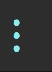

## 前言

基本的npm包使用

<!--More-->

## 项目结构

\- build --- 前端工程 webpack 构建设置

\- config --- 前端工程构建参数设置(通过 index.js 配置项目开发运行端口等及打包相关配置)

\- src --- 项目源码

  \- api --- 服务端接口代理配置

  \- assets --- 项目静态文件,图片等

  \- components --- 项目自定义组件

  \- constant --- 常量

  \- directive --- 项目自定义指令文件

  \- filter --- 项目自定义 vue 过滤器

  \- handler --- 当页面为自动生成的时，和界面相关的一些代码放在本文件夹，

​    当页面不是自动生成的时（即 views 中有对应页面），本文件夹中不应该有相关代码

  \- mixins --- 项目混入文件

  \- mock --- mock 模拟数据（真实交互环境可以不需要）

  \- router --- 项目路由配置

  \- service --- 前端业务逻辑，当简单调用后台服务时，不需要有该层

  \- store --- 前端中央数据仓库

  \- style --- 项目样式文件

  \- utils --- 项目公共方法文件

  \- views --- 项目中各功能页

  \- app.vue --- 项目入口渲染页面

  \- main.js --- 项目入口文件(创建整个项目的 vue 实例，并将 router、hui 等注入)

\- index.html --- 项目入口模板

\- package.json --- 项目的依赖配置、运行配置等

\- sysconfig.js --- 项目常用接口配置

\- 其余暂不用关注

## ora

> Elegant terminal spinner
>
> 1. 这是一个旋转器,在加载完成之前优化用户体验
> 2. 主要用来实现`node.js`命令行环境的loading效果，和显示各种状态的图标等
>
> ```
> $ npm install ora
> ```

**基本使用**:

```js
const ora = require('ora'); 
const spinner = ora('Loading unicorns').start(); setTimeout(() => {    spinner.color = 'yellow';    
 spinner.text = 'Loading rainbows';
}, 1000);
```

**项目使用**:

```js
const spinner = ora('building for production...');
spinner.start();
... ...
spinner.stop();
```

**基本效果**:



## rimraf

> `rimraf` 包的作用：以包的形式包装`rm -rf`命令，用来删除文件和文件夹的，不管文件夹是否为空，都可删除
>
> ```bash
> $ npm install rimraf --save-dev
> ```

**基本使用**:

```js
const rimraf = require('rimraf');
rimraf('./test.txt', function (err) { // 删除当前目录下的 test.txt
  console.log(err);
});
```

## path

> This is an exact copy of the NodeJS ’path’ module published to the NPM registry.
>
> 路径
>
> ```bash
> $ npm install --save path
> ```

**基本使用**:

```js
var path = require('path');

1、path.dirname()  :获取目录
2、path.basename() ：获取文件名.扩展名(我们统称为全名)
3、path.extname()  : 获取扩展名
4、path.parse()    : 将一个路径转换成一个js对象
5、path.format()   ：将一个js对象转换成路径
6、join()          : 拼接多个路径成一个路径
7、path.resolve() :将相对路径转为绝对路径

__dirname: 总是返回被执行的 js 所在文件夹的绝对路径

__filename: 总是返回被执行的 js 的绝对路径

以下属性、接口，都跟平台的具体实现相关。也就是说，同样的属性、接口，在不同平台上的表现不同。

path.posix：path相关属性、接口的linux实现。
path.win32：path相关属性、接口的win32实现。
path.sep：路径分隔符。在linux上是/，在windows上是\。
path.delimiter：path设置的分割符。linux上是:，windows上是;。
注意，当使用 path.win32 相关接口时，参数同样可以使用/做分隔符，但接口返回值的分割符只会是\。
```

## fs-extra

> `fs-extra` adds file system methods that aren't included in the native `fs` module and adds promise support to the `fs` methods. It also uses [`graceful-fs`](https://github.com/isaacs/node-graceful-fs) to prevent `EMFILE` errors. It should be a drop in replacement for `fs`.
>
> 1. **fs-extra模块是系统fs模块的扩展，提供了更多便利的 API，并继承了fs模块的 API**
>
> 2. 你不需要包括原版`fs`模块：
>
>    ```js
>    const fs = require('fs') // this is no longer necessary
>    ```
>
>    您现在可以这样做：
>
>    ```js
>    const fs = require('fs-extra')
>    ```
>
> ```bash
> npm install fs-extra
> ```


## chalk

> 修改控制台中字符串的样式（字体样式加粗等／字体颜色／背景颜色）
>
> 加粗+红色字+背景白色
>
> ```bash
> $ npm install chalk
> ```

**基本使用**:

```js
console.log(chalk.blue('Hello world!'));
```

粉笔提供了一个易于使用的可组合API，您只需链接和嵌套您想要的样式。

```js
const chalk = require('chalk');
const log = console.log;
 
// Combine styled and normal strings
log(chalk.blue('Hello') + ' World' + chalk.red('!'));
 
// Compose multiple styles using the chainable API
log(chalk.blue.bgRed.bold('Hello world!'));
 
// Pass in multiple arguments
log(chalk.blue('Hello', 'World!', 'Foo', 'bar', 'biz', 'baz'));
 
// Nest styles
log(chalk.red('Hello', chalk.underline.bgBlue('world') + '!'));
 
// Nest styles of the same type even (color, underline, background)
log(chalk.green(
    'I am a green line ' +
    chalk.blue.underline.bold('with a blue substring') +
    ' that becomes green again!'
));
 
// ES2015 template literal
log(`
CPU: ${chalk.red('90%')}
RAM: ${chalk.green('40%')}
DISK: ${chalk.yellow('70%')}
`);
 
// ES2015 tagged template literal
log(chalk`
CPU: {red ${cpu.totalPercent}%}
RAM: {green ${ram.used / ram.total * 100}%}
DISK: {rgb(255,131,0) ${disk.used / disk.total * 100}%}
`);
 
// Use RGB colors in terminal emulators that support it.
log(chalk.keyword('orange')('Yay for orange colored text!'));
log(chalk.rgb(123, 45, 67).underline('Underlined reddish color'));
log(chalk.hex('#DEADED').bold('Bold gray!'));
```

轻松地定义您自己的主题：

```js
const chalk = require('chalk');
 
const error = chalk.bold.red;
const warning = chalk.keyword('orange');
 
console.log(error('Error!'));
console.log(warning('Warning!'));
```

利用控制台日志[字符串替换](https://nodejs.org/docs/latest/api/console.html#console_console_log_data_args):

```js
const name = 'Sindre';
console.log(chalk.green('Hello %s'), name);
//=> 'Hello Sindre'
```

## webpack

> webpack is a module bundler. Its main purpose is to bundle JavaScript files for usage in a browser, yet it is also capable of transforming, bundling, or packaging just about any resource or asset.
>
> WebPack是一个模块绑定器。它的主要目的是捆绑JavaScript文件，以便在浏览器中使用，但它也能够转换、捆绑或打包任何资源或资产。
>
> ```bash
> npm install --save-dev webpack
> ```

webpack是德国开发者 Tobias Koppers 开发的模块加载器, 在 Webpack 当中, 所有的资源都被当作是模块, js, css, 图片等等.通过 webpack 的各种加载器，我们可以更高效地管理这些文件。

webpack较之其他类似工具有什么不同:

- 有同步和异步两种不同的加载方式
- Loader,加载器可以将其他资源整合到JS文件中，通过这种方式，可以讲所有的源文件形成一个模块
- 优秀的语法分析能力，支持 CommonJs和AMD 规范
- 有丰富的开源插件库，可以根据自己的需求自定义webpack的配置

