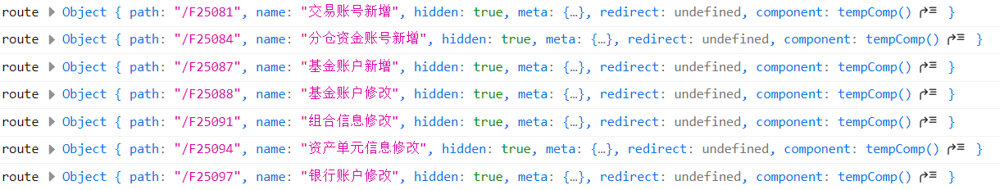

## 前言

AM4系统框架流程

<!--More-->

## 动态路由表

> `src\store\modules\permission.js`下的`permission.js`文件用于动态生成路由表,**根据后台传回的可用menus或者业务标识,递归过滤异步路由表，返回符合用户角色权限的路由表**

根据输出,可以看到动态生成的路由的一部分:



**详细内容**

- 获取url的api为:

  ```js
  import { filedir } from '@/api/url';
  ```

  而`filedir`的内容主要就是一个对应关系

  ```js
  export const filedir = {
    3339: '/bg/',
    3349: '/bm/',
    3344: '/liq/',
    3348: '/zx/',
    3343: '/jys/',
    3346: '/yhj/',
    3345: '/otc/',
    3342: '/intb/',
    3347: '/der/',
    3341: '/ins/',
    3340: '/bgb/',
    3354: '/bgs/',
    3355: '/bgb/',
  };
  ```

- 针对的是两个路由表:

  ```js
  let asyncRouterMap = new Map();
  const asyncMenuPathMap = new Map();
  ```

  这两个Map用于储存对应的Router和Menu,具体的方法为:

  ```js
  /**
   * 根据后台传回的可用menus或者业务标识,递归过滤异步路由表，返回符合用户角色权限的路由表
   * @param router
   * @param menus
   * @param type  过滤类型  1菜单过滤，2业务标识过滤
   */
  function filterRouterByArr(router, menus) {
      ...
  }
  ```

  这个方法是通过一个递归,对Menus中的所有Menus中的所有children进行遍历,对每一个menu中的item的属性进行处理和存放:(部分代码)

  ```js
  let tempComName = `M${menu.menuCode}`;
  let tempUrl = menu.url;
  let tempName = menu.menuName;
  let tempId = menu.menuCode;
  let tempHidden = menu.url.trim() === '';
  ```

  处理好后封装到一个route里面

  ```js
  const route = {
              path: tempUrl + tempComName,
              name: tempName,
              hidden: tempHidden,
              meta: {
                icon: menu.icon,
                isKeepAlive: true, //  或者直接置为true
                comName: tempComName,
                rootId: menu.subsysNo,
                id: tempId, // 用于tabs切换时可以定位到菜单栏
                windowShow: menu.windowShow,
                createType: menu.createType,
                sysPre: `${filedir[menu.subsysNo]}#`,
                // subsysNo: menu.subsysNo,
              },
              redirect: menu.redirect,
              component: tempComp, // resolve => require([`@/views${tempUrl}.vue`], resolve),
            };
  ```

  这就一个动态route了,我们只需要把这个route放到router和两个Map中即可

  ```js
  router.push(route);
  asyncRouterMap.set(tempId, route);
  asyncMenuPathMap.set(route.path, tempId);
  ```

  可以看到,最后得到的一个完整的是route:

  

  这个函数的功能就是返回一个`return router;`

- persimmon.js的功能不仅仅是做这样一个router,这只是一个工具,,我们真正需要返回的是一个permission的对象,他应该拥有哪些属性了?

  ```js
  const permission = {
    state: {
      // routers: constantRouterMap,
      addRouters: [],
      searchRoute: [],
      // general: {},
      routerMap: [],
      gridflash: {},
      menuPathMap: [],
    },
    mutations: {
        ...
    },
    action: {
        ...
    }
  }
  ```

  在`action`中就做了一些和刚才函数有关的操作:

  ```js
  // 根据服务端菜单生成路由
  GenerateRoutesByMenus({ commit }, data) {
      return new Promise((resolve) => {
          asyncRouterMap = new Map();
          const accessedRouters = filterRouterByArr([], data);
          commit('ADD_GRIDFLASH', accessedRouters);
          commit('SET_ROUTERS', accessedRouters);
          commit('SEARCH_ROUTE', accessedRouters);
          commit('SET_ROUTERMAP', asyncRouterMap);
          commit('SET_MENUPATH', asyncMenuPathMap);
          resolve();
      });
  }
  ```

  - 如何理解这里使用Promise的方法,首先通过廖雪峰大神对Promise的理解入手:https://www.liaoxuefeng.com/wiki/1022910821149312/1023024413276544 ,这种“承诺将来会执行”的对象在JavaScript中称为Promise对象,可见Promise最大的好处是在异步执行的流程中，把执行代码和处理结果的代码清晰地分离了,在做多个任务的时候,尤为有用，`job1.then(job2).then(job3).catch(handleError);`
  - 在这里我们给的第一个参数`router`是`[]`,第二个参数`menu`就是`data`
  - 返回这个Promise

## 登录处理

- Vuex
- SessionStroge
- Cookies(token)

在登录的时候设置SessionStroge,Cookies和Vuex中的token

```js
window.sessionStorage.setItem('userName', opCode);
window.sessionStorage.setItem('companyId', companyId);
Cookies.set('loggedin', true);
commit('SET_TOKEN', 'online');
```

## 服务代理

- **服务代理基类BaseProxy**

  配置一些基础的属性:

  - 是否转为小写:  lowerUrl

  - 构造函数:constructor

    ```js
    /**
       * 创建一个服务代理实例
       *
       * @param {import("axios").AxiosInstance} fetch fetch实例
       * @param {string} [baseUrl=''] 基础路径
       * @param {boolean} [lowerUrl=false] 是否转为小写url
       * @memberof BaseProxy
       */
      constructor(fetch, baseUrl = '', lowerUrl = BaseProxy.LOWER_URL) {
        this.fetch = fetch;
        this.baseUrl = baseUrl;
        this.lowerUrl = lowerUrl;
      }
    ```

  - 封装了一些get请求,post请求,方便其他服务代理继承的时候请求数据

- 数据字典相关操作: 基于基类进行一些基本的增删改查操作

- 类似数据字典,其他很多api的使用都是通过继承BaseProxy进行后台交互,原理也是使用Axios

  

  