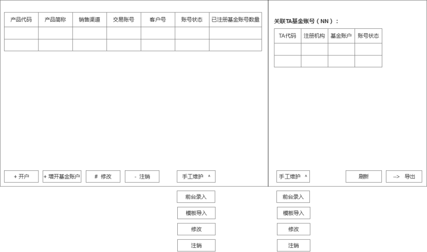

## 前言

项目文档和解读

<!--More-->

## 相关文档

- HUI
  - http://192.168.58.189:8080/hui/#/
- 协同
  - https://hs-cas.hundsun.com/cas/login?service=https%3A%2F%2Fsynergy.hundsun.com%2Flogin%2FLogin.jsp%3Flogintype%3D1%26message%3D19%26languageid%3D7
- 服务器展示
  - http://10.20.29.235:8088/bg/
- 电子配置库权限管理平台
  - https://cm.hundsun.com/svnManage/
- 构通场外基金投资管理系统需求说明书V1.1_数据库信息备注版本
- 机构通场外基金投资管理系统开发概要说明文档
  - https://192.168.57.155/HZYY/FIS1.0/trunk/Documents/D2.Designs/
- 数据库修改汇总
  - https://192.168.57.155/HZYY/FIS1.0/trunk/Documents/D2.Designs/DB/
- 新版原型图
  - https://lanhuapp.com/url/QuMAZ-DVnQd

## 计划安排 2019-7-26

以下是开发的初版安排，为了尽量给测试留充分的时间，所以进度上安排了比较紧。

账户类的模块，一个人估计肯定要2-3星期，现在由作棒带2个新人，先试着6天内看看能不能搞定，不行的话会调整时间安排的。

交易类的处理，涉及到各种回溯状态，也较复杂，暂定由吕晓涛（主）与王作棒合作1周内来完成，保守估计是要2周的，先做做看，不行后续我理概要说明，协助开发。

下面是何我相关的内容：

| 模块                                                        | 概要说明                                                  | 人员                 | 计划开始日期 | 计划结束日期 |
| ----------------------------------------------------------- | --------------------------------------------------------- | -------------------- | ------------ | ------------ |
| 3.7 账户管理（交易账户和基金账户维护）                      |                                                           | 王作棒、李浩田、杨鑫 | 7月29日      | 7月30日      |
| 3.8 电子化开户报单——开户 && 3.1电子化开户报单——修改账户资料 | 子页面，页面输入参数{产品id}                              | 王作棒、李浩田、杨鑫 | 7月30日      | 8月2日       |
| 3.11 电子化开户报单——注销账户                               | 子页面，页面输入参数{产品id，基金账号}                    | 王作棒、李浩田、杨鑫 | 7月29日      | 7月29日      |
| 3.9 电子化开户报单——增开基金账户                            | 子页面，页面输入参数{产品id，交易账号}                    | 王作棒、李浩田、杨鑫 | 7月29日      | 7月29日      |
| 3.12 账户类业务申报记录                                     | 查询 含账号申报类转机机定时任务与账号类回填转机机定时任务 | 李浩田、杨鑫、王作棒 | 8月5日       | 8月6日       |
| 3.27 资金交收复核                                           |                                                           | 李浩田               | 8月7日       | 8月9日       |
| 持仓份额调整复核                                            |                                                           | 李浩田               | 8月12日      | 8月13日      |
| 3.29 标的基金调整及复核                                     |                                                           | 李浩田               | 8月14日      | 8月15日      |

### 3.7账户管理（交易账户和基金账户维护）

1. 主要流程

   1. 交易账号和基金账号数据关联展示

   2. 支持电子化开户、修改账号资料和销户的电子化报单发起

   3. 支持前端将已经代销柜台确认的数据导入、更新、修改或注销

2. 业务规则

   1. 每只产品在**不同代销渠道都会新开交易账户**，需支持**单渠道多交易账户**

   2. 每交易账户关联诸基金账户

   3.  注销只是注销基金账户，账户【注销】业务发起时，若账户有持仓或在途交易/账户业务，则不许发起

   **【在途业务定义】未归档的账户/交易订单中有关联该基金账户的记录（非销户记录）。**

3. **数据库表**

   现有：bgb_ttradeaccount（交易账号表）、bgb_tfundaccount，修改：场外基金交易账号为fund_trade_account字段。trade_account字段必须输入时，为0。（otc_tunitstock表为场外的单元持仓表）、bgb_tfundaccount表里需要新增TA代码字段。

4. 页面处理说明

   1. Ø 查询：数据来源于【bgb_ttradeaccount】（主表）、【bgb_tfund】、【bgb_tfundaccount】。

   2. Ø 手工维护：【bgb_ttradeaccount】、【bgb_tfundaccount】、【otc_ttradeaccount_ex】（可选项目）

5. 初步原型图

   

