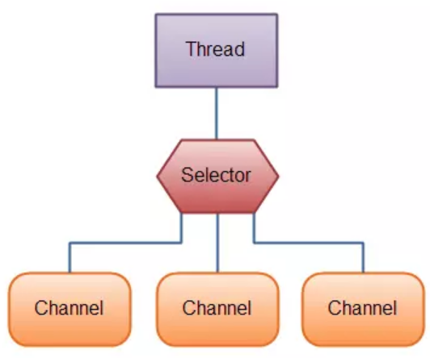
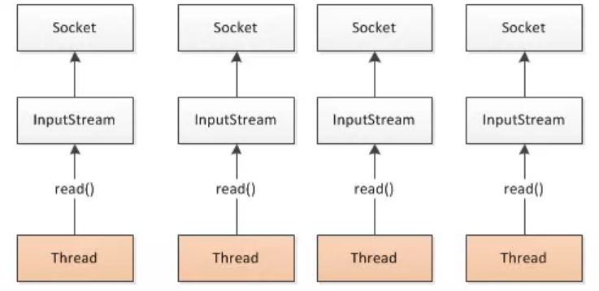
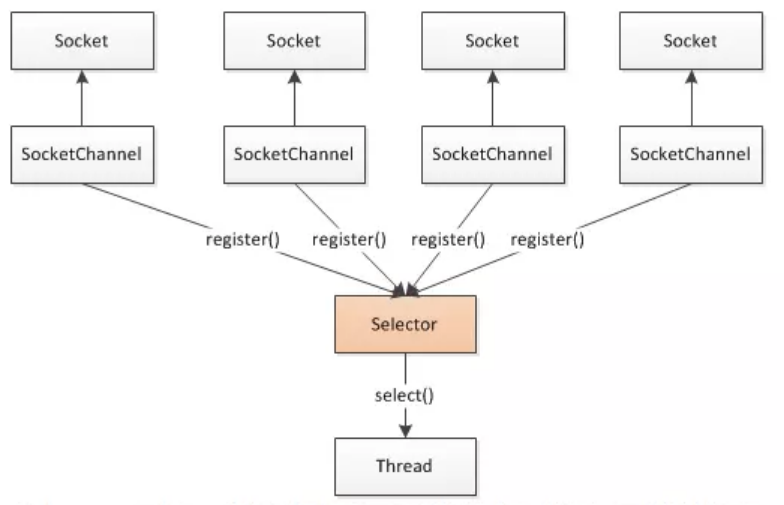

## 前言

线程中很基础的关于BIO和NIO的概念，需要我们进行一个简单的了解

<!--More-->

## 概念

- `BIO`: Blocking IO  阻塞线程
- `NIO`: Non-Blocking IO 非阻塞线程

所谓的 `BIO` ， 就是当线程执行了某个`耗时操作`时，需要等待耗时操作结束，再进行后续操作。
 `NIO`, 就是当线程执行了耗时操作时，该线程不需要等待耗时操作结束，可用来执行其他操作。

Java NIO有三大组成部分：`Buffer,Channel,Selector`，通过`事件驱动模式`实现了什么时候有数据可读的问题。

- Channel: 相当于IO操作的载体，相当于一个硬件设备，一个文件，一个socket或是区别程序中的不同IO操作，如read，write。
  channel类似流，但又有些不同：
  既可以从通道中读取数据，又可以写数据到通道。但流的读写通常是单向的。
  通道可以异步地读写。
  通道中的数据总是要先读到一个Buffer，或者总是要从一个Buffer中写入。

- Buffer: 用于和NIO通道进行交互。如你所知，数据是从通道读入缓冲区，从缓冲区写入到通道中的。
  缓冲区本质上是一块可以写入数据，然后可以从中读取数据的内存。这块内存被包装成NIO Buffer对象，并提供了一组方法，用来方便的访问该块内存。

- Selector: Selector（选择器）是Java NIO中能够检测一到多个NIO通道，通道将关心的事件注册到selector 上，selector能够知晓通道是否为这些事件诸如读写事件做好数据准备。这样，一个单独的线程可以管理多个channel，从而管理多个网络连接。

## Java NIO和IO的主要区别

|  **IO  |  NIO**   |
| :----: | :------: |
| 面向流 | 面向缓冲 |
| 阻塞IO | 非阻塞IO |
|   无   |  选择器  |

线程是较为重量级的资源。`bio`当并发量大，而后端服务或客户端处理数据慢时就会产生产生大量线程处于等待中，即上述的**阻塞，是非常严重的资源浪费**。此外，**线程的切换**也会导致`cpu`资源的浪费，单机内存限制也无法过多的线程，只能单向以流的形式读取数据。

`nio`使用单线程或者只使用少量的多线程，多个连接共用一个线程，消耗的线程资源会大幅减小。并且当处于等待（没有事件）的时候线程资源可以释放出来处理别的请求，通过事件驱动模型当有`accept/read/write`等事件发生后通知（唤醒）主线程分配资源来处理相关事件。以`buffer`缓冲区的形式处理数据，处理更为方便。

## **面向流与面向缓冲**

`Java NIO`和`IO`之间第一个最大的区别是，**IO是面向流的，NIO是面向缓冲区的**。 

Java IO面向流意味着每次从流中读一个或多个字节，直至读取所有字节，它们没有被缓存在任何地方。此外，它不能前后移动流中的数据。如果需要前后移动从流中读取的数据，需要先将它缓存到一个缓冲区。

Java NIO是将数据读取到一个它稍后处理的缓冲区，需要时可在缓冲区中前后移动。这就增加了处理过程中的灵活性。但是，还需要检查该缓冲区中是否包含所有您需要处理的数据。而且，需确保当更多的数据读入缓冲区时，不要覆盖缓冲区里尚未处理的数据。

## **阻塞与非阻塞IO**

`Java IO`的各种流是阻塞的。这意味着，当一个线程调用`read()`或`write()`时，该线程被阻塞，直到有一些数据被读取，或数据完全写入。**该线程在此期间不能再干任何事情了**。 `Java NIO`的非阻塞模式，使一个线程从某通道发送请求读取数据，但是它仅能得到目前可用的数据，如果目前没有数据可用时，就什么都不会获取。**而不是保持线程阻塞，所以直至数据变得可以读取之前，该线程可以继续做其他的事情**。 非阻塞写也是如此。一个线程请求写入一些数据到某通道，但不需要等待它完全写入，这个线程同时可以去做别的事情。 线程通常将非阻塞`IO`的空闲时间用于在其它通道上执行`IO`操作，所以一个单独的线程现在可以管理多个输入和输出通道（`channel`）。

AIO（其实就是NIO.2）:

AIO主要有两部分组成，`Files`用于解决文件的一部处理问题，`Sockets`用于解决`Socket`的一部处理问题，在`Linux`上，主要有两种实现，一种是`Posix AIO`，即用户态实现，另一种是`Kernel Native AIO`内核态实现，性能比较高，`nginx、mysql`等的新版本都支持`kernel Natice AIO`。

