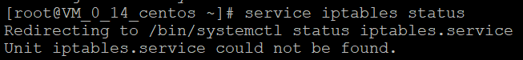
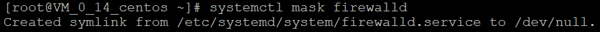
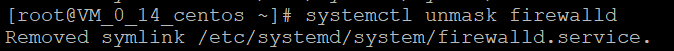
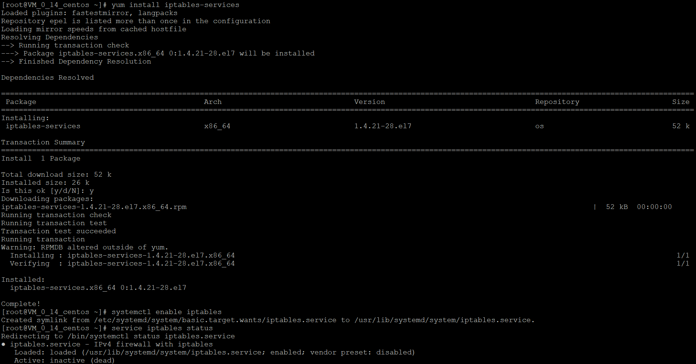
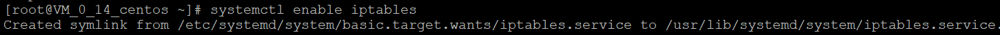
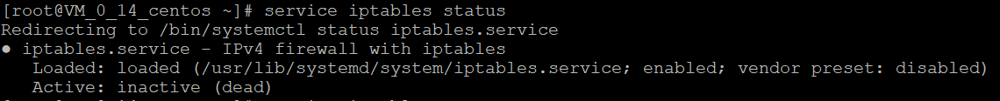
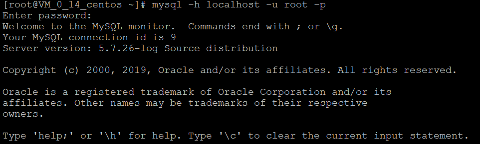
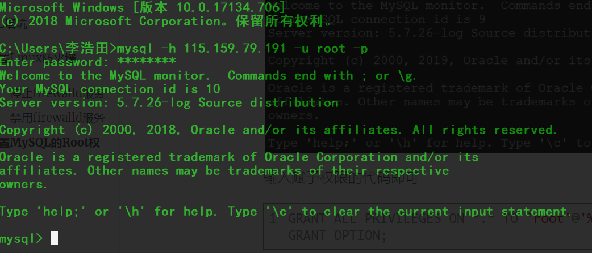

## 前言

在拥有个人服务器后，非常重要的一件事就是部署自己的MySQL，我选用了MySQL5.7的版本，相比MySQL5.5及以下版本，5.7使用Innodb数据库存储引擎，增添了事务的机制，这两者非常重要。安装MySQL可以通过两种方式，一种使用yum源，或者使用Docker安装MySQL容器，这两者我都使用过，不过这次我使用了<a href="https://www.bt.cn/Download/btsoftlinux.html">宝塔Linux面板</a>虽然无脑安装，但是省事不少。

<!--More-->

## MySQL填坑

安装好外部无法访问？我之前一直以为是没有grant相关权限给root，root只有localhost的权限，也就是只有本机才能访问，但是我在本机赋予权限后，发现在我自己的电脑上海市访问不到，这就很难受。当然grant权限是必要的步骤，但是还有一个非常重要的操作。

#### 设置Linux防火墙

我们需要对3306端口进行设置：

**防火墙设置**

```bash
service iptables status
```

结果：



显然，提示我们iptables.service不存在，CentOS7默认的防火墙不是iptables，而是firewalle

######停止firewalld服务

```bash
systemctl stop firewalld
```

结果：


没有提示错误就是对咯，我们继续

######禁用firewalld服务

 ```bash
systemctl mask firewalld
 ```

你可能会好气，停止后为什么还要禁用，有什么意义？

注销服务意味着：

1. 该服务在系统重启的时候不会启动
2. 该服务无法进行做systemctl start/stop操作
3. 该服务无法进行systemctl enable/disable操作

结果：



如果我们要开启的话，开启命令为：

 ```bash
systemctl unmask firewalld 
 ```

执行结果为：



随后我们就需要**安装iptables-services**

 ```bash
yum install iptables-services
 ```

结果为：



期间需要输入一个y即可，表示yes！ 

**设置开机启动**

 ```bash
systemctl enable iptables
 ```

结果为：

 

然后查看状态

```bash
service iptables status
```

iptables：未运行防火墙。



我们可以看到，并未启动。**开启防火墙**

 ```bash
service iptables start
 ```

我们现在需要，关闭防火墙，来开放端口：

```bash
service iptables stop
```

**Linux 防火墙开放3306端口**

开放端口命令：

```bash
/sbin/iptables -I INPUT -p tcp --dport 3306 -j ACCEPT
```

到此我们就结束了本次操作

#### 设置MySQL的Root权限

在本地进入MySQL：

```bash
mysql -h localhost -u root -p
```

随后输入密码进入，结果：



输入赋予权限的代码即可

```bash
GRANT ALL PRIVILEGES ON *.* TO 'root'@'%' IDENTIFIED BY 'password' WITH GRANT OPTION;
```

这句话意思很简单，赋予root所有权限到\*.\*也就是所有访问，而不是localhost，通过一个password验证就可以登录。

显示`Query OK, 0 rows affected, 1 warning (0.01 sec)`大功告成

这样我们的MySQL就算完全部署好了。我们在自己的电脑上连接成功：



## 转载一篇优秀的博文

`转自：http://blog.csdn.net/huxu981598436/article/details/54864260`

#### 开启端口命令

输入firewall-cmd --query-port=6379/tcp，如果返回结果为no，那么证明6379端口确实没有开启。

输入firewall-cmd --add-port=6379/tcp，将6379端口开启，返回success。

#### 1、firewalld的基本使用

解除屏蔽 （mask）systemctl unmask firewalld.service

启动： systemctl start firewalld

查看状态： systemctl status firewalld 

停止： systemctl disable firewalld

禁用： systemctl stop firewalld

#### 2.systemctl是CentOS7的服务管理工具中主要的工具，它融合之前service和chkconfig的功能于一体。

启动一个服务：systemctl start firewalld.service
关闭一个服务：systemctl stop firewalld.service
重启一个服务：systemctl restart firewalld.service
显示一个服务的状态：systemctl status firewalld.service
在开机时启用一个服务：systemctl enable firewalld.service
在开机时禁用一个服务：systemctl disable firewalld.service
查看服务是否开机启动：systemctl is-enabled firewalld.service
查看已启动的服务列表：systemctl list-unit-files|grep enabled
查看启动失败的服务列表：systemctl --failed

#### 3.配置firewalld-cmd

查看版本： firewall-cmd --version

查看帮助： firewall-cmd --help

显示状态： firewall-cmd --state

查看所有打开的端口： firewall-cmd --zone=public --list-ports

更新防火墙规则： firewall-cmd --reload

查看区域信息:  firewall-cmd --get-active-zones

查看指定接口所属区域： firewall-cmd --get-zone-of-interface=eth0

拒绝所有包：firewall-cmd --panic-on

取消拒绝状态： firewall-cmd --panic-off

查看是否拒绝： firewall-cmd --query-panic

那怎么开启一个端口呢

##### 添加

firewall-cmd --zone=public --add-port=80/tcp --permanent    （--permanent永久生效，没有此参数重启后失效）

##### 重新载入

firewall-cmd --reload

##### 查看

80/tcp

删除

firewall-cmd --zone= public --remove-port=80/tcp --permanent

======================================================

iptables是linux下的防火墙，同时也是服务名称。

service  iptables  status        查看防火墙状态

service  iptables  start           开启防火墙

service  iptables  stop           关闭防火墙

service  iptables  restart        重启防火墙

 

**防火墙开放特定端口：**

①文件/etc/sysconfig/iptables    

 ②添加：

     -A RH-Firewall-1-INPUT -m state --state NEW -m tcp -p tcp --dport 8080 -j ACCEPT
    
       ★数字8080代表开放8080端口，也可以改成其他的端口★

##### ③重启防火墙

保存对防火墙的设置

serivce iptables save

查看iptables规则及编号

iptables -nL --line-number

关闭所有的INPUT FORWARD（转发） OUTPUT的所有端口

iptables -P INPUT DROP

iptables -P FORWARD DROP

iptables -P OUTPUT DROP

只打开22端口

iptables -A  INPUT -p tcp --dport 22 -j ACCEPT

iptables -A OUTPUT -p tcp --sport 22 -j ACCEPT

##### 参数讲解：

–A 参数就看成是添加一条规则

–p 指定是什么协议，我们常用的tcp 协议，当然也有udp，例如53端口的DNS

–dport 就是目标端口，当数据从外部进入服务器为目标端口

–sport 数据从服务器出去，则为数据源端口使用 

–j 就是指定是 ACCEPT -接收 或者 DROP 不接收

##### 禁止某个IP访问

iptables -A INPUT -p tcp -s 192.168.1.2 -j DROP

–s 参数是来源（即192.168.1.2）

后面拒绝就是DROP 


##### 删除规则

iptables -D INPUT 2

删除INPUT链编号为2的规则

## 题外话

服务器使用两年了，MySQL的部署也搞过很多次，其实建议大家使用Docker进行部署，是最好的，之前的博客使用wordpress也记录过，可惜由于数据库没有备份好，丢失了数据，现在再一次进行记录。

