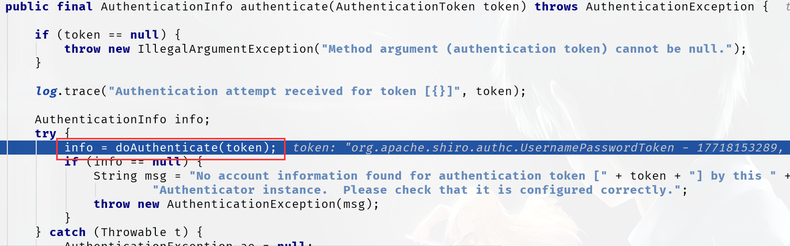

## 前言

本次研究Springboot Shiro还是遇到了很多问题，记录如下：

- 加密次数问题：credentialsMatcher.setHashIterations(2);

- 首次登录不跳转Controller问题

- 登录验证流程

- 异常类自定义和捕获

- 工具类研究

<!--More-->

## 关于加密次数

出现这个问题的位置：ShiroConfig
`credentialsMatcher.setHashIterations(2);`

```java
/**
     * 密码校验规则HashedCredentialsMatcher
     * 这个类是为了对密码进行编码的
     * 防止密码在数据库里明码保存 ,当然在登陆认证的时候
     * 这个类也负责对form里输入的密码进行编码
     * 处理认证匹配处理器：如果自定义需要实现继承HashedCredentialsMatcher
     */
    @Bean("hashedCredentialsMatcher")
    public HashedCredentialsMatcher shiroHashedCredentialsMatcher() {
        HashedCredentialsMatcher credentialsMatcher = new HashedCredentialsMatcher();
        //指定加密方式为MD5
        credentialsMatcher.setHashAlgorithmName("MD5");
        //加密次数
        credentialsMatcher.setHashIterations(2);
        credentialsMatcher.setStoredCredentialsHexEncoded(true);
        return credentialsMatcher;
    }
```
这就涉及到了Shiro中的编码加密的内容，请参看《Springboot-Shiro-编码/加密》

## 首次登录不跳转Controller

这是Shiro的一个大的坑,因为理论上我们应当在login的Controller中使用

```java
UsernamePasswordToken token =
                new UsernamePasswordToken(username, password, role);
Subject currentUser = SecurityUtil.currentSubject();
currentUser.login(token);
```

进行登录,之后我们会详细研究login的过程,之后会跳转到下面的代码中,进行用户指定方式的验证

```java
@Override
protected AuthenticationInfo doGetAuthenticationInfo(AuthenticationToken token) throws AuthenticationException {
```

但是首次登录并没有按照这个流程,而是直接跳到了上述代码,没有走Controller,也就是没有放入一个UsernamePasswordToken,那么肯定无法验证,这就需要我们进行一下配置:

```java
@Bean
public ShiroFilterFactoryBean shiroFilterFactoryBean(DefaultWebSecurityManager securityManager) {
    // 开放登录接口，否则在第一次登录的时候就会绕过controller，执行doGetAuthenticationInfo
    map.put("/*/login", "anon");
}
```

如果没有配置开放登录的接口,就会被过滤器filter拦截,拦截过后就无法进入

## 登录验证流程

现在我们来看一下详细的登录验证流程:在Controller的login中打断点,逐步debug进行研究

使用postman进行Post请求的发送:


shiroConfig的过滤器中设置登录接口的位置:

```java
//登录
shiroFilterFactoryBean.setLoginUrl("/*/login");
```

而login的controller代码如下:


通过path拿到用户的角色,后面的LoginInfoRequestBean是为了获取用户的用户名密码,并验证他们的基本数据(长度够不够,能否为空等)

### Debug-Controller

进入Controller,拿到请求的数据:


#### UsernamePasswordToken

UsernamePassword类是我们之前说过的Shiro用于验证用户登录的基本类


设置了用户的基本数据,用户名,密码,是否记住我,还有host(角色),而password被转换成了char的数组,为了之后方便进行处理,char是基本数据类型,而String不是,这有很大的区别

#### Subject

Subject是用户/客户端对象,我们通过构建一个Subject来记录


拿到了当前的Subject:


可以进行登录操作:`currentUser.login(token);`


login的源码中,使用securityManager的login功能,我们在shiroConfig中自定义注入了一个manager,就会使用我们自己的规则

此处掠过几步,我通过对login的继续深入,发现进入了:



而这个正式我们在ShiroRealm中定义的doAuthenticate()的方法

成功从大量的源代码跳入了我们自己写的代码中:


我们在Controller中定义的UsernamePassword就进入了这里,我们储存了用户登录的凭证,一路随着源码往回走,返回可用的用户info


info是不为空的,也就是验证成功了

shiro就会告诉我们`notifySuccess(token, info);`


创建一个Subject的loggedIn并且成功onSuccessfulLogin,这样就跳回了最初的:


直到最后,Controller执行到了最后一行:


就返回成功success();登录完成

我们可以继续debug看到,其实Springboot最核心的也是Servlet的机制


最终PostMan收到了:


