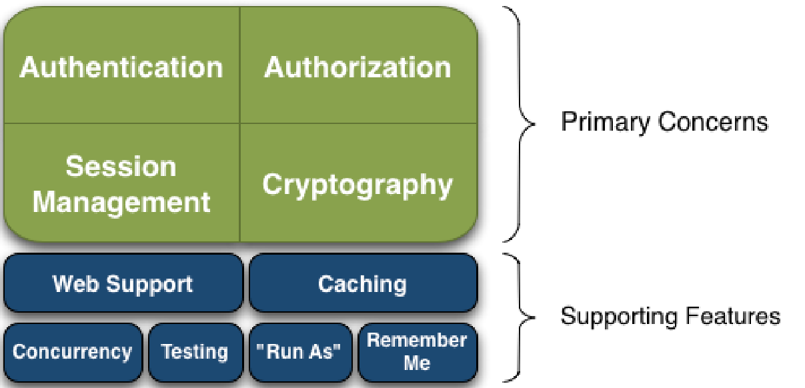
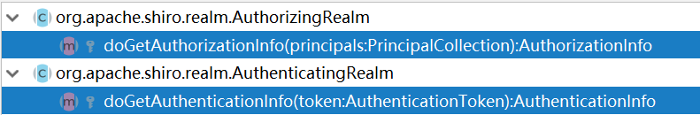

## 前言

FamilyManage项目的后台部分，最核心的一部分一定是安全控制和权限控制。

这一次，我们就来了解一下什么是Spring Shiro

<!--More-->

## 什么是Spring Shiro

- Apache Shiro 是 Java  的一个安全（权限）框架。 

- Shiro 可以非常容易的开发出足够好的应用，其不仅可以用在 JavaSE 环境，也可以用在 JavaEE 环境。 
- Shiro 可以完成：认证、授权、加密、会话管理、与Web 集成、缓存 等。
- 下载：http://shiro.apache.org/

## 基本功能



- Authentication：身份认证/登录，验证用户是不是拥有相应的身份； 
-  Authorization：授权，即权限验证，验证某个已认证的用户是否拥有某个权限；即判断用 户是否能进行什么操作，如：验证某个用户是否拥有某个角色。或者细粒度的验证某个用户 对某个资源是否具有某个权限； 
- Session Manager：会话管理，即用户登录后就是一次会话，在没有退出之前，它的所有 信息都在会话中；会话可以是普通 JavaSE 环境，也可以是 Web 环境的； 
- Cryptography：加密，保护数据的安全性，如密码加密存储到数据库，而不是明文存储
- Web Support：Web 支持，可以非常容易的集成到Web 环境； 
- Caching：缓存，比如用户登录后，其用户信息、拥有的角色/权限不必每次去查，这样可 以提高效率； 
- Concurrency：Shiro 支持多线程应用的并发验证，即如在一个线程中开启另一个线程，能 把权限自动传播过去； 
-  Testing：提供测试支持； 
- Run As：允许一个用户假装为另一个用户（如果他们允许）的身份进行访问； 
- Remember Me：记住我，这个是非常常见的功能，即一次登录后，下次再来的话不用登 录了

## Shiro架构

-  Subject：应用代码直接交互的对象是 Subject，也就是说 Shiro 的对外 API 核心就是 Subject。**Subject 代表了当前“用户”**， 这个用户不一定 是一个具体的人，**与当前应用交互的任何东西都是 Subject**，如网络爬虫， 机器人等；与 Subject  的所有交互都会委托给 SecurityManager； Subject 其实是一个门面，SecurityManager 才是实际的执行者； 
-  SecurityManager：安全管理器；即所有与安全有关的操作都会与 SecurityManager 交互；且其管理着所有 Subject；可以看出它是 Shiro 的核心，它负责与 Shiro 的其他组件进行交互，它相当于 SpringMVC 中 DispatcherServlet 的角色 
- Realm：Shiro 从 Realm 获取安全数据（如用户、角色、权限），就是说 SecurityManager 要验证用户身份，那么它**需要从 Realm 获取相应的用户** 进行比较以确定用户身份是否合法；也需要从 **Realm 得到用户相应的角色/ 权限**进行验证用户是否能进行操作；**可以把 Realm 看成 DataSource**。可以有 1 个或多个 Realm，可以认为是安全实体数据源，即用于获取安全实体 的；可以是JDBC 实现，也可以是内存实现等等；由用户提供；所以一般在应用中都需要 实现自己的 Realm；
- Authenticator：**负责 Subject 认证**，是一个扩展点，可以自定义实现；可以使用认证 策略（Authentication Strategy），即什么情况下算用户认证通过了； 
- Authorizer：授权器、即访问控制器，**用来决定主体是否有权限进行相应的操作**；即控制着用户能访问应用中的哪些功能；
-  SessionManager：**管理 Session 生命周期的组件**；而 Shiro 并不仅仅可以用在 Web 环境，也可以用在如普通的 JavaSE 环境
- CacheManager：缓存控制器，来管理如用户、角色、权限等的缓存的；因为这些数据 基本上很少改变，**放到缓存中后可以提高访问的性能** 
-  Cryptography：密码模块，Shiro 提高了一些常见的**加密组件用于如密码加密/解密**。

## 编写Shiro配置类

Shiro配置的最重要的三个就是Subject（用户主体），WebSecurityManager（安全管理器）、Realm（自定义验证）和ShiroFilterFactory（过滤器），安全管理器通过对用户主体进行验证，而验证的方式用户可以进行自定义，如果我们还需要进行加密处理等操作，那么我们需要进行HashedCredentialsMatcher的配置

#### 配置DefaultWebSecurityManager

```java
    /**
     * 权限管理，配置主要是Realm的管理认证
     */
    @Bean(name = "securityManager")
    public DefaultWebSecurityManager defaultSecurityManager(){
        DefaultWebSecurityManager defaultWebSecurityManager = new DefaultWebSecurityManager();
        defaultWebSecurityManager.setRealm(shiroRealm());
        return defaultWebSecurityManager;
    }
```

代码中的shiroRealm()就是我们需要自定义的验证方法。

#### 自定义验证方法ShiroRealm

```java
    /**
     * 自定义验证方法
     * @return
     */
    @Bean
    public ShiroRealm shiroRealm(){
        ShiroRealm shiroRealm = new ShiroRealm();
        //加入加密算法
        shiroRealm.setCredentialsMatcher(shiroHashedCredentialsMatcher());
        return shiroRealm;
    }
```

这个ShiroRealm就是我们需要自定义的验证方法，那么我现在来编写一个ShiroRealm类定制我们的验证方法，它需要继承自**AuthorizingRealm**，就需要实现其中的重要方法：



##### 1.doGetAuthenticationInfo(AuthenticationToken token)

```java
    /**
     * 判断用户是否在缓存记录(即Shiro是否Remember user)和登录
     * @param token 该凭证来自客户端传来的用户信息
     * @return
     * @throws AuthenticationException
     */
    @Override
    protected AuthenticationInfo doGetAuthenticationInfo(AuthenticationToken token) throws AuthenticationException {
        ... ...
        return null;
    }
```

我们通过源码进行分析：**AuthenticationToken**是什么东西呢？

```java
public interface AuthenticationToken extends Serializable
```

通过源码我们知道他是一个可序列化的接口类

我们看它类头的注释

```java

/**
 * <p>An <tt>AuthenticationToken</tt> is a consolidation of an account's principals and supporting
 * credentials submitted by a user during an authentication attempt.
 * <p/>
 * <p>The token is submitted to an {@link Authenticator Authenticator} via the
 * {@link Authenticator#authenticate(AuthenticationToken) authenticate(token)} method.  The
 * Authenticator then executes the authentication/log-in process.
 * <p/>
 * <p>Common implementations of an <tt>AuthenticationToken</tt> would have username/password
 * pairs, X.509 Certificate, PGP key, or anything else you can think of.  The token can be
 * anything needed by an {@link Authenticator} to authenticate properly.
 * <p/>
 * <p>Because applications represent user data and credentials in different ways, implementations
 * of this interface are application-specific.  You are free to acquire a user's principals and
 * credentials however you wish (e.g. web form, Swing form, fingerprint identification, etc) and
 * then submit them to the Shiro framework in the form of an implementation of this
 * interface.
 * <p/>
 * <p>If your application's authentication process is  username/password based
 * (like most), instead of implementing this interface yourself, take a look at the
 * {@link UsernamePasswordToken UsernamePasswordToken} class, as it is probably sufficient for your needs.
 * <p/>
 * <p>RememberMe services are enabled for a token if they implement a sub-interface of this one, called
 * {@link RememberMeAuthenticationToken RememberMeAuthenticationToken}.  Implement that interface if you need
 * RememberMe services (the <tt>UsernamePasswordToken</tt> already implements this interface).
 * <p/>
 * <p>If you are familiar with JAAS, an <tt>AuthenticationToken</tt> replaces the concept of a
 * {@link javax.security.auth.callback.Callback}, and  defines meaningful behavior
 * (<tt>Callback</tt> is just a marker interface, and of little use).  We
 * also think the name <em>AuthenticationToken</em> more accurately reflects its true purpose
 * in a login framework, whereas <em>Callback</em> is less obvious.
 *
 * @see RememberMeAuthenticationToken
 * @see HostAuthenticationToken
 * @see UsernamePasswordToken
 * @since 0.1
 */
```

我们可以获得这些信息：

- AuthenticationToken is a consolidation of an account's principals and supporting：它是对帐户主体和支持的整合。

- credentials submitted by a user during an authentication attempt：用户在身份验证尝试期间提交的凭据。当然通过类名我们也能知道，这是一种凭据Token。

- Common implementations of an AuthenticationToken would have username/password pairs, X.509 Certificate, PGP key, or anything else you can think of.  The token can be：显而易见，这个类认为实现这个接口的类，应当提供一些比如用户名/密码这种用户登录的凭证，或者是其他你认为可以验证用户的凭据

- ```Java
  If your application authentication process is  username/password based(like most), instead of implementing this interface yourself, take a look at the {@link UsernamePasswordToken UsernamePasswordToken} class, as it is probably sufficient for your needs.
  ```

这里就是重点了，既然这个类是一个接口类，实现其类的时候说过了要注意对用户登陆的凭据进行一些处理，那么这一行注释就非常重要：他说如果你的验证过程是基于用户名/密码的方式，你可能需要看看UsernamePasswordToken这个类，他可能会给你提供你所需要的。

- 再往后还有对RememberMeAuthenticationToken和Callback的陈述，显而易见。

回头来看我们的这个类，刚刚我并没有写出这个函数内部的代码，现在来看看我是怎么写的：

```java
@Override
    protected AuthenticationInfo doGetAuthenticationInfo(AuthenticationToken token) throws AuthenticationException {
        UsernamePasswordToken userToken = (UsernamePasswordToken) token;
        User user = IUserService.findByName(userToken.getUsername());
        if(user != null) {
            //该对象会记录在Shiro中认为是info,登录和缓存判断时使用
            SimpleAuthenticationInfo simpleAuthenticationInfo =
                    new SimpleAuthenticationInfo(user, user.getPassword(),EncodeUtil.getSalt(user.getUserId()),getName());
            return simpleAuthenticationInfo;
        }
        return null;
    }
```

我使用了UsernamePasswordToken，上文说过，他实现了AuthenticationToken，我的应用程序中正是使用了这种用户名+密码的验证方式，那么将token强制转化成这种类型也不为奇怪，现在我们来看看UsernamePasswordToken这个类，根据源代码：

```java
public class UsernamePasswordToken implements HostAuthenticationToken, RememberMeAuthenticationToken
```

我们知道他实现了**HostAuthenticationToken, RememberMeAuthenticationToken**这两个类，而第一个又实现了AuthenticationToken，显而易见了。

```java
public interface HostAuthenticationToken extends AuthenticationToken
```

它只有一个方法那就是返回客户端的host名字。

```java
/**
 * Returns the host name of the client from where the
 * authentication attempt originates or if the Shiro environment cannot or
 * chooses not to resolve the hostname to improve performance, this method
 * returns the String representation of the client's IP address.
 * <p/>
 * When used in web environments, this value is usually the same as the
 * {@code ServletRequest.getRemoteHost()} value.
 *
 * @return the fully qualified name of the client from where the
 *         authentication attempt originates or the String representation
 *         of the client's IP address is hostname resolution is not
 *         available or disabled.
 */
String getHost();
```

看看第二个RememberMeAuthenticationToken是什么呢？

```java
public interface RememberMeAuthenticationToken extends AuthenticationToken {

    /**
     * Returns {@code true} if the submitting user wishes their identity (principal(s)) to be remembered
     * across sessions, {@code false} otherwise.
     *
     * @return {@code true} if the submitting user wishes their identity (principal(s)) to be remembered
     *         across sessions, {@code false} otherwise.
     */
    boolean isRememberMe();

}
```

显而易见他也继承了AuthenticationToken，他也只有一个方法，那就是“记住我？”，客户在一次登录后将记住，之后可以不用重复登录。或许英文更适合你的口味？

```java
/**
 * An {@code AuthenticationToken} that indicates if the user wishes their identity to be remembered across sessions.
 * <p/>
 * Note however that when a new session is created for the corresponding user, that user's identity would be
 * remembered, but they are <em>NOT</em> considered authenticated.  Please see the
 * {@link org.apache.shiro.subject.Subject#isRemembered()} JavaDoc for an in-depth explanation of the semantic
 * differences of what it means to be remembered vs. authenticated.
 *
 * @see org.apache.shiro.subject.Subject#isRemembered()
 * @since 0.9
 */
```

返回来看我们当前这个类UsernamePasswordToken，他能够处理“记住我”的功能同时能够知道客户端的名字，除去一些基本的构造函数，我们看看他有什么特殊函数呢？

他有username/password的setter和getter，有清空凭据的clear方法，仅此而已，那么我们想在doGetAuthenticationInfo中判断用户是否在缓存记录中（是否已经“记住我”）的话，我们可以通过getUsername()的方法获得用户名，通过用户名调用Service中的方法获得指定用户。


SimpleAuthenticationInf现在我们需要来看另一个东西**AuthenticationInfo**，因为他和上述代码中的**SimpleAuthenticationInfo**有关系，在我们找到对应用户的时候，我们如何处理呢？

我们看源代码中的注释：

```java
<code>AuthenticationInfo</code> represents a Subject's (aka user's) stored account information relevant to the
* authentication/log-in process only.
```

他代表着一个Subject（客户主体）储存的账号信息和认证/登录过程有关。那么他和**AuthenticationToken有什么区别呢？**

- AuthenticationInfo提供的是represent already-verified and stored account data，就是已经准备好的，储存好的账户信息

- AuthenticationToken的作用是：

  ```java
  AuthenticationToken represents data
  * submitted for any given login attempt (which may or may not successfully match the verified and stored account
  * <code>AuthenticationInfo</code>).
  ```

他对任何的登录请求，不管能不能够通过验证进行确认和储存的信息，都会进行处理。

了解了这个，我们回头看这个类：

```java
public class SimpleAuthenticationInfo implements MergableAuthenticationInfo, SaltedAuthenticationInfo
```

就是我们刚刚提及的我们使用的这个类他实现的**MergableAuthenticationInfo**, **SaltedAuthenticationInfo**有什么特点呢？

- MergableAuthenticationInfo： 
  
  ```java
  public interface MergableAuthenticationInfo extends AuthenticationInfo
  ```

他就是继承自**AuthenticationInfo**这个类，他有什么作用呢？

```java
void merge(AuthenticationInfo info);
```

那就是**合并**，简而言之不要重复呗，相同的用户不要创建多次，我们还需要记录最新的一个即可。

- SaltedAuthenticationInfo：

  ```java
  public interface SaltedAuthenticationInfo extends AuthenticationInfo
  ```
  
  他也是继承自**AuthenticationInfo**，显而易见这是一个用于“加盐”的工具，他的功能就是：
  
  ```java
  ByteSource getCredentialsSalt();
  ```
  
  获得Salt盐，加盐是个非常重要的过程，对于安全性有了进一步的保障，如果我们进行了加盐操作，那么这个类就派得上用场了。

分析过这两个了类及他们的父类，我们就理解了**SimpleAuthenticationInfo**是做什么的了：

我们可以用他其中的构造方法，对客户配置很多属性，比如：

```java
public SimpleAuthenticationInfo(Object principal, Object hashedCredentials, ByteSource credentialsSalt, String realmName) {
    this.principals = new SimplePrincipalCollection(principal, realmName);
    this.credentials = hashedCredentials;
    this.credentialsSalt = credentialsSalt;
}
```

设置用户对象，用户密码，盐，用户名等等，将这个对象作为**doGetAuthenticationInfo**函数的返回值，我们就做完了本次操作，当然如果查不到用户，返回null即可。

##### 2.doGetAuthorizationInfo(PrincipalCollection principals)

这个功能我们做什么呢？**定义如何获取用户的角色和权限的逻辑，给shiro做权限判断。**

**PrincipalCollection** 是什么呢？他就是**缓存中的用户凭证**，你如果问我缓存怎么来的，那么你上边的一定没理解，就是**doGetAuthenticationInfo(AuthenticationToken token)**注入的呀！

既然这个函数是**定义如何获取用户的角色和权限的逻辑**的，那么如何获得呢？

```java
String username = (String) super.getAvailablePrincipal(principals);
```

我们通过super中的getAvailablePrincipal方法，获得可用的用户凭据，也就是我们的用户名，有了用户名我们就能得到这个用户的所有信息（或者为null）：

```java
User user = IUserService.findByName(username);
if(user != null){
    SimpleAuthorizationInfo info = new SimpleAuthorizationInfo();
    Set<String> roles = user.getRoleList().stream().map(role -> role.getRoleName()).collect(Collectors.toSet());
    //存放用户权限
    info.setRoles(roles);
    return info;
}
return null;
```

有的话那最好，我们定义他的权限角色，并setRoles设置进去，这里使用的是Set集，也就是不允许重复，返回这个info就拥有了角色，之后我们进行判断的时候就知道这个用户有哪些角色和权限能做什么事情。

好了，到这里，我们就定制化了验证方法，完成了**ShiroRealm**

#### 配置ShiroFilterFactoryBean过滤器

过滤器，顾名思义，**设置对应的过滤条件和跳转条件**。

```java
@Bean
public ShiroFilterFactoryBean shiroFilterFactoryBean(DefaultWebSecurityManager securityManager)
```

这个函数的返回值是**ShiroFilterFactoryBean**，我们来看一下源文件中的介绍：

`To prevent configuration duplication, this implementation provides the following properties to allow you to set relevant values in only one place:`

翻译过来就是：`为了防止配置重复，这个实现提供了以下属性，允许您只在一个地方设置相关值:`

这些属性就是：

- ```
  setLoginUrl(String)
  ```

- ```
  setSuccessUrl(String)
  ```

- ```
  setUnauthorizedUrl(String)
  ```

使用这三个有什么好处呢？

`Then at startup, any values specified via these 3 properties will be applied to all configured Filter instances so you don't have to specify them individually on each filter instance.  To ensure your own custom filters benefit from this convenience, your filter implementation should subclass one of the 3 mentioned earlier.`

翻译过来就是：

`然后在启动时，通过这3个属性指定的任何值都将应用于所有已配置的过滤器实例，这样您就不必在每个过滤器实例上分别指定它们。为了确保您自己的自定义过滤器能够从这种便利中获益，您的过滤器实现应该继承前面提到的三个过滤器之一。`

1. 申请一个ShiroFilterFactoryBean:

```java
ShiroFilterFactoryBean shiroFilterFactoryBean = new ShiroFilterFactoryBean();
shiroFilterFactoryBean.setSecurityManager(securityManager);
```

2. 定义一个Map来储存了路由规则

```java
Map<String, String> map = new LinkedHashMap<>();
// 比如静态资源
map.put("/*.html","anon");
map.put("/**/*.css","anon");
map.put("/**/*.js","anon");
map.put("/**/*.png","anon");
map.put("/**/*.jpg","anon");
map.put("/**/*.jpeg","anon");
map.put("/**/*.html","anon");

shiroFilterFactoryBean.setFilterChainDefinitionMap(map);
```

3. 设置登录页面

```java
shiroFilterFactoryBean.setLoginUrl("/*/login");
```

4. 返回return

```java
return shiroFilterFactoryBean;
```

#### 配置ShiroRealm的bean

上文提到配置自定义的ShiroRealm,我们需要在ShiroConfig中将其作为bean注入

```java
/**
     * 自定义验证方法加入到容器中
     * 当前使用的不是框架默认的简单密码匹配方法
     * 该方是MD5加盐的对称加密算法
     *
     * @return ShiroRealm
     */
    @Bean
    public ShiroRealm shiroRealm(){
      ShiroRealm shiroRealm = new ShiroRealm();
      //加入加密算法
      shiroRealm.setCredentialsMatcher(shiroHashedCredentialsMatcher());
        return shiroRealm;
    }
```

代码中提到的setCredentialsMatcher,也是下一步要谈到的

#### 配置密码校验规则HashedCredentialsMatcher

```java
/**
     * 密码校验规则HashedCredentialsMatcher
     * 这个类是为了对密码进行编码的
     * 防止密码在数据库里明码保存 ,当然在登陆认证的时候
     * 这个类也负责对form里输入的密码进行编码
     * 处理认证匹配处理器：如果自定义需要实现继承HashedCredentialsMatcher
     */
    @Bean("hashedCredentialsMatcher")
    public HashedCredentialsMatcher shiroHashedCredentialsMatcher() {
        HashedCredentialsMatcher credentialsMatcher = new HashedCredentialsMatcher();
        //指定加密方式为MD5
        credentialsMatcher.setHashAlgorithmName("MD5");
        //加密次数
        credentialsMatcher.setHashIterations(1024);
        credentialsMatcher.setStoredCredentialsHexEncoded(true);
        return credentialsMatcher;
    }
```

来了解一下HashedCredentialsMatcher是什么?<a href="http://shiro.apache.org/static/1.3.0/apidocs/org/apache/shiro/authc/credential/HashedCredentialsMatcher.html">官网地址</a>

1. 实现的之类:

[Md2CredentialsMatcher](http://shiro.apache.org/static/1.3.0/apidocs/org/apache/shiro/authc/credential/Md2CredentialsMatcher.html), [Md5CredentialsMatcher](http://shiro.apache.org/static/1.3.0/apidocs/org/apache/shiro/authc/credential/Md5CredentialsMatcher.html), [Sha1CredentialsMatcher](http://shiro.apache.org/static/1.3.0/apidocs/org/apache/shiro/authc/credential/Sha1CredentialsMatcher.html), [Sha256CredentialsMatcher](http://shiro.apache.org/static/1.3.0/apidocs/org/apache/shiro/authc/credential/Sha256CredentialsMatcher.html), [Sha384CredentialsMatcher](http://shiro.apache.org/static/1.3.0/apidocs/org/apache/shiro/authc/credential/Sha384CredentialsMatcher.html), [Sha512CredentialsMatcher](http://shiro.apache.org/static/1.3.0/apidocs/org/apache/shiro/authc/credential/Sha512CredentialsMatcher.html)

2. 证书散列是保护用户私有凭据(密码、密钥等)时最常见的安全技术之一。大多数开发人员从来不想以普通的形式存储用户的凭据，任何人都可以查看，因此他们通常会在将用户的凭据保存到数据存储区之前对其进行散列。

   这个类(及其子类)功能如下：

   1. 散列`AuthenticationToken`用户在登录期间提供的凭据。
   2. 将此散列值直接与`AuthenticationInfo`存储在系统中的凭据(存储帐户凭据预计已经以散列形式出现)。
   3. 如果这两个值是[`equal`](http://shiro.apache.org/static/1.3.0/apidocs/org/apache/shiro/authc/credential/SimpleCredentialsMatcher.html#equals-java.lang.Object-java.lang.Object-)，则提交的凭据匹配，否则不匹配。

   过程很好理解,但是我们还应当继续使用"加盐"

3. 盐渍和多重散列迭代

   因为简单的散列通常对安全的应用程序不够好，这个类也支持‘盐析’和多个散列迭代。请读这篇精彩的文章

   散列Java文章

   若要了解盐渍和多次迭代，以及您可能需要使用它们的原因，请执行以下操作。(注：第5条“为何加盐？”和6“加强对抗攻击者的攻击”)。我们还应该注意到，Shiro的所有Hash实现(例如，`Md5Hash``Sha1Hash`等)通过重载构造函数支持盐析和多个散列迭代。


来看一下我使用到的Api

| `void` | `setHashAlgorithmName(String hashAlgorithmName)`设置`Hash` [`algorithmName`](http://shiro.apache.org/static/1.3.0/apidocs/org/apache/shiro/crypto/hash/Hash.html#getAlgorithmName--)在为凭据匹配执行散列时使用。 |
| ------ | :----------------------------------------------------------- |
| `void` | `setHashIterations(int hashIterations)`设置提交的次数。`AuthenticationToken`在与系统中存储的凭据进行比较之前，将对其凭证进行散列。 |

| `void` | `setStoredCredentialsHexEncoded(boolean storedCredentialsHexEncoded)`如果系统存储的凭据散列是否已编码，则设置指示符。 |
| ------ | ------------------------------------------------------------ |
|        |                                                              |

我们使用这样的加密方式,配置到ShiroRealm中去


> 这样,最基本的配置就告一段落,很多地方还是需要修改的,日后再谈