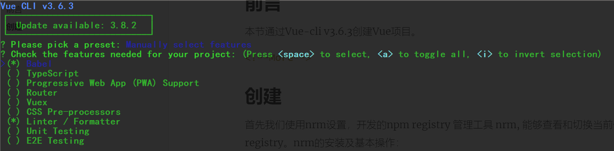
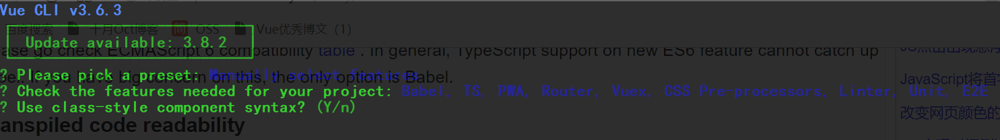
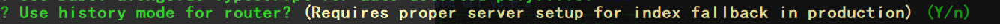
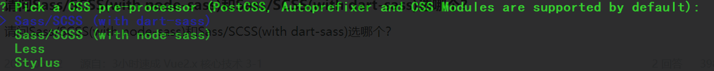
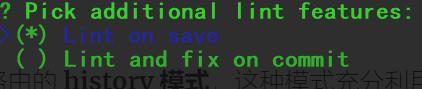
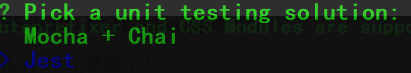
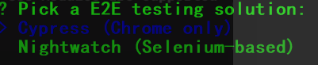
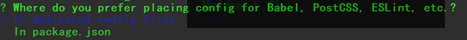

## 前言

本节通过Vue-cli v3.6.3创建Vue项目。

<!--More-->

## 创建

### nrm

首先我们使用nrm设置，开发的npm registry 管理工具 nrm, 能够查看和切换当前使用的registry。nrm的安装及基本操作：
```bash
npm install -g nrm
nrm ls
nrm use [name] # 我使用nrm use taobao
nrm help
nrm home [name] # 查看对应源的官网
```
### 第一步

创建Vue项目我们只需要

```bash
vue create family-manage
```

第一次会让我们选择`please pick a preset`，使用默认或者手动配置



这里就有必要一一看一下都是些什么东西了。

#### Babel

- 官网走一波：https://babeljs.io  

- 推荐一波优秀博文：https://www.cnblogs.com/gg1234/p/7168750.html 

- 搬运工：

babel官网正中间一行黄色大字写着“babel is a javascript compiler”，翻译一下就是babel是一个javascript转译器。为什么会有babel存在呢？原因是javascript在不断的发展，但是浏览器的发展速度跟不上。以es6为例，es6中为javascript增加了箭头函数、块级作用域等新的语法和Symbol、Promise等新的数据类型，但是这些语法和数据类型并不能够马上被现在的浏览器全部支持，为了能在现有的浏览器上使用js新的语法和新的数据类型，就需要使用一个转译器，将javascript中新增的特性转为现代浏览器能理解的形式。babel就是做这个方面的转化工作。

**显而易见我们应当选择Balbel**

#### TypeScript

一下内容来自于 <a href="https://www.cnblogs.com/hongten/p/hongten_typescript_01.html">[Hongten](https://home.cnblogs.com/u/hongten/)。</a>

TypeScript是JavaScript类型的超集，并且可以编译为纯JavaScript。在任何浏览器，集群（服务器），操作系统上面都可以运行，而且还开源。TypeScript的来源于微软的团队。

TypeScript 是 JavaScript 的强类型版本。然后在编译期去掉类型和特有语法，生成纯粹的 JavaScript 代码。由于最终在浏览器中运行的仍然是 JavaScript，所以 TypeScript 并不依赖于浏览器的支持，也并不会带来兼容性问题。


TypeScript 是 JavaScript 的超集，这意味着他支持所有的 JavaScript 语法。并在此之上对 JavaScript 添加了一些扩展，如 class / interface / module 等。这样会大大提升代码的可阅读性。使用过Java的同学就更能够明白这个道理。

 

强类型语言的优势在于静态类型检查，概括来说主要包括以下几点：


1) 静态类型检查

　　静态类型检查可以避免很多不必要的错误， 不用在调试的时候才发现问题 。

2) IDE 智能提示

　　在 TypeScript 这一类语言之前， JavaScript 的智能提示基本完全依赖 IDE 提供的猜测 (在猜测的质量上， Visual Studio 和 brackets 是我见过的最好的)。 局限性就是， 这种猜测可能并不正确， 并且也缺乏更多的辅助信息， 所以要正确使用一个类库， 得不断地在文档和 IDE 之间切换， 影响心情和效率。 而 TypeScript 不仅自己写的类库有丰富的类型信息， 也可以对其他纯 JS 项目进行类型标注 (DefinitelyTyped)， 便于使用者直接在 IDE 中浏览 API， 效率大增。 而对于自己的或者团队的代码， 好处也很明显。 团队的代码自己不一定能把各种接口记得滚瓜烂熟， 自己的代码如果规模大了也很难记全， 这个时候再去翻源文件。。。


3) 代码重构

　　且不说我这种经常纠结变量名的会时不时看某个变量名不顺眼， 改之的情况。 有时候的确需要修改一些变量/属性/方法名， 牵涉到属性和方法的时候， 很多改动是跨文件的， 不像普通变量可以简单定位 scope， 属性方法名的重命名对于 JS 来说异常痛苦， 一方面是修改本身就不方便， 另一方面是改了还不确定该改的是不是改了， 不该改的是不是也改了。 而 TypeScript 的静态类型系统就可以较为完美的解决这个问题 (这个地方还牵涉到一些最佳实践， 就暂不深入了)。


4) 可读性

对于阅读代码的人来讲， 各种便利的类型一目了然， 更容易明白作者的意图。
TypeScript 虽然是强类型语言，但是如果对象被声明为了 any 类型，就会忽略所有的类型检查。这种灵活的结构保证了他可以在保证整体有强类型检查优势的同时，在一些细节问题上保持弱类型的灵活。
TypeScript 本身是开源的，这意味着开发者可以自由修改其源代码，同时 TypeScript 的架构设计也很优秀，提供了充分的 API 接口方便开发者进行进一步扩展。顺便说一下，TypeScript 编译器本身是用 TypeScript 开发的。构建流程是先用旧版本的 TypeScirptCompiler。js 将新版本的 TypeScript Language 的 TypeScript源代码编译成新的 TypeScriptCompiler。js，听起来很厉害的样子。
由于其开源性，通过 TypeScript Compiler API，开发者可以自己实现编译器（比如添加增量编译和自动编译，大幅提升编译速度），自定义语法检查，以及自定义输出结构等。 由于编译器核心灵活的结构，开发者只需要简单的添加一些代码，就可以在 IDE 中支持 TypeScript 的诸多特性。
白鹭引擎是基于 TypeScript 的开源 HTML5 游戏引擎。白鹭引擎的后续版本会利用这些特性不断完善引擎自身。举例，我们的 IDE Egret Wing 就利用了 TypeScript Service API 实现了了代码智能提示等功能。文档生成工具也是通过扩展 TypeScript Compiler API 实现的。

我认为 TypeScript 是一项非常值得学习的新技术，由于他是 JavaScript 的超集，对 JavaScript 开发者来说入门门槛很低（相对于 Dart / CoffeeScript 等其他 JavaScript 变种来说 ）。

#### PWA

PWA：Progressive Web App，为什么我们要使用PWA呢？

- 搬运工：https://www.jianshu.com/p/098af61bbe04

PWA是Progressive Web App的英文缩写， 翻译过来就是渐进式增强WEB应用， 是Google 在2016年提出的概念，2017年落地的web技术。目的就是在移动端利用提供的标准化框架，在网页应用中实现和原生应用相近的用户体验的渐进式网页应用。

简单来说，如果你的项目，打算包装成一个APP，你可能需要这个技术。

#### Router

- 官方：https://router.vuejs.org/zh/

Vue Router 是 [Vue.js](http://cn.vuejs.org/) 官方的路由管理器。它和 Vue.js 的核心深度集成，让构建单页面应用变得易如反掌。包含的功能有：

- 嵌套的路由/视图表
- 模块化的、基于组件的路由配置
- 路由参数、查询、通配符
- 基于 Vue.js 过渡系统的视图过渡效果
- 细粒度的导航控制
- 带有自动激活的 CSS class 的链接
- HTML5 历史模式或 hash 模式，在 IE9 中自动降级
- 自定义的滚动条行为

这个比较基础了，我们肯定需要勾选的。

#### Vuex

每一个 Vuex 应用的核心就是 store（仓库）。“store”基本上就是一个容器，它包含着你的应用中大部分的**状态 (state)**。Vuex 和单纯的全局对象有以下两点不同：

1. Vuex 的状态存储是响应式的。当 Vue 组件从 store 中读取状态的时候，若 store 中的状态发生变化，那么相应的组件也会相应地得到高效更新。
2. 你不能直接改变 store 中的状态。改变 store 中的状态的唯一途径就是显式地**提交 (commit) mutation**。这样使得我们可以方便地跟踪每一个状态的变化，从而让我们能够实现一些工具帮助我们更好地了解我们的应用。

我们需要对用户的权限进行区别的话，在全局范围内进行标识，那么肯定需要用的到Vuex。

#### Css Pre-processors

Css预处理，我们常用的就是，[三个 CSS 预处理器：Sass、LESS 和 Stylus](https://www.cnblogs.com/wyd168/p/6605225.html)

CSS预处理器定义了一种新的语言，基本的思想是用一种专门的编程语言，开发者只需要使用这种语言进行编码工作，减少枯燥无味的CSS代码的编写过程的同时，它能让你的CSS具备更加简洁、适应性更强、可读性更加、层级关系更加明显、更易于代码的维护等诸多好处。

#### Linter / Formatter

我们一般使用ESLint来进行代码规范的设置

#### Testing

选择测试方式

1. 选择Unit测试方式
2. 选择E2E测试方式

这两者有什么区别呢？

<a href="http://www.51testing.com/index.php?action-viewnews-itemid-3720889-php-1">前端实现自动化就要借助到unit和e2e端到端[**测试**]了(javascript:;)</a>

　　**一.unit测试**

　　站在程序员的角度测试

　　unit测试是把代码看成是一个个的组件。从而实现每一个组件的单独测试，测试内容主要是组件内每一个函数的返回结果是不是和期望值一样。

　　例如：


　　而代码覆盖率是指代码中每一个函数的每一中情况的测试情况，上述测试的代码覆盖率是100%


　　这样代码覆盖率是50%，因为else情况没有测试到

　　**二.e2e测试**

　　站在用户角度的测试

　　e2e测试是把我们的程序堪称是一个黑盒子，我不懂你内部是怎么实现的，我只负责打开[**浏览器**](javascript:;)，把测试内容在页面上输入一遍，看是不是我想要得到的结果。

　　两者的存在都是很有意义的。

　　unit测试是程序员写好自己的逻辑后可以很容易的测试自己的逻辑返回的是不是都正确。

　　e2e代码是测试所有的需求是不是都可以正确的完成，而且最终要的是在代码重构，js改动很多之后，需要对需求进行测试的时候测试代码是不需要改变的，你也不用担心在重构后不能达到客户的需求。

### 第二步



提示我们“Use class-style component syntax”，那么这是是否使用class风格的组件语法


是否使用babel做转义，我们选择是



官方：https://router.vuejs.org/zh/guide/essentials/history-mode.html

vue-router` 默认 hash 模式 —— 使用 URL 的 hash 来模拟一个完整的 URL，于是当 URL 改变时，页面不会重新加载。

vue-route有两种模式：history模式和hash模式。

##### hash模式（vue-router默认hash模式）
hash模式背后的原理是onhashchange事件。

```js
window.onhashchange=function(){
 let hash=location.hash.slice(1);
 document.body.style.color=hash;
}
```

（localtion是js里管理地址栏的内置对象，是window对象的一部分，可通过window.localtion访问，在w3cshool里的详细介绍) 
由于hash发生变化的url都会被浏览器记录下来，使得浏览器的前进后退都可以使用了，尽管浏览器没有亲求服务器，但是页面状态和url关联起来。后来人们称其为前端路由，成为单页应用标配。

比如http://www.abc.com/#/index，hash值为#/index。hash模式的特点在于hash出现在url中，但是不会被包括在HTTP请求中，对后端没有影响，不会重新加载页面。

##### history模式

history模式利用了HTML5 History Interface中新增的pushState()和replaceState()方法。MDN相关介绍（需要特定浏览器支持）。这两个方法应用于浏览器的历史记录栈，提供了对历史记录进行修改的功能。只是当他们进行修改时，虽然修改了url，但浏览器不会立即向后端发送请求。 
当使用history模式时，url就像正常的url,例如http://abc.com/user/id相比hash模式更加好看。特别注意，history模式需要后台配置支持。如果后台没有正确配置，访问时会返回404。 
通过history api，我们丢弃了丑陋的#，但是有一个缺点，当刷新时，如果服务器中没有相应的相应或者资源，会分分钟刷出一个404来（刷新需要请求服务器）。所以history模式不怕前进，不怕后退，就怕刷新。

##### hash模式和history模式对比

pushState()设置新的url可以是和当前url**同源的任意url;hash只可修改#后面的部分，只能设置当前url同文档**的url。
pushState()设置的新url可与当前url一致，这样也会把记录添加到栈中；hash必须设置与当前url不同的url的，才会触发动作将记录添加到栈中。
pushState()通过stateObject参数可以添加任意类型的数据到记录中；hash只可添加短字符串。
pushState()可额外设置title属性供后续使用。
不过，hash模式也有比history模式优势的地方。

hash模式下，仅hash符号之前的url会被包含在请求中，后端如果没有做到对路由的全覆盖，也不会返回404错误。
history模式下，前端的url必须和实际向后端发起请求的url一致，如http://abc.com/user/id,后端如果没有对user/id的路由处理，将返回404错误。 
history模式官方文档
4.应用场景
**对于一般的Vue+Vue-router+Webpack+XXX形式1的Web开发场景，用history模式即可，后端用Apach或Nginx进行路由的简单配置，同时搭配前端路由的404页面支持。**
上述区别来自于<a href="https://blog.csdn.net/E_li_na/article/details/80212724 ">E_li_na </a>

如果不想要很丑的 hash，我们可以用路由的 **history 模式**，这种模式充分利用 `history.pushState` API 来完成 URL 跳转而无须重新加载页面。



据说Sass推荐使用dart-sass，最新的更新会放在这个里面，但是使用node-sass的也很多。



询问项目的什么时候校验格式(1是保存时，2是提交时)。



询问项目的测试框架，我就是用Jest了，因为我做测试不多，也不是很了解。



选择E2E的测试方式，注意第一个只能在Chrome上进行



询问项目的配置文件存放在哪儿（1是独立文件，2是在package.json）这里选择独立的文件，选择2在后续配置postcs适配时存在问题。

随后回车我们进行项目的构建


