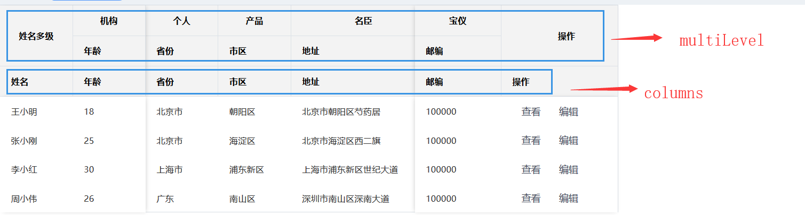
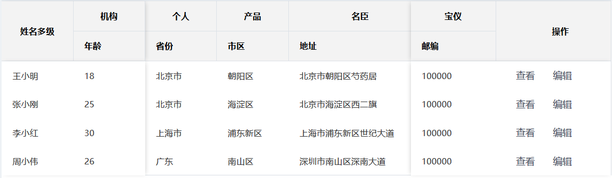
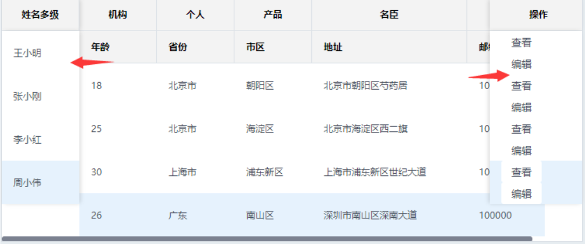
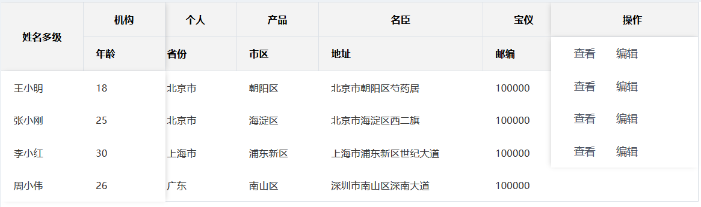
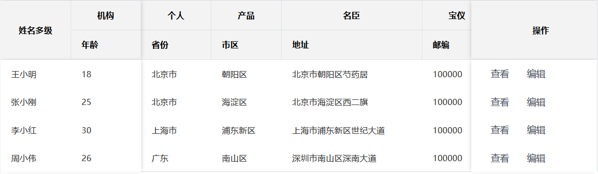

**目录**
[TOC]

## 前言

您好!

我是云毅网络的实习生李浩田(**liht28162**),最近在使用`HUI`中发现`table`组件的一些"问题",我不确定这个问题是我个人使用不当,理解不到位造成,还是确实存在这样的小问题,总结如下,如有问题,还请大家指点!

<!--More-->

## 需求描述

根据HUI文档中的代码，我们可以得到以下效果：



我的需求是`columns`不显示,并且固定在最右边显示的只有`操作栏`

不显示`columns`可以通过设置`css`实现:

```css
  .cur-th {
    display: none;
  }
```

现在的效果为:



## 问题描述

问题在于,当我把固定右边的`宝仪`和`邮编`取消其`fixed: 'right'`属性的时候,样式显示出了问题:

1. 这个问题只出现在`fixed: ''`不管是`left`还是`right`都存在
1. 这个问题只出现在只有一列固定列,且这个固定列**跨多行**
1. 这个问题表现为规定了跨两行显示,结果显示错误,具体效果如下

### **例一**:



>  这个问题确实困扰了很久,在群里找大家一起解决,也没有得到合适的解决方案

### **例二**:



`操作栏`本来设置为:

```js
          {
            title: '操作',
            cols: 1,
            rows: 2,
            align: 'center',
            fixed: 'right',
          },
```

显示两行一列,但是实际效果只有一行一列,为了解决这个问题,我修改为以下代码:

> 备注: `rows: '2'`和`rows: 2`没有区别

**原代码**:

```js
      multiLevel1: [
        [
          ... ...
          {
            title: '宝仪',
            cols: '1',
            align: 'center',
          },
          {
            title: '操作',
            cols: '1',
            rows: 2,
            align: 'center',
            fixed: 'right',
          },
        ],
        [
          ... ...
          {
            title: '邮编',
            width: 100,
          },
          {
            title: '操作',
            width: 100,
            fixed: 'right',
          },
        ],
      ],
```

## 问题解决

针对这个问题,我有一定的解决办法,但是这个办法只是暂时的,应该作为缺陷进行修复

**我的方案是添加一段代码**:

> 这段代码,我的理解是"**占位单元格**",可以解决问题

```js
{
    title: '',
    cols: 1,
    rows: 1,
    align: 'center',
    fixed: 'right',
},
```

**修改后代码**:

```js
      multiLevel1: [
        [
          ... ...
          {
            title: '宝仪',
            cols: '1',
            align: 'center',
          },
          {
            title: '操作',
            cols: '1',
            rows: 2,
            align: 'center',
            fixed: 'right',
          },
          {
            title: '',
            cols: 1,
            rows: 1,
            align: 'center',
            fixed: 'right',
          },
        ],
        [
          ... ...
          {
            title: '邮编',
            width: 100,
          },
          {
            title: '操作',
            width: 100,
            fixed: 'right',
          },
        ],
      ],
```

**修改后的效果:**



## 所有源码

我修改后的所有源代码:

```js
<template>
  <div>
    <h-table width="850"
             border
             :multiLevel="multiLevel1"
             :columns="columnsFixed"
             :data="dataFixed">
    </h-table>
  </div>
</template>
<script>
export default {
  data() {
    return {
      multiLevel1: [
        [
          {
            title: '姓名多级',
            cols: 1,
            rows: 2,
            align: 'center',
            fixed: 'left',
          },
          {
            title: '机构',
            cols: '1',
            align: 'center',
            fixed: 'left',
          },
          {
            title: '个人',
            cols: '1',
            align: 'center',
          },
          {
            title: '产品',
            cols: '1',
            align: 'center',
          },
          {
            title: '名臣',
            cols: '1',
            align: 'center',
          },
          {
            title: '宝仪',
            cols: '1',
            align: 'center',
          },
          {
            title: '操作',
            cols: '1',
            rows: 2,
            align: 'center',
            fixed: 'right',
          },
          {
            title: '',
            cols: 1,
            rows: 1,
            align: 'center',
            fixed: 'right',
          },
        ],
        [
          {
            title: '年龄',
            width: 100,
            fixed: 'left',
          },
          {
            title: '省份',
            width: 100,
          },
          {
            title: '市区',
            width: 100,
          },
          {
            title: '地址',
            width: 200,
          },
          {
            title: '邮编',
            width: 100,
          },
          {
            title: '操作',
            width: 100,
            fixed: 'right',
          },
        ],
      ],
      columnsFixed: [
        {
          title: '姓名',
          key: 'name',
          width: 100,
          fixed: 'left',
        },
        {
          title: '年龄',
          key: 'age',
          width: 100,
          fixed: 'left',
        },
        {
          title: '省份',
          key: 'province',
          width: 100,
        },
        {
          title: '市区',
          key: 'city',
          width: 100,
        },
        {
          title: '地址',
          key: 'address',
          width: 200,
        },
        {
          title: '邮编',
          key: 'zip',
          width: 100,
        },
        {
          title: '操作',
          key: 'action',
          fixed: 'right',
          width: 180,
          render: (h, params) => h('div', [
            h(
              'Button',
              {
                props: {
                  type: 'text',
                  size: 'small',
                },
              },
              '查看',
            ),
            h(
              'Button',
              {
                props: {
                  type: 'text',
                  size: 'small',
                },
              },
              '编辑',
            ),
          ]),
        },
      ],
      dataFixed: [
        {
          name: '王小明',
          age: 18,
          address: '北京市朝阳区芍药居',
          province: '北京市',
          city: '朝阳区',
          zip: 100000,
        },
        {
          name: '张小刚',
          age: 25,
          address: '北京市海淀区西二旗',
          province: '北京市',
          city: '海淀区',
          zip: 100000,
        },
        {
          name: '李小红',
          age: 30,
          address: '上海市浦东新区世纪大道',
          province: '上海市',
          city: '浦东新区',
          zip: 100000,
        },
        {
          name: '周小伟',
          age: 26,
          address: '深圳市南山区深南大道',
          province: '广东',
          city: '南山区',
          zip: 100000,
        },
      ],
    };
  },
};
</script>
<style>
  .cur-th {
    display: none;
  }
</style>

```

