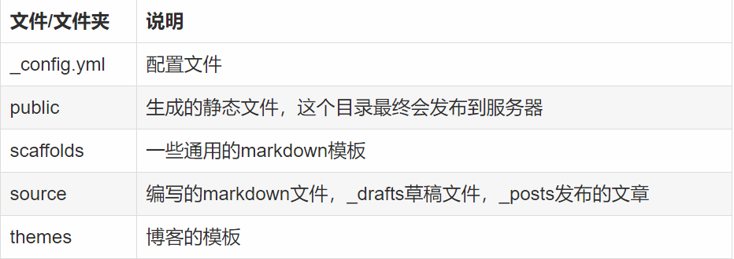
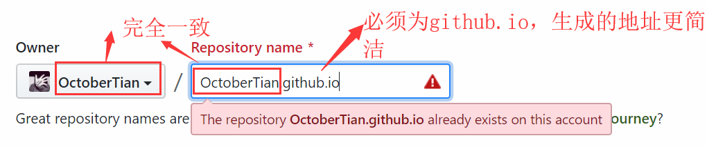
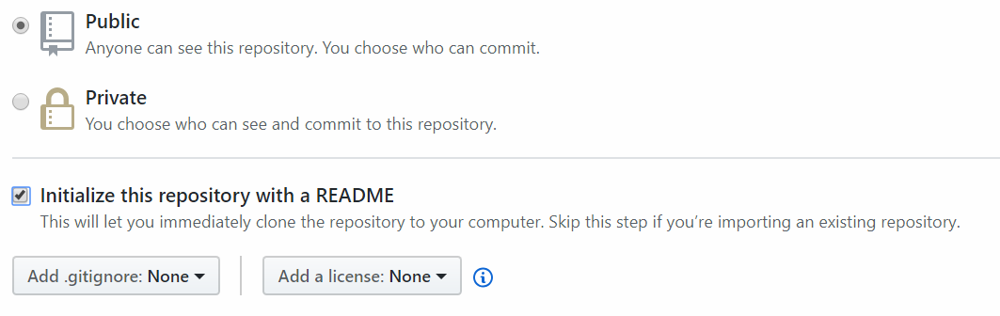
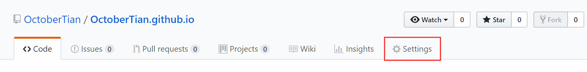
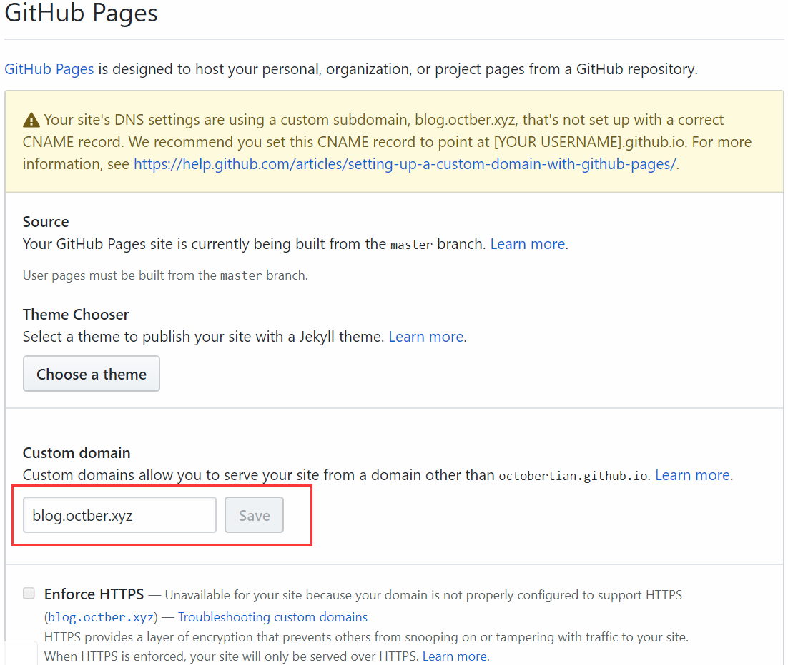
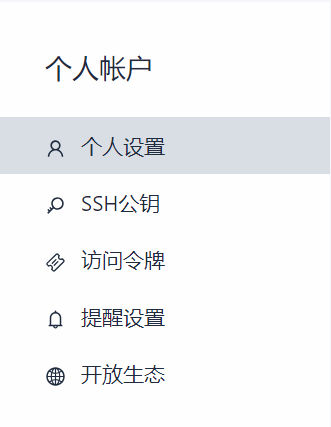
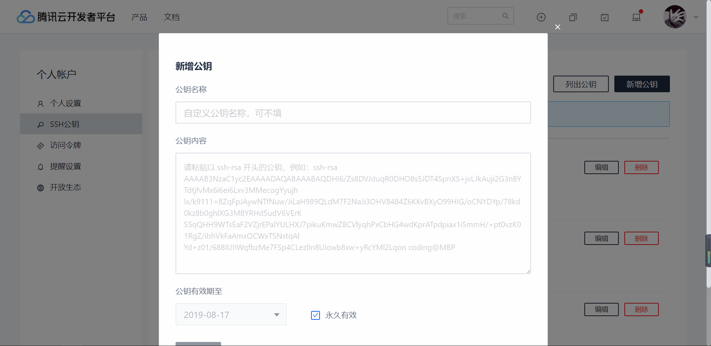
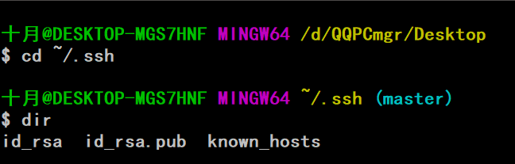

## Hexo

Hexo是一个快速、简洁而且高效的博客框架，他的优点也正是官网（https://hexo.io/zh-cn/）所说的：


- hexo 可以理解为是基于node.js制作的一个博客工具，不是我们理解的一个开源的博客系统。其中的差别，有点意思。

- hexo 正常来说，不需要部署到我们的服务器上，我们的服务器上保存的，其实是基于在hexo通过markdown编写的文章，然后hexo帮我们生成静态的html页面，然后，将生成的html上传到我们的服务器。简而言之：hexo是个静态页面生成、上传的工具。

- hexo 需要数据库吗？答案是不需要

- hexo 一定需要服务器部署吗？答案是我们可以选择Github Pages等工具实现，如果你有高性能的服务器，那一定更好。

  <!--more-->

## Hexo的源码结构



## Hexo的安装

#### 安装前提

- [Node.js](http://nodejs.org/) (Should be at least nodejs 6.9)
- [Git](http://git-scm.com/)

#### 安装命令

`npm install -g hexo-cli`或者

`cnpm install -g hexo-cli`

## Hexo建站

1. 创建你的博客文件夹，如：Hexo

2. 进入Hexo文件夹，执行以下命令

   ```bash
   hexo init
   cnpm install 或者 npm install
   ```

   这一步完成后你会看到这样的结构目录

   ```bash
   .
   ├── _config.yml
   ├── package.json
   ├── scaffolds
   ├── source
   |   ├── _drafts
   |   └── _posts
   └── themes
   ```

## Hexo基本配置

请看我的另一篇博文《Hexo配置文件详解》

## Github配置

#### 首先创建一个项目



建议生成默认的README文件



随后Create即可，进入Settings页面



我们可以看到一个强大的功能：Github Pages



Github Pages会自动部署我们的静态网页，我们可以通过http://youname.github.io来访问，当然如果你有已经备案过的域名，添加一个CNAME解析便可以使用自己的域名访问，注意我们可以使用一级域名，或者www和blog的二级域名，官方建议使用一级域名。


## Coding配置

与Github类似，需要注意的是，仓库名为`你的coding名.coding.me`,其他略。

## Hexo配置deploy

在项目根目录的_config.yml中配置deploy设置

```yml
deploy:
  type: git
  repo: 
    github: git@github.com:OctoberTian/OctoberTian.github.io.git
    coding: git@git.dev.tencent.com:OctCoding/OctCoding.coding.me.git
  branch: master
```

通过这一层配置，我们可以通过`hexo d`（等价于`hexo deploy`）命令将我们修改的内容推送到github上和coding上，这里使用SSH，使用Https也可以，建议使用SSH公钥。

#### SSH公钥

我们以Coding为例，如何在自己的电脑上部署SSH。（详情可查看官方文档：https://coding.net/help/doc/git/ssh-key.html）

进入个人设置，我们可以看到SSH公钥的功能



点击SSH公钥进入我们可以新增公钥：



这就要求我们电脑本地设置SSH公钥，并获取公钥内容

#### 随机位置打开git bash

```bash
cd ~/.ssh
cat id_rsa.pub #查看共要内容
```

如果看到下图，表明你已经生成过公钥：



直接查看id_rsa.pub复制内容到coding即可完成配置

如果没有目录，我们来创建公钥：

```bash
ssh-keygen -t rsa -C "your global email" 
cat ~/.ssh/id_rsa.pub
```

配置好这些，Hexo的安装就接近尾声了

## Hexo部署

详细的指令我会在之后的博文详细讲解，这里我们输入：`hexo clean && hexo g && hexo d`

可以看到我们的文件被推送到github或者coding或者两者上，值得一提的是，一个域名只能映射一个网址，比如我的是blog.octber.xyz映射到octcoding.coding.me上，coding为我强制转换为HTTPS访问，但是由于只能映射一个，所以没有映射github，在每次部署的时候github都会提示我域名存在问题，所以我选择了部署coding，毕竟github服务器在国外，速度比coding更为缓慢。

最终效果可以通过访问 `https://blog.octber.xyz`得到博客

