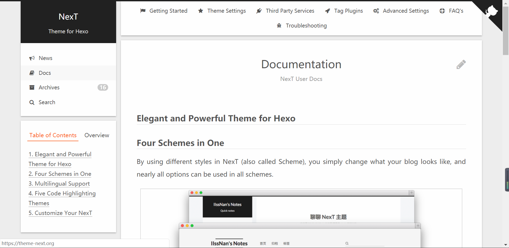
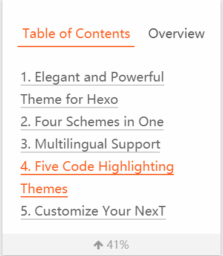
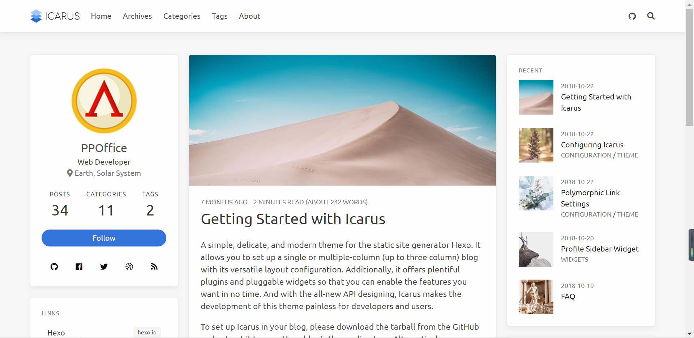
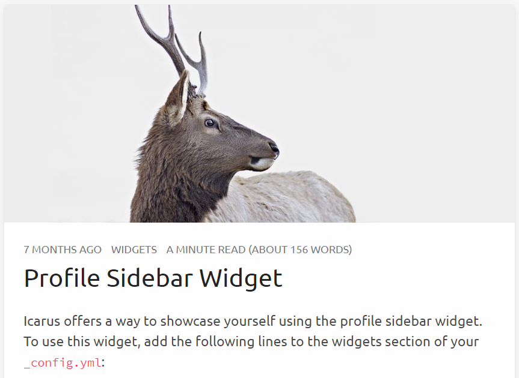
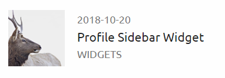
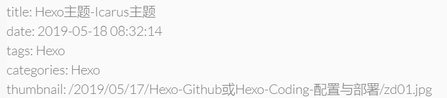

特别鸣谢
--------------------- 
作者：Aokilin 
来源：CSDN 
原文：https://blog.csdn.net/marvine/article/details/89816846 

## Hexo主题

说起主题，这里首先看官方的主题商店`https://hexo.io/themes/`

<!--More-->

不得不说，使用最广泛的主题并不是博主我用的主题，而是nexT：

<a href="https://theme-next.org/docs/">官方地址</a>



他的一个功能我非常喜欢，那就是左边显示文章的目录，并且点击可以跳转过去。



主题大气，耐看，确实是一个好的选择。

而我使用的是一个名为伊卡洛斯（Icarus）的主题：<a href="https://blog.zhangruipeng.me/hexo-theme-icarus/">官方地址</a>



我喜欢他的原因也很简单：

1. 文章主图很美观
2. 布局扁平化布局很好看
3. 小工具比较多，很丰富
4. 字体也很好看

## 配置文件

如果你和我一眼选用的伊卡洛斯，那么你可以继续往下看，看看我的主题配置

```yml
...
# 注意：language不知道为什么不起作用，需要改一些地方，请看**备注 1**
language: ch
...
# 注意：此处的menu本来是英文，不要指望他会按照语言变成中文，手动写成中文即可，请看**备注 1**
navbar:
    # Navigation bar menu links
    menu:
        主页: /
        归档: /archives
        分类: /categories
        标签: /tags
        关于: /about
    # Navigation bar links to be shown on the right
    links:
        My Github:
            icon: fab fa-github
            url: 'https://github.com/OctoberTian'
...
# 注意：如果你想让你的文章在new的时候有自动生成thumbnail等，可以在此设置。请看**备注 2**
article:
    # Code highlight theme
    # https://github.com/highlightjs/highlight.js/tree/master/src/styles
    highlight: atom-one-light
    # Whether to show article thumbnail images
    thumbnail: true
    # Whether to show estimate article reading time
    readtime: true
...
# 注意：这是开启评论功能，这一部分我会单独一篇博客讲Hexo中的插件和小功能，请持续关注
comment:
    # Name of the comment plugin
    type: valine
    app_id: ***
    app_key: ***
    notify: false
    verify: false
    placeholder: 看了这么久不评价一下吗？
    guest_info: nick,mail,link
    pagesize: 10
    shortname: 不能为空

...
# 注意：这是打赏功能，images文件夹是主题文件夹source下的images
donate:
    -
        # Donation entry name
        type: alipay
        # Qrcode image URL
        qrcode: '/images/wechat.png'
    -
        # Donation entry name
        type: wechat
        # Qrcode image URL
        qrcode: '/images/wechat.png'
    -
...
# 注意：这里是侧边栏的设置，sticky表示在你滑动文章时，左右侧边栏是否一起滑动
sidebar:
    # left sidebar settings
    left:
        # Whether the left sidebar is sticky when page scrolls
        sticky: false
    # right sidebar settings
    right:
        # Whether the right sidebar is sticky when page scrolls
        sticky: false
...
# 注意：两遍的小组件，由于三列显示会把文章列搞得太小，于是我把所有的部件都移动到了右边，会美观一点。
widgets:
    -
        # Widget name
        type: profile
        # Where should the widget be placed, left or right
        position: right
        # Author name to be shown in the profile widget
        author: October 十 月
        # Title of the author to be shown in the profile widget
        author_title: Coding Man
        # Author's current location to be shown in the profile widget
        location: China
        # Path or URL to the avatar to be shown in the profile widget
        avatar: 'http://file.octber.xyz/avatar.png'
        # Email address for the Gravatar to be shown in the profile widget
        gravatar: 'https://github.com/OctoberTian'
        # Whether to show avatar image rounded or square
        avatar_rounded: true
        # Path or URL for the follow button
        follow_link: 'https://github.com/OctoberTian'
        # Links to be shown on the bottom of the profile widget
        social_links:
            Github:
                icon: fab fa-github
                name: 'Github'
                url: 'https://github.com/OctoberTian'
            Coding:
                icon: fab fa-github
                name: 'Coding'
                url: 'https://dev.tencent.com/u/OctCoding'
    -
        # Widget name
        type: toc
        # Where should the widget be placed, left or right
        position: right
    -
        # Widget name
        type: category
        # Where should the widget be placed, left or right
        position: right
    -
        # Widget name
        type: tagcloud
        # Where should the widget be placed, left or right
        position: right
    -
        # Widget name
        type: recent_posts
        # Where should the widget be placed, left or right
        position: right
    -
        # Widget name
        type: archive
        # Where should the widget be placed, left or right
        position: right
    -
        # Widget name
        type: tag
        # Where should the widget be placed, left or right
        position: right
```

其他配置暂时设为默认，有兴趣可以自己调试一下。

#### 备注 1: 关于语言的问题

语言的坑我踩了很久，首先找到language文件夹，就在主题文件的根目录，我们可以看到，中文的对应yml是`zh_Ch`,英文是`en`，但是我在配置文件里修改了language为'zh_Ch'却怎么都不起作用，最后我发现这么一处代码：

打开layout下的layout.ejs:

```html
<html <%- has_config('language') ? ' lang="' + get_config('language').substring(0, 2) + '"' : '' %>>
```

可以看到，他从配置文件中取出对应language的配置，但是却subString(0, 2)，那么取出zh_Ch就会变成zh，于是我把language文件下的zh_Ch.yml文件名改成了ch.yml。

打开common/scripts.ejs看到

```html
<script>moment.locale("<%= get_config('language', 'en') %>");</script>
```

我把en改成ch

但是发现仍然不能变为中文，于是我直接把配置文件中Menu的内容手动改成中文，大功告成。

#### 备注 2： article

如何为我们的每篇文章添加主图呢？这个问题一直查不到，困扰了很久，其实就是配置thumbnail为true，我们只需要在文章的配置里，添加thumbnail还有图片目录，就可以生成文章主图，效果就是：





这样就非常的美观，但是你可能会遇到一个问题，图片无法加载，这确实是一个问题，路径如何选择，这个主题在生成静态文件的时候，按照时间`/year/month/day/name/picture`来找，所以我们需要手动加上前缀时间前缀，比如我这篇文章：



你可能还有一个问题，那就是每次都来写title，date，tags这些标签，非常的费劲，关于如何快速的写一篇博文我会单独作为一个博文来讲，请持续关注。


