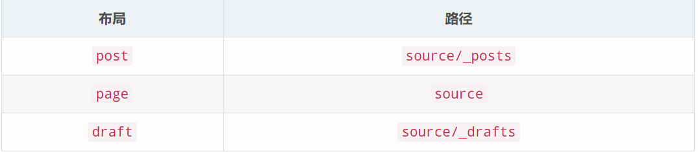
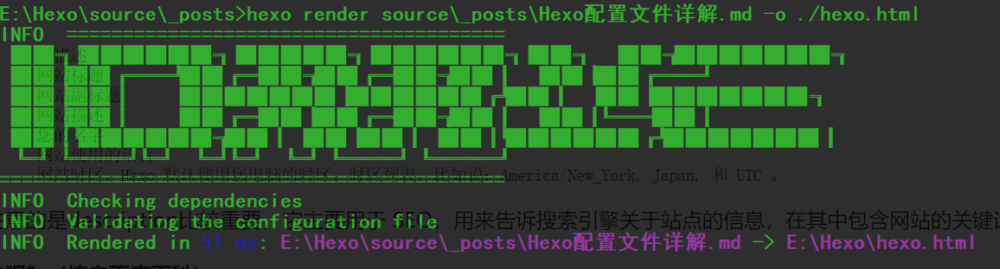
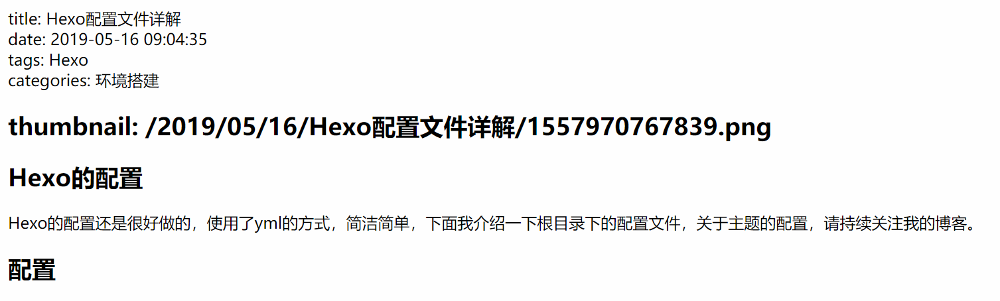
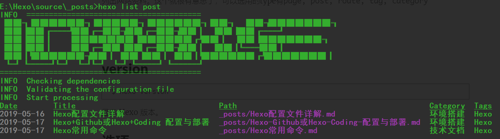
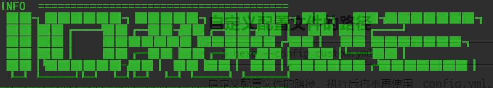

## 前言

学习一个东西，一门语言也好，一个框架也好，最好的方式就是查看官方文档与自己阅读源代码，其次是查阅优秀博文，再次是查阅相关学习课程与视频，独立学习能力是一个程序员适应时代发展最重要的能力。

本节，我结合实际使用，和官方文档，来讲一下Hexo的常用指令。

<!--More-->

## 文档本体

官方文档地址： https://hexo.io/zh-cn/docs/  

## init

```
$ hexo init [folder]
```

新建一个网站。如果没有设置 `folder` ，Hexo 默认在目前的文件夹建立网站。

## new

```
$ hexo new [layout] <title>
```

新建一篇文章。如果没有设置 `layout` 的话，默认使用 [_config.yml](https://hexo.io/zh-cn/docs/configuration) 中的 `default_layout` 参数代替。如果标题包含空格的话，请使用引号括起来。

```
$ hexo new "post title with whitespace"
```

这是我的配置文件中关于写博客的一些配置

```yml
# Writing
new_post_name: :title.md # File name of new posts
default_layout: post
titlecase: false # Transform title into titlecase
external_link: true # Open external links in new tab
filename_case: 0
render_drafts: false
post_asset_folder: true
relative_link: false
future: true
highlight:
  enable: true
  line_number: true
  auto_detect: false
  tab_replace:
```

我规定在生成新博客的时候采用标题加md的方式作为文件名，默认的layout为post，也就是在_post文件夹内创建我的markdown文件，Layout就是布局的意思，每个文件使用默认的布局又是什么意思呢？

打开Hexo根目录下的themes文件，你就会看到你所有的主题，打开你现在正在使用的主题，比如我的主题是伊卡洛斯（icarus），里面有一个名为Layout的文件夹，顾名思义，这就是布局文件了，打开下面的layout.ejs文件，我们可以看到它由这几个部分组成：

```html
<head>
    <%- partial('common/head') %>
</head>
```

头部，引入了common的head文件

```html
<%- partial('common/navbar', { page }) %>
```

navbar也就是导航栏部分

```html
<%- partial('common/widget', { position: 'left' }) %>
<%- partial('common/widget', { position: 'right' }) %>
```

中间部分，分为左边和右边

```html
<%- partial('common/footer') %>
```

页面尾部，他们都在common目录下

这些部分共同组成一个html文件，也就是说我们通过不同时间向Layout注入不同的内容来实现页面的跳转，这种单页面实现所有功能的结构并不少见，比如Vue也相类似。

每个Hexo站点基本上分为`index（首页）`、`post（文章详情页）`、`page（导航标签页）`、`archive（归档页）`、`category（类别页）`以及`tag（标签页）`，没错就是Layout文件夹下的几个文件。它们每个都代表一种布局，将它们用来替换掉`layout.ejs`文件里的`<%- body %>`就得到了各个布局的页面代码。

#### index首页布局

最后来看看`index.ejs`，它是首页布局，跟其他的布局还是不一样的。代码如下：

```html
<% page.posts.each(function(post){ %>
    <%- partial('common/article', { post, index: true }) %>
<% }); %>
<% if (page.total > 1) { %>
    <%- partial('common/paginator') %>
<% } %>
```

这一块什么意思？首先是一个循环语句，因为首页要显示出近期发布的几篇文章，引入局部模块的时候使用了[Local Variables（本地变量）](http://www.linux2me.com/2015/06/06/Hexo_Docs3.html#%EF%BC%883%EF%BC%89Local_Variables%EF%BC%88%E6%9C%AC%E5%9C%B0%E5%8F%98%E9%87%8F%EF%BC%89)的相关内容，这里是将`post页面变量`赋值给了本地变量`item`，换句话说，在`_partial/article.ejs`这个文件中所有的`item`变量都指的是`post页面变量`，里面使用了很多页面变量的一些键值，参考这里[页面变量](http://www.linux2me.com/2015/06/06/Hexo_Docs3.html#%EF%BC%882%EF%BC%89%E9%A1%B5%E9%9D%A2%E5%8F%98%E9%87%8F)看`article.ejs`的代码就容易多了。

#### 布局（Layout）
Hexo 有三种默认布局：post、page 和 draft，它们分别对应不同的路径，而您自定义的其他布局和 post 相同，都将储存到 source/_posts 文件夹。



默认为post布局，page是页面，draft是草稿。

## generate

```
$ hexo generate
```

生成静态文件。我们常常简写为`hexo g`，因为Coding/Github Pagas帮我们部署的正是静态文件，所以我们在每一次发布的时候都需要生成静态文件。

| 选项             | 描述                   |
| ---------------- | ---------------------- |
| `-d`, `--deploy` | 文件生成后立即部署网站 |
| `-w`, `--watch`  | 监视文件变动           |

该命令可以简写为

```
$ hexo g
```

我们可以通过`hexo g -d`在生成后制动部署，部署也就是按照配置文件中的deploy自动推到Coding/Github或者你的服务器上，推上去的便是你生成的静态文件。

## publish

```
$ hexo publish [layout] <filename>
```

发表草稿。

## server

```
$ hexo server
```

启动服务器。默认情况下，访问网址为： `http://localhost:4000/`。可以本地预览你的博客。

在你需要调整很多内容的时候你就可以通过这种方式快速看到你代码更改后的效果。

| 选项             | 描述                           |
| ---------------- | ------------------------------ |
| `-p`, `--port`   | 重设端口                       |
| `-s`, `--static` | 只使用静态文件                 |
| `-l`, `--log`    | 启动日记记录，使用覆盖记录格式 |

## deploy

```
$ hexo deploy
```

部署网站。

| 参数               | 描述                     |
| ------------------ | ------------------------ |
| `-g`, `--generate` | 部署之前预先生成静态文件 |

该命令可以简写为：

```
$ hexo d
```

和之前的用法相似，我们使用`hexo d -g`也是可以的

## render

```
$ hexo render <file1> [file2] ...
```

渲染文件。将我们的文章渲染成单个html文件。



最终打开hexo.html是这样的



效果并不是很好，没有很多css的包装，只是阅读还是可以的。

| 参数             | 描述         |
| ---------------- | ------------ |
| `-o`, `--output` | 设置输出路径 |

## migrate

```
$ hexo migrate <type>
```

从其他博客系统 [迁移内容](https://hexo.io/zh-cn/docs/migration)。不赘述，这个命令往往在我们需要迁移内容的时候再考虑学习。

## clean

```
$ hexo clean
```

清除缓存文件 (`db.json`) 和已生成的静态文件 (`public`)。

在某些情况（尤其是更换主题后），如果发现您对站点的更改无论如何也不生效，您可能需要运行该命令。

**毒比较大的时候，建议clean一下**

## list

```
$ hexo list <type>
```

列出网站资料。这个就很有意思了，可以选用的type有`page, post, route, tag, category`




## version

```
$ hexo version
```

显示 Hexo 版本。

## 选项

### 安全模式

```
$ hexo --safe
```

在安全模式下，**不会载入插件和脚本**。当您在安装新插件遭遇问题时，可以尝试以安全模式重新执行。

### 调试模式

```
$ hexo --debug
```

在终端中显示调试信息并记录到 `debug.log`。当您碰到问题时，可以尝试用调试模式重新执行一次，并 [提交调试信息到 GitHub](https://github.com/hexojs/hexo/issues/new)。

### 简洁模式

```
$ hexo --silent
```

隐藏终端信息。

### 自定义配置文件的路径

```
$ hexo --config custom.yml
```

自定义配置文件的路径，执行后将不再使用 `_config.yml`。这一点非常重要，但是要记住一旦执行，你就会发现原来的配置文件不能生效，如果你忘记了这件事，那么你可能始终想不通为什么自己的hexo坏了，只好重装。

### 显示草稿

```
$ hexo --draft
```

显示 `source/_drafts` 文件夹中的草稿文章。

### 自定义 CWD

```
$ hexo --cwd /path/to/cwd
```

自定义当前工作目录（Current working directory）的路径。

本次博文就先到这里，部分内容摘自官方文档。



