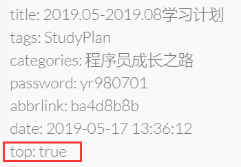
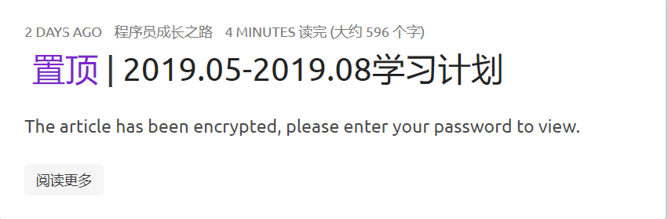
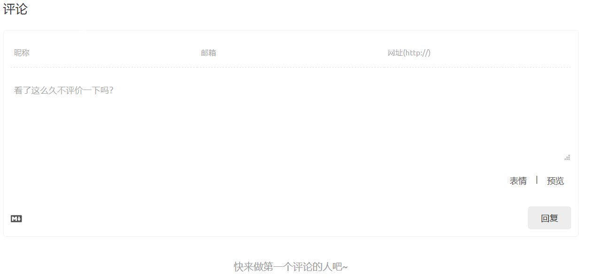

## 前言

想优雅的使用Hexo这个博客还是很不容易的，需要学会使用一些插件，而有的插件之间有一定的冲突，我们需要进行一些修改，才能完美的适配我们的博客。

<!--More-->

## hexo-abbrlink

原生的Hexo博客生成的目录是`:year/:month/:day/:title`，这就使得我们的url中携带大量中文，有些人通过`hexo new title`使用英文的title，这当然可行的，但是这不代表你的title就一定是唯一确定的，这也不方便日后对文章进行整理，也不方便我们推广，比如推广到百度站上，进行SEO是非常不方便的。

而这一款插件就可以为我们的文章生一个固定不变而且唯一的地址，就算你修改文章的title，也不会对url发生变化的插件。

我们只需要`npm install hexo-abbrlink --save`即可

随后在我们的主配置文件中进行相应的配置：

```yml
permalink: :year/:month/:day/:abbrlink.html
abbrlink:
  alg: crc32  # 算法：crc16(default) and crc32
  rep: hex    # 进制：dec(default) and hex
```

在使用了这个插件后，需要执行一次`hexo clean && hexo g`，否则之前的博文可能会变为undefined，需要先clean一下。

## *hexo*-asset-image

这一款插件是为我们为文章中插入图片提供方便的，我们需要在配置文件中启用：

```yml
post_asset_folder: true
```

安装方法是一样的:

```bash
npm install --save hexo-asset-image
```

安装好后当我们新建博文的时候，就会为我们在同级目录下生成一个名字为title的文件夹，存放在这个文件夹里面的图片，在我们部署后可以顺利显示。

## hexo-generator-index-pin-top

如果你想置顶某一篇博文的话，就用的上这个插件了，安装方式不说了，直接说怎么用：



最后在适当的地方，比如说我是在aiticles的标题处加上了置顶的代码：

```html
<% if (post.top) { %>
<i class="fa fa-thumb-tack"></i>
<font color=7D26CD>置顶</font>
<span class="post-meta-divider">|</span>
<% } %>
```

最终效果：



## hexo-wordcount

这是用于统计文章字数和阅读市场的插件，因为icarus已经有了这样的功能，所以我只提一下，

配置可以这样：

```yml
post_wordcount:
  item_text: true
  wordcount: true
  min2read: true
```

## hexo-baidu-url-submit

有一位大神写的特别好，我就看他配置的妥妥的，不说了，传送门：

<a href="https://hui-wang.info/2016/10/23/Hexo%E6%8F%92%E4%BB%B6%E4%B9%8B%E7%99%BE%E5%BA%A6%E4%B8%BB%E5%8A%A8%E6%8F%90%E4%BA%A4%E9%93%BE%E6%8E%A5/">Hexo插件之百度主动提交链接 </a>

## hexo-blog-encrypt

文章加密的插件，非常好用，也非常简单：

以下内容来自官方文档：

#### 具体的使用方法

##### 首先，你需要在 _config.yml 中启用该插件

```
# Security
##
encrypt:
    enable: true
```

##### 给文章添加密码：

```
---
title: hello world
date: 2016-03-30 21:18:02
tags:
    - fdsfadsfa
    - fdsafsdaf
password: Mike
abstract: Welcome to my blog, enter password to read.
message: Welcome to my blog, enter password to read.
---
```

- password: 是该博客加密使用的密码
- abstract: 是该博客的摘要，会显示在博客的列表页
- message: 这个是博客查看时，密码输入框上面的描述性文字

##### 对 TOC 进行加密

如果你有一篇文章使用了 TOC，你需要修改模板的部分代码。这里用 landscape 作为例子：

- 你可以在 *hexo/themes/landscape/layout/_partial/article.ejs* 找到 article.ejs。
- 然后找到 <% post.content %> 这段代码，通常在30行左右。
- 使用如下的代码来替代它:

```
<% if(post.toc == true){ %>
    <div id="toc-div" class="toc-article" <% if (post.encrypt == true) { %>style="display:none" <% } %>>
        <strong class="toc-title">Index</strong>
        <% if (post.encrypt == true) { %>
            <%- toc(post.origin, {list_number: true}) %>
        <% } else { %>
            <%- toc(post.content, {list_number: true}) %>
        <% } %>
    </div>
<% } %>
<%- post.content %>
```

##### 修改加密模板

- 如果你对默认的主题不满意，或者希望修改默认的提示和摘要内容，你可以添加如下配置在 *_config.yml* 中。

```
# Security
##
encrypt:
    enable: true
    default_abstract: the content has been encrypted, enter the password to read.</br>
    default_message: Please enter the password to read.
    default_template:
        <script src="https://cdnjs.cloudflare.com/ajax/libs/jquery/3.3.1/jquery.min.js"></script>
        <div id="hbe-security">
          <div class="hbe-input-container">
          <input type="password" class="hbe-form-control" id="pass" placeholder="{{message}}" />
            <label for="pass">{{message}}</label>
            <div class="bottom-line"></div>
          </div>
        </div>
        <div id="decryptionError" style="display:none;">{{decryptionError}}</div>
        <div id="noContentError" style="display:none;">{{noContentError}}</div>
        <div id="encrypt-blog" style="display:none">
        {{content}}
        </div>
```

- 可以看见，和上面的配置文件对比来看，多了 **default_template** 和 **default_abstract** 和 **default_message** 配置项。
  - default_abstract : 这个是指在文章列表页，我们看到的加密文章描述。当然这是对所有加密文章生效的。
  - default_message : 这个在文章详情页的密码输入框上方的描述性文字。
  - default_template : 这个是指在文章详情页，我们看到的输入密码阅读的模板，同理，这个也是针对所有文章的
    - 开始的解密部分需要由 div 包裹，而且 div 的 id **必须** 是 'hbe-security'，解密后以便于隐藏。
    - 最后的 content 显示 div 的 id **必须** 是 'encrypt-blog'，同时为了好看，也希望进行隐藏。
    - 同时，必须要有一个 input 输入框，id **必须**是"pass"，用来供用户输入密码。
    - 输入密码之后，务必要有一个触发器，用来调用 'decryptAES' 函数。样例中以 button 来触发。
- 如果你希望对某一篇特定的文章做特殊处理，这有两种方法可以达到这个效果, 在博客的源文件添加 template 配置:

```
---
title: hello world
date: 2016-03-30 21:18:02
tags:
    - fdsfadsfa
    - fdsafsdaf
password: Mike
abstract: Welcome to my blog, enter password to read.
message: Welcome to my blog, enter password to read.
template:
    <script src="https://cdnjs.cloudflare.com/ajax/libs/jquery/3.3.1/jquery.min.js"></script>
    <div id="hbe-security">
      <div class="hbe-input-container">
      <input type="password" class="hbe-form-control" id="pass" placeholder="{{message}}" />
        <label for="pass">{{message}}</label>
        <div class="bottom-line"></div>
      </div>
    </div>
    <div id="decryptionError" style="display:none;">{{decryptionError}}</div>
    <div id="noContentError" style="display:none;">{{noContentError}}</div>
    <div id="encrypt-blog" style="display:none">
    {{content}}
    </div>
---
```

##### 回调

如果您需要在文章解密之后调用一些代码，您可以参考以下配置：

```
encrypt:
  enable: true
  callback: |-
    initLightGallery()
    initImageResize()
    initTocBot()
```

> 在`callback` 之后的这个符号`|-`代表多行的yaml值

如果您在其他js文件里面定义了函数，您可以在这里调用它们，或者您也可以在`callback`这里写上您自己的代码逻辑，比如`$('#someId').lightGallery()`，上面的`initXXX()`只是示例，您不应该直接复制上面的配置。

## 卜算子ip计数统计

这个很简单，只需要加几行代码，不过我发现每次在打开网站时候都会卡这么一下，和这个貌似有关系，emmmm，所以我不是很喜欢这个。

传送门：<a href="https://www.jianshu.com/p/8a8f880f40c0">卜算子教程</a>

## leancloud-storage

这个比较麻烦，是添加comment评论的：Valine评论

请移步查看官方文档：http://www.zhaojun.im/hexo-valine-admin/

效果就是这样的：



好看是挺好看，不过没人评论就很尴尬emmm。。。

## hexo-abbrlink和hexo-asset-image冲突怎么办

在这两个同时使用的时候，图片会因为图片路由包含了文章名而无法显示，这就很难受，通通过修改`/node_modules/hexo-asset-image/index.js`修改了路由获取方式，成功显示了图片，因为修改的是依赖文件，所以当你删除了/node_modules或者你还了电脑重新拉了项目进行npm install的时候，这部分代码就没有了，记得备份好，那么我修改的内容是：

```js
'use strict';
var cheerio = require('cheerio');

// http://stackoverflow.com/questions/14480345/how-to-get-the-nth-occurrence-in-a-string
function getPosition(str, m, i) {
  return str.split(m, i).join(m).length;
}

hexo.extend.filter.register('after_post_render', function(data){
  var config = hexo.config;
  if(config.post_asset_folder){
    var link = data.permalink;
	// 第一处改动
	link = link.replace('.html', '/');
	var beginPos = getPosition(link, '/', 3) + 1;
	// In hexo 3.1.1, the permalink of "about" page is like ".../about/index.html".
	var endPos = link.lastIndexOf('/') + 1;
    link = link.substring(beginPos, endPos);

    var toprocess = ['excerpt', 'more', 'content'];
    for(var i = 0; i < toprocess.length; i++){
      var key = toprocess[i];
 
      var $ = cheerio.load(data[key], {
        ignoreWhitespace: false,
        xmlMode: false,
        lowerCaseTags: false,
        decodeEntities: false
      });

      $('img').each(function(){
		// For windows style path, we replace '\' to '/'.
        var src = $(this).attr('src').replace('\\', '/');
        if(!/http[s]*.*|\/\/.*/.test(src)){
		  // For "about" page, the first part of "src" can't be removed.
		  // In addition, to support multi-level local directory.
		  var linkArray = link.split('/').filter(function(elem){
		    return elem != '';
		  });
		  var srcArray = src.split('/').filter(function(elem){
		    return elem != '';
		  });
		  if(linkArray[linkArray.length - 1] == srcArray[0]) {
		    srcArray.shift();
		  }
		  // 第二处改动
		  srcArray.shift();
          src = srcArray.join('/');
          $(this).attr('src', '/' + link + src);
        }
      });
      data[key] = $.html();
    }
  }
});

```

一共两处修改，第一处是将路由中的.html变为/，这是因为我在设置文章访问路由的时候设置为了`permalink: :year/:month/:day/:abbrlink.html`，所以要去掉html换为/，气候添加了一个`srcArray.shift()`这个的作用是删除数组中的第一个元素，删除的正是中文标题的名字，这一层目录是多余的。

如果你存在问题，请在下面评论，或者联系我的邮箱：925474088@qq.com