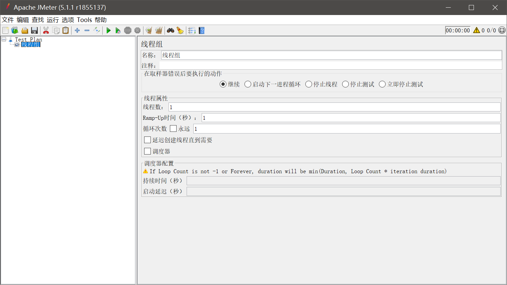
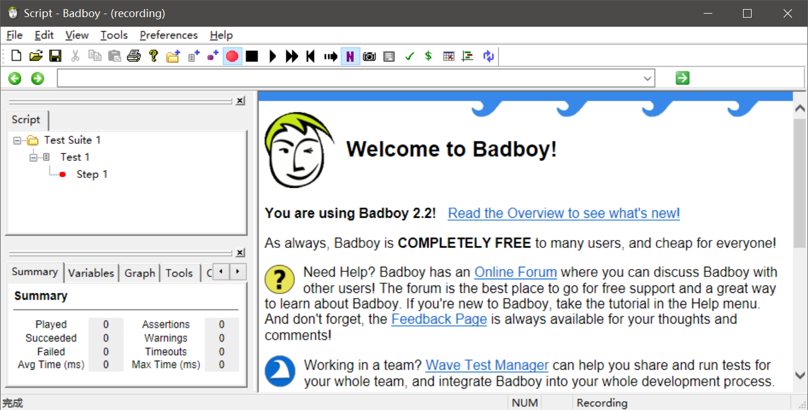
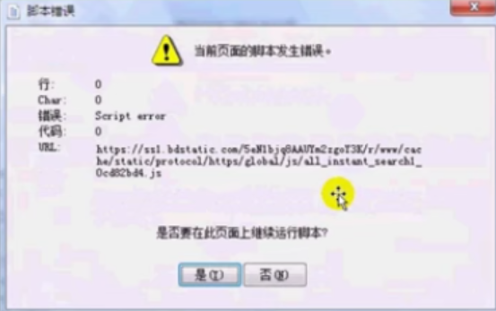
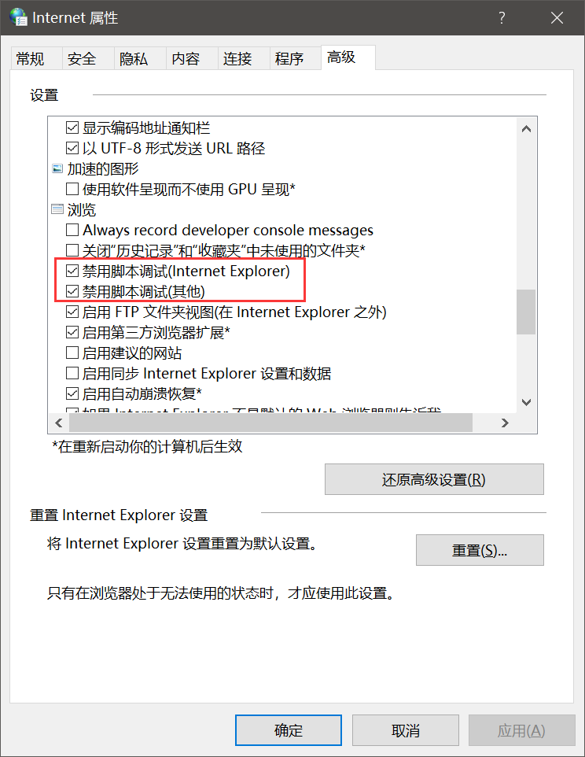
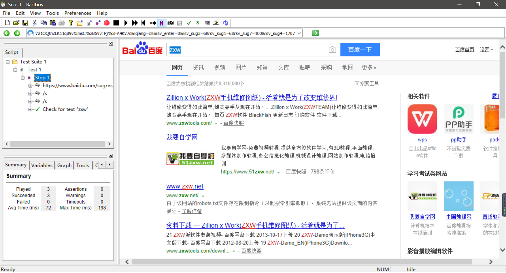
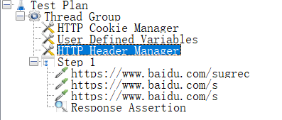

## 什么是JMeter

Apache JMeter是Apache组织开放源代码的项目，是一个纯Java的桌面应用，用于压力测试和性能测试，他最初被设计用于web应用测试，但后来扩展到其他测试领域，用于分析不同压力条件下的总体性能情况。

<!--More-->

## 获取JMeter

1. JDK > 1.8
2. 官方下载

## 首先设置语言为中文

> options->select language->Chinese

## JMeter目录

- bin：可执行文件
  - jmeter.bat是windows的启动文件
  - jmeter.log是日志文件
  - jmeter.sh是Linux的启动文件
  - jmeter.propertis是配置文件
  - jmeter-server.bat是windows分布式测试要用到的服务器配置
  - jmeter-serve是linux分布式测试要用到的服务器配置
- docs：接口文档目录
- extras：拓展插件目录
- lib：所用到的插件目录，里面全是jar包，jmeter会自动在JMETER_HOME/lib和ext目录下寻找需要的类。
- Licenses：jmeter的证书目录
- printable_docs：用户使用手册

## JMeter工具组成部分

- 资源生成器：用于生成测试过程中服务器，负载机的资源代码
- 用户运行器：通常是一个脚本运行引擎，根据脚本要求模拟指定用户行为
- 报表生成器：根据测试中实时的数据生成报表，提供可视化数据显示
- 负载发生器：用于产生负载，通常以多线程或是多进程的方式模拟用户行为

#### Test Plan 测试计划

用来描述一个性能测试，包含与本次性能测试所有相关的功能。也就是说性能测试的所有内容是基于一个**计划**的。

## Threads（Users）线程 用户

> Test Plan->添加->线程（用户）->setUp线程组

#### setup thread group

一种特殊类型的ThreadGroup，可用于执行**预测试**操作，这些线程的行为完全想一个正常的线程组远见。不同的是，这些类型的线程执行测试前进行定期线程组的执行，类似init()的功能。

> Test Plan->添加->线程（用户）->tearDown线程组

#### tearDown thread group

一种特殊类型的ThreadGroup，可用于执行*测试后*动作，类似于end()

> Test Plan->添加->线程（用户）->线程组

#### thread group

这个就是我们通常添加运行的线程，可以看做一个虚拟用户组，线程组中的每一个线程都可以理解为一个虚拟用户，线程组中包含的线程数量在测试执行过程中是不会发生改变的，类似action()

添加线程组后的界面：

## 测试片段 Test Fragment

> Test Plan->添加->测试片段->测试片段

测试片段元素是控制器上的一个特殊的线程组，他与线程组的不同的是他**不被执行**，除非他是一个木块控制器或者是被控制器被引用才会执行

## 配置元件 Config Element

> Test Plan->添加->配置元件

用于提供对**静态数据**配置的支持，如CSV Data Set Config 可以将本地数据文件形成数据池Data Pool

## 定时器 Timer

> Test Plan->添加->定时器

定时器用于操作之间设置**等待时间**，等待时间是性能测试中常用的控制客户端QPS的手段，类似于“思考时间”，比如我们设置在1000个线程没有启动完之前不进行操作等。

## 前置处理器 Per Processors

> Test Plan->添加->前置处理器

用于在实际的请求发出之前对**即将发出的请求**进行特殊处理。比如对HTTP URL重写修复符这可以实现URL重写。

## 后置处理器 Post Processors

> Test Plan->添加->后置处理器

用于对发出请求后得到的响应数据进行处理，一般用来提取相应中的特定数据。

## 断言 Assertions

> Test Plan->添加->断言

断言用于检查测试中得到的响应数据是否符合预期，一般用来设置检查点，用以保证性能测试过程中的数据交互是否与预期一致。

## 监听器 Listener

> Test Plan->添加->监听器

是用来对**测试结果数据**进行处理和可视化展示的一系列元件。比如图形结果，查看结果树，聚合报告等。

## 取样器 Sample

> 线程组->添加->取样器

性能测试中向服务器发送请求，记录响应信息，记录响应时间的最小单元，JMeter原生支持多种不同的sampler，如HTTP Request Sampler，FTP，TCP，JDBC等。

## 逻辑控制器

> 线程组->添加->逻辑控制器

- 控制test plan中sampler节点发送请求的逻辑顺序的控制器，常用的有if控制器，switch controller等控制器
- 还有一类，用于控制sampler来节点的，如事务控制器，吞吐量控制器

## Jmeter脚本录制

#### 使用BadBoy录制

官方下载地址： http://www.badboy.com.au/download/

#### BadBoy是什么？

他是一个强大的工具，旨在帮助测试和开发复杂的动态应用。

我们可以方便的开始录制，输入url地址，回车访问，就开始录制你所有的动作。

#### 使用

我们可以在file->export为jmeter的格式（.jmx），随后jmeter导入进来，就可以看到之前操作的所有step。并且可以进行相应的回放。

## BadBoy 检查点与参数化

#### 检查点（断言）设置

选择要检查的文字，然后再Tools->step1里添加断言，再回放

> Tools->Add Assertion for Selection

添加断言，会生成一个check for XXX

#### 录制问题

在录制过程中如果报这个错误：

其实这不是什么问题，并不影响录制，如果想要关闭这个，我们可以找到对应的浏览器，进入Internet配置中在高级中选上下面的两个属性即可

#### 录制界面

#### 导入JMeter

我们可以看到我们录制操作时候的step完全呈现在了Jmeter中

#### 参数化

