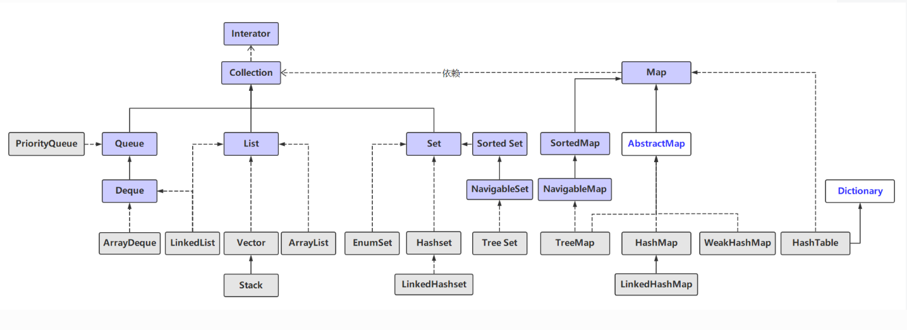

## 前言

Java中的集合和线程安全

<!--More-->

# 集合框架

Java集合框架 (Java Collections Framework, JCF) 也称容器，这里可以类比 C++ 中的 STL

Java集合框架提供了数据持有对象的方式，提供了对数据集合的操作。Java 集合框架位于 ` java.util` 包下，主要有三个大类：**Collection(接口)**、**Map(接口)**、**集合工具类**。



## Collection

- `ArrayList`：**线程不同步**。默认初始容量为 10，当数组大小不足时容量扩大为 1.5 倍。为追求效率，ArrayList 没有实现同步（synchronized），如果需要多个线程并发访问，用户可以手动同步，也可使用 Vector 替代。 
- `LinkedList`：**线程不同步**。**双向链接实现**。LinkedList 同时实现了 List 接口和 Deque 接口，也就是说它既可以看作一个顺序容器，又可以看作一个队列（Queue），同时又可以看作一个栈（Stack）。这样看来，LinkedList 简直就是个全能冠军。当你需要使用栈或者队列时，可以考虑使用 LinkedList，一方面是因为 Java 官方已经声明不建议使用 Stack 类，更遗憾的是，Java 里根本没有一个叫做 Queue 的类（它是个接口名字）。关于栈或队列，现在的首选是 ArrayDeque，它有着比 LinkedList（当作栈或队列使用时）有着更好的性能。 
- `Stack and Queue`：Java 里有一个叫做 Stack 的类，却没有叫做 Queue 的类（它是个接口名字）。当需要使用栈时，Java 已不推荐使用 Stack，而是推荐使用更高效的 ArrayDeque；既然 Queue 只是一个接口，当需要使用队列时也就首选 ArrayDeque 了（次选是 LinkedList ）。 
- `Vector`：**线程同步**。默认初始容量为 10，当数组大小不足时容量扩大为 2 倍。它的同步是通过 `Iterator` 方法加 `synchronized` 实现的。
- `Stack`：**线程同步**。继承自 Vector，添加了几个方法来完成栈的功能。现在已经不推荐使用 Stack，在栈和队列中有限使用 ArrayDeque，其次是 LinkedList。
- `TreeSet`：**线程不同步**，内部使用 `NavigableMap` 操作。默认元素 “自然顺序” 排列，可以通过 `Comparator` 改变排序。TreeSet 里面有一个 TreeMap（适配器模式）
- `HashSet`：**线程不同步**，内部使用 HashMap 进行数据存储，提供的方法基本都是调用 HashMap 的方法，所以两者本质是一样的。集合元素可以为 NULL。
- `Set`：Set 是一种不包含重复元素的 Collection，Set 最多只有一个 null 元素。Set 集合通常可以通过 Map 集合通过适配器模式得到。
- `PriorityQueue`：Java 中 PriorityQueue 实现了 Queue 接口，不允许放入 null 元素；其通过堆实现，具体说是通过完全二叉树（complete binary tree）实现的**小顶堆**（任意一个非叶子节点的权值，都不大于其左右子节点的权值），也就意味着可以通过数组来作为 PriorityQueue 的底层实现。 
  - **优先队列的作用是能保证每次取出的元素都是队列中权值最小的**（Java 的优先队列每次取最小元素，C++ 的优先队列每次取最大元素）。这里牵涉到了大小关系，**元素大小的评判可以通过元素本身的自然顺序（natural ordering），也可以通过构造时传入的比较器**（*Comparator*，类似于 C++ 的仿函数）。 
- `NavigableSet`：添加了搜索功能，可以对给定元素进行搜索：小于、小于等于、大于、大于等于，放回一个符合条件的最接近给定元素的 key。
- `EnumSet`：线程不同步。内部使用 Enum 数组实现，速度比 `HashSet` 快。**只能存储在构造函数传入的枚举类的枚举值**。

## Map

> 关于红黑树可参考: https://www.jianshu.com/p/e136ec79235c

- `TreeMap`：**线程不同步**，基于 **红黑树** （Red-Black tree）的 NavigableMap 实现，能够把它保存的记录根据键排序，默认是按键值的升序排序，也可以指定排序的比较器，当用 Iterator 遍历 TreeMap 时，得到的记录是排过序的。
  - **TreeMap 底层通过红黑树（Red-Black tree）实现**，也就意味着 `containsKey()`, `get()`, `put()`, `remove()` 都有着 `log(n)` 的时间复杂度。其具体算法实现参照了《算法导论》。
- `HashTable`：**线程安全**，HashMap 的迭代器 \(Iterator\) 是 `fail-fast` 迭代器。**HashTable 不能存储 NULL 的 key 和 value。**
- `HashMap`：**线程不同步**。根据 `key` 的 `hashcode` 进行存储，内部使用静态内部类 `Node` 的数组进行存储，默认初始大小为 16，每次扩大一倍。当发生 Hash 冲突时，采用拉链法（链表）。JDK 1.8中：**当单个桶中元素个数大于等于8时，链表实现改为红黑树实现；当元素个数小于6时，变回链表实现。由此来防止hashCode攻击。**
  - Java HashMap 采用的是冲突链表方式。  
  - HashMap 是 Hashtable 的轻量级实现，可以接受为 null 的键值 (key\) 和值 \(value\)，而 Hashtable 不允许。
- `LinkedHashMap`：**保存了记录的插入顺序**，在用 Iterator 遍历 LinkedHashMap 时，先得到的记录肯定是先插入的。也可以在构造时用带参数，按照应用次数排序。在遍历的时候会比 HashMap 慢，不过有种情况例外，当 HashMap 容量很大，实际数据较少时，遍历起来可能会比 LinkedHashMap 慢，因为 LinkedHashMap 的遍历速度只和实际数据有关，和容量无关，而 HashMap 的遍历速度和他的容量有关。
- `WeakHashMap`：从名字可以看出它是某种 Map。它的特殊之处在于 WeakHashMap 里的 entry 可能会被 GC 自动删除，即使程序员没有调用 `remove()` 或者 `clear()` 方法。 WeakHashMap 的存储结构类似于HashMap
  - 既然有 WeekHashMap，是否有 WeekHashSet 呢？答案是没有！不过 Java Collections 工具类给出了解决方案，`Collections.newSetFromMap(Map<E,Boolean> map)` 方法可以将任何 Map包装成一个Set。


## 工具类

- `Collections`、`Arrays`：集合类的一个工具类帮助类，其中提供了一系列静态方法，用于对集合中元素进行排序、搜索以及线程安全等各种操作。

- `Comparable`、`Comparator`：一般是用于对象的比较来实现排序，两者略有区别。

  > - 类设计者没有考虑到比较问题而没有实现 Comparable 接口。这是我们就可以通过使用 Comparator，这种情况下，我们是不需要改变对象的。
  > - 一个集合中，我们可能需要有多重的排序标准，这时候如果使用 Comparable 就有些捉襟见肘了，可以自己继承 Comparator 提供多种标准的比较器进行排序。

**说明**：线程不同步的时候可以通过，`Collections.synchronizedList() `方法来包装一个线程同步方法

# 线程安全

> 太喜欢这个大哥的文章了: https://www.cnblogs.com/deky97/p/11024527.html

## 1. 为什么大多数的集合类不是线程安全的？

`ArrayList, LinkedList, HashMap, HashSet, TreeMap, TreeSet`等等都不是线程安全的,事实上,所有的集合类（除了`Vector和HashTable`以外）在`java.util`包中都不是线程安全的，只遗留了两个实现类（`Vector和HashTable`）是线程安全的

> 线程安全的有: `ConcurrentHashMap/Vector/HashTable/Stack`

在使用1000万个元素进行测试`Vector`和`ArrayList`发现`ArrayList`的时间是`Vector`的一般,效率是其的两倍,甚至更多

## 2. 快速失败迭代器(Fail-Fast Iterators)

在使用集合的时候，你也要了解到迭代器的并发策略：Fail-Fast Iterators
 看下以后代码片段，遍历一个String类型的集合：

```java
List<String> listNames = Arrays.asList("Tom", "Joe", "Bill", "Dave", "John");
 
Iterator<String> iterator = listNames.iterator();
 
while (iterator.hasNext()) {
    String nextName = iterator.next();
    System.out.println(nextName);
}
```

这里我们使用了Iterator来遍历list中的元素，试想下`listNames`被两个线程共享：一个线程执行遍历操作，在还没有遍历完成的时候，第二线程进行修改集合操作（添加或者删除元素），你猜测下这时候会发生什么？
 遍历集合的线程会立刻抛出异常“`ConcurrentModificationException`”，所以称之为：快速失败迭代器（随便翻的哈，没那么重要，理解就OK）
 为什么迭代器会如此迅速的抛出异常？
 因为当一个线程在遍历集合的时候，另一个在修改遍历集合的数据会非常的危险：集合可能在修改后，有更多元素了，或者减少了元素又或者一个元素都没有了。所以在考虑结果的时候，选择抛出异常。而且这应该尽可能早的被发现，这就是原因。（反正这个答案不是我想要的~）

下面这段代码演示了抛出：`ConcurrentModificationException`

```java
import java.util.*;
 
/**
 * This test program illustrates how a collection's iterator fails fast
 * and throw ConcurrentModificationException
 * @author www.codejava.net
 *
 */
public class IteratorFailFastTest {
 
    private List<Integer> list = new ArrayList<>();
 
    public IteratorFailFastTest() {
        for (int i = 0; i < 10_000; i++) {
            list.add(i);
        }
    }
 
    public void runUpdateThread() {
        Thread thread1 = new Thread(new Runnable() {
 
            public void run() {
                for (int i = 10_000; i < 20_000; i++) {
                    list.add(i);
                }
            }
        });
 
        thread1.start();
    }
 
 
    public void runIteratorThread() {
        Thread thread2 = new Thread(new Runnable() {
 
            public void run() {
                ListIterator<Integer> iterator = list.listIterator();
                while (iterator.hasNext()) {
                    Integer number = iterator.next();
                    System.out.println(number);
                }
            }
        });
 
        thread2.start();
    }
 
    public static void main(String[] args) {
        IteratorFailFastTest tester = new IteratorFailFastTest();
 
        tester.runIteratorThread();
        tester.runUpdateThread();
    }
}
```

如你所见，在thread1遍历list的时候，thread2执行了添加元素的操作，这时候异常被抛出。
 需要注意的是，使用iterator遍历list，快速失败的行为是为了让我更早的定位问题所在。我们不应该依赖这个来捕获异常，因为快速失败的行为是没有保障的。这意味着如果抛出异常了，程序应该立刻终止行为而不是继续执行。
 现在你应该了解到了`ConcurrentModificationException`是如何工作的，而且最好是避免它。

## 3. 同步封装器

当然我们不能使用线程不安全的集合在多线程环境下，这样做会导致出现我们期望的结果。我们可以手动自己添加synchronized代码块来确保安全，但是使用自动线程安全的线程比我们手动更为明智。
 你应该已经知道，Java集合框架提供了工厂方法创建线程安全的集合，这些方法的格式如下：

```java
Collections.synchronizedXXX(collection)
```

这个工厂方法封装了指定的集合并返回了一个线程安全的集合。XXX可以是`Collection、List、Map、Set、SortedMap`和`SortedSet`的实现类。比如下面这段代码创建了一个线程安全的列表：

```java
List<String> safeList = Collections.synchronizedList(new ArrayList<>());
```

如果我们已经拥有了一个线程不安全的集合，我们可以通过以下方法来封装成线程安全的集合：

```java
Map<Integer, String> unsafeMap = new HashMap<>();
Map<Integer, String> safeMap = Collections.synchronizedMap(unsafeMap);
```

如你锁看到的，工厂方法封装指定的集合，返回一个线程安全的结合。事实上接口基本都一直，只是实现上添加了`synchronized`来实现。所以被称之为：同步封装器。后面集合的工作都是由这个封装类来实现。

提示：
 在我们使用iterator来遍历线程安全的集合对象的时候，我们还是需要添加synchronized字段来确保线程安全，因为Iterator本身并不是线程安全的，请看代码如下：

```java
List<String> safeList = Collections.synchronizedList(new ArrayList<>());
 
// adds some elements to the list
 
Iterator<String> iterator = safeList.iterator();
 
while (iterator.hasNext()) {
    String next = iterator.next();
    System.out.println(next);
}
```

事实上我们应该这样来操作：

```java
synchronized (safeList) {
    while (iterator.hasNext()) {
        String next = iterator.next();
        System.out.println(next);
    }
}
```

同时提醒下，Iterators也是支持快速失败的。
尽管经过类的封装可保证线程安全，但是他们依然有着自己的缺点，具体见下面部分。

## 4. 并发集合

一个关于同步集合的缺点是，用集合的本身作为锁的对象。这意味着，在你遍历对象的时候，这个对象的其他方法已经被锁住，导致其他的线程必须等待。其他的线程无法操作当前这个被锁的集合，只有当执行的线程释放了锁。这会导致开销和性能较低。
 这就是为什么jdk1.5+以后提供了并发集合的原因，因为这样的集合性能更高。并发集合类并放在java.util.concurrent包下，根据三种安全机制被放在三个组中。

- 第一种为：写时复制集合：这种集合将数据放在一成不变的数组中；任何数据的改变，都会重新创建一个新的数组来记录值。这种集合被设计用在，读的操作远远大于写操作的情景下。有两个如下的实现类：CopyOnWriteArrayList 和 CopyOnWriteArraySet.
   需要注意的是，写时复制集合不会抛出ConcurrentModificationException异常。因为这些集合是由不可变数组支持的，Iterator遍历值是从不可变数组中出来的，不用担心被其他线程修改了数据。
- 第二种为：比对交换集合也称之为CAS（Compare-And-Swap）集合：这组线程安全的集合是通过CAS算法实现的。CAS的算法可以这样理解：
   为了执行计算和更新变量，在本地拷贝一份变量，然后不通过获取访问来执行计算。当准备好去更新变量的时候，他会跟他之前的开始的值进行比较，如果一样，则更新值。
   如果不一样，则说明应该有其他的线程已经修改了数据。在这种情况下，CAS线程可以重新执行下计算的值，更新或者放弃。使用CAS算法的集合有：ConcurrentLinkedQueue and ConcurrentSkipListMap.
   需要注意的是，CAS集合具有不连贯的iterators，这意味着自他们创建之后并不是所有的改变都是从新的数组中来。同时他也不会抛出ConcurrentModificationException异常。
- 第三种为：这种集合采用了特殊的对象锁（java.util.concurrent.lock.Lock）：这种机制相对于传统的来说更为灵活，可以如下理解：
   这种锁和经典锁一样具有基本的功能，但还可以再特殊的情况下获取：如果当前没有被锁、超时、线程没有被打断。
   不同于synchronization的代码,当方法在执行，Lock锁一直会被持有，直到调用unlock方法。有些实现通过这种机制把集合分为好几个部分来提供并发性能。比如：LinkedBlockingQueue，在队列的开后和结尾，所以在添加和删除的时候可以同时进行。
   其他使用了这种机制的集合有：ConcurrentHashMap 和绝多数实现了BlockingQueue的实现类
   同样的这一类的集合也具有不连贯的iterators，也不会抛出ConcurrentModificationException异常。

> ConcurrentHashMap: https://www.cnblogs.com/shan1393/p/9020564.html

# 总结

我们来总结下今天我们所学到的几个点：

1. 大部分在java.util包下的实现类都没有保证线程安全为了保证性能的优越，除了Vector和Hashtable以外。
1. 通过Collection可以创建线程安全类，但是他们的性能都比较差。
1. 同步集合既保证线程安全也在给予不同的算法上保证了性能，他们都在java.util.concurrent包中。 

  