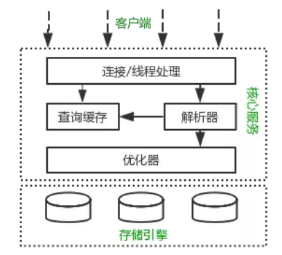
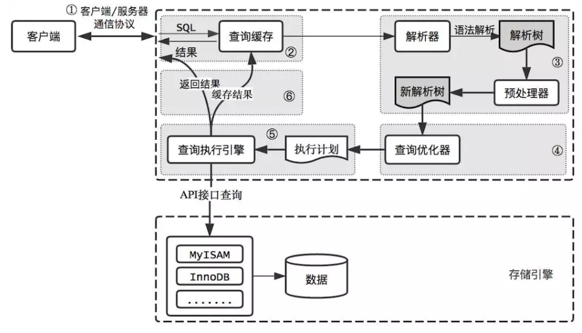
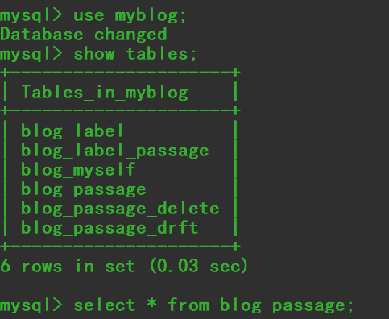
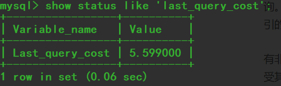
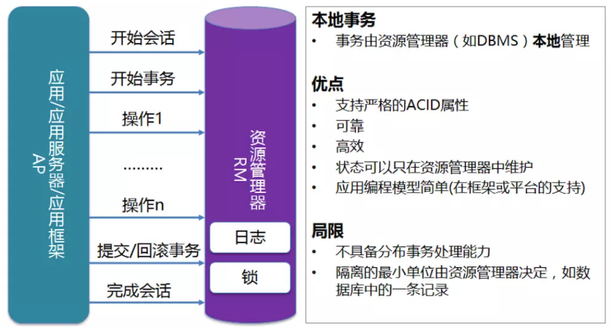

## 前言

简单分析了解MySQL底层原理

<!--More-->

> 1. 感谢<a href="https://www.jianshu.com/p/2c58cbadafc6">码到城攻</a>文章对我的指导
> 2. 感谢<a href="https://my.oschina.net/xinxingegeya">秋风醉了</a>文章对我的指导

## 1.MySQL逻辑架构



> MySQL的逻辑结构分为三层，分别为：**客户端层**、**核心服务层**、**存储引擎层**：

### **1.1 客户层**

连接处理、授权认证、安全等功能均在这一层处理；

### **1.2 核心服务层**

包括查询解析、分析、优化、缓存、内置函数(比如：时间、数学、加密等函数)。所有的跨存储引擎的功能也在这一层实现，如：存储过程、触发器、视图等；

### **1.3 存储引擎层**

其负责MySQL中的数据存储和提取。和Linux下的文件系统类似，每种存储引擎都有其优势和劣势。中间的服务层通过API与存储引擎通信，这些API接口屏蔽了不同存储引擎间的差异；

## 2.MySQL逻辑流程

> 一条SQL语句的执行流程是什么样的呢?



### 2.1 客户端和服务端的通信协议

​       `mysql`客户端和服务器的通信协议是**半双工的**，这意味着在任何时刻，要么由服务器向客户端发送数据，要么由客户端向服务器发送数据，这两个动作不能同时发生。**所以我们无法也无须将一个消息切成小块独立来发送。**

​       这种协议让`mysql`通信简单快速，但也从很多地方限制了`mysql`。一个明显的限制是没法进行流量控制。一旦一端开始发送消息，另一端要接收完整个消息才能响应它。

​       客户端用一个单独的数据包将查询传给服务器。**一旦客户端发送了请求，他能做的事情就只是等待结果了**。

​       相反的，一般服务器响应给用户的数据通常很多，由多个数据包组成。当服务器开始响应客户端请求时，客户端必须完整的接收整个返回结果，而不能简单的只取前面几条结果，或者接收完几条结果后就粗暴地断开连接。**这也是在必要的时候一定要在查询中加上limit限制的原因**。

​       多数连接`mysql `的库函数都可以获得全部结果集并缓存到内存中，还可以逐行获取需要的数据，默认一般是获取全部结果集并缓存到内存中。`mysql`通常要等待**所有的数据都已经发送给客户端才能释放这条查询所占用的资源**，所以接收全部结果并缓存通常可以减少服务器的压力，让查询能够早点结束，早点释放相应的资源。

​    当使用多数连接`mysql`的库函数从`mysql`获取数据时，其结果看起来都像是从`mysql`服务器获取数据，而实际上都是从这个**库函数的缓存获取数据**。多数情况下这没什么问题，但是如果**需要返回一个很大的结果集的时候**，这样做并不好，**因为库函数会花很多时间和内存来存储所有的结果集**。如果能够尽早开始处理这些结果集，就能大大减少内存的消耗，这种情况下可以不使用缓存来记录结果而是直接处理。这样做的缺点是，对于服务器来说，需要查询完成后才能释放资源，所以在和客户端交互的整个过程中，服务器的资源都是被这个查询所占用的。

### 2.2 查询缓存

#### 2.2.1 什么情况会使用缓存

​       在解析一个查询语句前，如果查询缓存是打开的，那么`MySQL`会检查这个查询语句是否命中查询缓存中的数据。如果当前查询恰好命中查询缓存，在检查一次用户权限后直接返回缓存中的结果。这种情况下，查询不会被解析，也不会生成执行计划，更不会执行。

#### 2.2.2 缓存原理

MySQL将缓存存放在一个引用表（不要理解成`table`，可以认为是类似于`HashMap`的数据结构），通过一个哈希值索引，这个哈希值通过查询本身、当前要查询的数据库、客户端协议版本号等一些可能影响结果的信息计算得来。**所以两个查询在任何字符上的不同（例如：空格、注释），都会导致缓存不会命中**。

#### 2.2.3 什么情况下进行缓存

如果查询中包含任何用户自定义函数、存储函数、用户变量、临时表、`MySQL`库中的系统表，其查询结果都不会被缓存。比如函数`NOW()`或者`CURRENT_DATE()`会因为不同的查询时间，返回不同的查询结果，再比如包含`CURRENT_USER`或者`CONNECION_ID()`的查询语句会因为不同的用户而返回不同的结果，将这样的查询结果缓存起来没有任何的意义。

#### 2.2.4 缓存失效

既然是缓存，就会失效，那查询缓存何时失效呢？`MySQL`的查询缓存系统会跟踪查询中涉及的每个表，如果这些表（数据或结构）发生变化，那么和这张表相关的所有缓存数据都将失效。正因为如此，在任何的写操作时，MySQL必须将对应表的所有缓存都设置为失效。如果查询缓存非常大或者碎片很多，这个操作就可能带来很大的系统消耗，甚至导致系统僵死一会儿。而且查询缓存对系统的额外消耗也不仅仅在写操作，读操作也不例外。

#### 2.2.5 缓存的优缺点

- 任何的查询语句在开始之前都必须经过检查，即使这条SQL语句永远不会命中缓存
- 如果查询结果可以被缓存，那么执行完成后，会将结果存入缓存，也会带来额外的系统消耗

所以，我们要知道并不是什么情况下查询缓存都会提高系统性能，缓存和失效都会带来额外消耗，只有当缓存带来的资源节约大于其本身消耗的资源时，才会给系统带来性能提升。但要如何评估打开缓存是否能够带来性能提升是一件非常困难的事情，也不在本文讨论的范畴内。如果系统确实存在一些性能问题，可以尝试打开查询缓存，并在数据库设计上做一些优化。

例如：

- 用多个小表代替一个大表，注意不要过度设计
- 批量插入代替循环单条插入
- 合理控制缓存空间大小，一般来说其大小设置为几十兆比较合适
- 可以通过`SQL_CACHE`和`SQL_NO_CACHE`来控制某个查询语句是否需要进行缓存

最后的忠告是不要轻易打开查询缓存，特别是写密集型应用。如果你实在是忍不住，可以将`query_cache_type`设置为`DEMAND`，这时只有加入`SQL_CACHE`的查询才会走缓存，其他查询则不会，这样可以非常自由地控制哪些查询需要被缓存。

### 2.3 语法解析和预处理

- **语法解析**

  `MySQL`通过**关键字**将`SQL`语句进行解析，并生成**一颗对应的解析树**。这个过程解析器主要通过**语法规则来验证和解析**。比如SQL中是否使用了错误的关键字或者关键字的顺序是否正确等等。

- **预处理**

  预处理则会根据`MySQL`规则进一步检查解析树是否合法。比如检查要查询的**数据表**和**数据列**是否存在等。

### 2.4 查询优化

经过前面的步骤生成的语法树被认为是**合法**的了，并且由**优化器**将其转化成**查询计划**。多数情况下，一条查询可以有**很多种执行方式**，最后都返回相应的结果。优化器的作用就是**找到这其中最好的执行计划**。

`MySQL`使用基于**成本**的优化器，它尝试预测一个查询使用某种执行计划时的**成本**，并选择其中成本最小的一个。在`MySQL`可以通过查询当前会话的`last_query_cost`的值来得到其计算当前查询的成本。





### 2.5 查询执行引擎

在完成解析和优化阶段以后，`MySQL`会生成对应的执行计划，查询执行引擎根据执行计划给出的指令逐步执行得出结果。整个执行过程的大部分操作均是通过**调用存储引擎实现的接口**来完成，这些接口被称为`handler API`。查询过程中的每一张表由一个`handler`实例表示。实际上，`MySQL`在查询优化阶段就为每一张表创建了一个`handler`实例，优化器可以根据这些实例的接口来获取表的相关信息，包括表的所有列名、索引统计信息等。**存储引擎接口**提供了非常丰富的功能，但其底层仅有几十个接口，这些接口像搭积木一样完成了一次查询的大部分操作。


### 2.6结果数据返回

查询执行的最后一个阶段就是将结果返回给客户端。即使查询不到数据，`MySQL`仍然会返回这个查询的相关信息，比如该查询影响到的行数以及执行时间等。

如果查询缓存被打开且这个查询可以被缓存，`MySQL`也会将结果存放到缓存中。

结果集返回客户端是一个**增量且逐步**返回的过程。有可能MySQL在生成第一条结果时，就开始向客户端逐步返回结果集了。这样服务端就无须存储太多结果而消耗过多内存，也可以让客户端第一时间获得返回结果。需要注意的是，结果集中的每一行都会以一个满足①中所描述的通信协议的数据包发送，再通过TCP协议进行传输，在传输过程中，可能对`MySQL`的数据包进行缓存然后批量发送。

### 2.7 一个查询过程的总结

- 客户端向`MySQL`服务器发送一条查询请求
- 服务器首先检查查询缓存，如果命中缓存，则立刻返回存储在缓存中的结果。否则进入下一阶段
- 服务器进行`SQL`解析、预处理、再由优化器生成对应的执行计划
- `MySQL`根据执行计划，调用存储引擎的`API`来执行查询
- 将结果返回给客户端，同时缓存查询结果

### 2.8 事务支持

`InnoDB`的本地事务由资源管理器进行管理:



- 事务的 `ACID` 是通过 `InnoDB` 日志和锁来保证；
- 事务的隔离性是通过数据库锁的机制实现的；
- 持久性通过 `Redo Log`（重做日志）来实现；
- 原子性和一致性通过`Undo Log` 来实现；

```
事务管理（ACID）
谈到事务一般都是以下四点
1. 原子性（Atomicity）
原子性是指事务是一个不可分割的工作单位，事务中的操作要么都发生，要么都不发生。
2. 一致性（Consistency）
事务前后数据的完整性必须保持一致。
3. 隔离性（Isolation）
事务的隔离性是多个用户并发访问数据库时，数据库为每一个用户开启的事务，不能被其他事务的操作数据所干扰，多个并发事务之间要相互隔离。
4. 持久性（Durability）
持久性是指一个事务一旦被提交，它对数据库中数据的改变就是永久性的，接下来即使数据库发生故障也不应该对其有任何影响

// 优秀博文: https://blog.csdn.net/dengjili/article/details/82468576
```

#### 2.8.1 Undo Log

`Undo Log `的原理是，为了满足事务的原子性，在操作数据之前，首先将这个数据备份到一个地方（这个存储数据备份的地方称为 `Undo Log`）。然后进行数据的修改。

如果事务范围内出现了错误或者用户执行了 `Rollback` 语句，系统就会利用` Undo Log `中的备份，将数据恢复到事务开始之前的状态。

#### 2.8.2 Redo Log

和 `Undo Log` 相反，`Redo Log `记录的是新数据的备份。在事务提交前，只要将`Redo Log `持久化即可，不需要将数据持久化。

当系统崩溃时，虽然数据没有持久化，但是 `Redo Log`已经持久化。系统会根据 `Redo Log `的内容，将所有数据恢复到最新的状态。

## 3. 性能优化

### 3.1 Scheme设计与数据类型优化

选择数据类型只要遵循**小而简单**的原则就好，越小的数据类型通常会更快，占用更少的磁盘、内存，处理时需要的`CPU`周期也更少。越简单的数据类型在计算时需要更少的`CPU`周期，比如，**整型就比字符操作代价低**，因而会使用整型来存储`ip`地址，使用`DATETIME`来存储时间，而不是使用字符串。

- 通常来说把可为NULL的列改为NOT NULL不会对性能提升有多少帮助，只是如果计划在列上创建索引，就应该将该列设置为NOT NULL。

- 整数类型指定宽度，比如INT(11)，没有任何卵用。INT使用32位（4个字节）存储空间，那么它的表示范围已经确定，所以INT(1)和INT(20)对于存储和计算是相同的。

- UNSIGNED表示不允许负值，大致可以使正数的上限提高一倍。比如TINYINT存储范围是-128 ~ 127，而UNSIGNED TINYINT存储的范围却是0 - 255。

- 通常来讲，没有太大的必要使用DECIMAL数据类型。即使是在需要存储财务数据时，仍然可以使用BIGINT。比如需要精确到万分之一，那么可以将数据乘以一百万然后使用BIGINT存储。这样可以避免浮点数计算不准确和DECIMAL精确计算代价高的问题。

- TIMESTAMP使用4个字节存储空间，DATETIME使用8个字节存储空间。因而，TIMESTAMP只能表示1970 - 2038年，比DATETIME表示的范围小得多，而且TIMESTAMP的值因时区不同而不同。

- 大多数情况下没有使用枚举类型的必要，其中一个缺点是枚举的字符串列表是固定的，添加和删除字符串（枚举选项）必须使用ALTER TABLE（如果只只是在列表末尾追加元素，不需要重建表）。

- schema的列不要太多。原因是存储引擎的API工作时需要在服务器层和存储引擎层之间通过行缓冲格式拷贝数据，然后在服务器层将缓冲内容解码成各个列，这个转换过程的代价是非常高的。如果列太多而实际使用的列又很少的话，有可能会导致CPU占用过高。

- 大表ALTER TABLE非常耗时，MySQL执行大部分修改表结果操作的方法是用新的结构创建一个张空表，从旧表中查出所有的数据插入新表，然后再删除旧表。尤其当内存不足而表又很大，而且还有很大索引的情况下，耗时更久。当然有一些奇技淫巧可以解决这个问题，有兴趣可自行查阅。

### 3.2 创建高性能索引

索引是提高MySQL查询性能的一个重要途径，**但过多的索引可能会导致过高的磁盘使用率以及过高的内存占用**，从而影响应用程序的整体性能。

通常我们所说的索引是指**B-Tree索引**，它是目前关系型数据库中查找数据最为常用和有效的索引，大多数存储引擎都支持这种索引。使用`B-Tree`这个术语，是因为`MySQL`在`CREATE TABLE`或其它语句中使用了这个关键字，但实际上不同的存储引擎可能使用不同的数据结构，比如`InnoDB`就是使用的`B+Tree`。

关于`BTree和B+Tree`可以通过这篇博文了解: https://www.cnblogs.com/vianzhang/p/7922426.html

`B+Tree`中的`B`是指`balance`，意为平衡。需要注意的是，`B+`树索引并不能找到一个给定键值的具体行，它找到的只是被查找数据行所在的页，接着数据库会把页读入到内存，再在内存中进行查找，最后得到要查找的数据。

### 3.3 优化的建议

- **通常来说把可为NULL的列改为NOT NULL不会对性能提升有多少帮助，只是如果计划在列上创建索引，就应该将该列设置为NOT NULL**
- **对整数类型指定宽度，比如INT(11)，没有任何卵用**
   INT使用32位（4个字节）存储空间，那么它的表示范围已经确定，所以INT(1)和INT(20)对于存储和计算是相同的
- **没有太大的必要使用DECIMAL数据类型**
   即使是在需要存储财务数据时，仍然可以使用BIGINT。比如需要精确到万分之一，那么可以将数据乘以一百万然后使用BIGINT存储。这样可以避免浮点数计算不准确和DECIMAL精确计算代价高的问题
- **DATETIME优于TIMESTAMP**
   TIMESTAMP使用4个字节存储空间，DATETIME使用8个字节存储空间。因而，TIMESTAMP只能表示1970 - 2038年，比DATETIME表示的范围小得多，而且TIMESTAMP的值因时区不同而不同
- **大多数情况下没有使用枚举类型的必要**
   其中一个缺点是枚举的字符串列表是固定的，添加和删除字符串（枚举选项）必须使用ALTER TABLE（如果只只是在列表末尾追加元素，不需要重建表）
- **schema的列不要太多**
   原因是存储引擎的API工作时需要在服务器层和存储引擎层之间通过行缓冲格式拷贝数据，然后在服务器层将缓冲内容解码成各个列，这个转换过程的代价是非常高的。如果列太多而实际使用的列又很少的话，有可能会导致CPU占用过高
- **对查询进行优化，要尽量避免全表扫描，首先应考虑在 where 及 order by 涉及的列上建立索引**
- **应尽量避免在 where 子句中的索引字段进行 null 值判断，否则将导致引擎放弃使用索引而进行全表扫描**

```
select id from t where num is null 
```

最好不要给数据库索引字段留NULL，尽可能的使用 NOT NULL填充数据库.
 备注、描述、评论之类的可以设置为 NULL，其他的，最好不要使用NULL。
 不要以为 NULL 不需要空间，比如：char(100) 型，在字段建立时，空间就固定了， 不管是否插入值（NULL也包含在内），都是占用 100个字符的空间的，如果是varchar这样的变长字段， null 不占用空间。

- **应尽量避免在 where 子句中使用 != 或 <> 操作符，否则将引擎放弃使用索引而进行全表扫描**
- **应尽量避免在 where 子句中使用 or 来连接条件**
   如果一个字段有索引，一个字段没有索引，将导致引擎放弃使用索引而进行全表扫描。

```
select id from t where num=10 or Name = 'admin';
```

可改为：

```
select id from t where num = 10
union all
select id from t where Name = 'admin';
```

- **in 和 not in 也要慎用，否则会导致全表扫描**

```
select id from t where num in(1,2,3);
```

对于连续值，可改为：

```
select id from t where num between 1 and 3
```

很多时候用 exists 代替 in

```
select num from a where num in(select num from b);
#使用exists替换
select num from a where exists(select 1 from b where num=a.num);
```

- **模糊查询like将导致全表扫描**

```
select id from t where name like ‘%abc%’;
#改为，或是用搜索引擎
select id from t where name like ‘abc%’;
```

- **不要在where子句中使用参数**

```
select id from t where num = @num
```

上面语句将导致全表扫描。因为SQL只有在运行时才会解析局部变量，但优化程序不能将访问计划的选择推迟到运行时；它必须在编译时进行选择。然 而，如果在编译时建立访问计划，变量的值还是未知的，因而无法作为索引选择的输入项。
 可以使用强制索引来解困

```
select id from t with(index(索引名)) where num = @num;
```

- **避免在where子句中对字段进行表函数、算术运算或其他表达式运算**

```
select id from t where num/2 = 100;
select id from t where substring(name,1,3) = ’abc’;
```

这将导致引擎放弃使用索引而进行全表扫描。
 应改为：

```
select id from t where num = 100*2;
select id from t where name like 'abc%';
```

- **在使用索引字段作为条件时，如果该索引是复合索引，那么必须使用到该索引中的第一个字段作为条件时才能保证系统使用该索引，否则该索引将不会被使用，并且应尽可能的让字段顺序与索引顺序相一致**
- **尽量使用表变量来代替临时表**
   如果表变量包含大量数据，请注意索引非常有限（只有主键索引）。
- **尽量避免大事务操作，提高系统并发能力**
- **尽量避免向客户端返回大数据量**
   若数据量过大，应该考虑相应需求是否合理，或者分页查询。

#### 一、基础规范

 （1）必须使用InnoDB存储引擎
 解读：支持事务、行级锁、并发性能更好、CPU及内存缓存页优化使得资源利用率更高
 （2）必须使用UTF8字符集
 解读：万国码，无需转码，无乱码风险，节省空间
 （3）数据表、数据字段必须加入中文注释
 解读：N年后谁tm知道这个r1,r2,r3字段是干嘛的
 （4）禁止使用存储过程、视图、触发器、Event
 解读：高并发大数据的互联网业务，架构设计思路是“解放数据库CPU，将计算转移到服务层”，并发量大的情况下，这些功能很可能将数据库拖死，业务逻辑放到服务层具备更好的扩展性，能够轻易实现“增机器就加性能”。数据库擅长存储与索引，CPU计算还是上移吧
 （5）禁止存储大文件或者大照片
 解读：为何要让数据库做它不擅长的事情？大文件和照片存储在文件系统，数据库里存URI多好

####  二、命名规范

 （6）只允许使用内网域名，而不是ip连接数据库
 （7）线上环境、开发环境、测试环境数据库内网域名遵循命名规范
 业务名称：xxx
 线上环境：dj.xxx.db
 开发环境：dj.xxx.rdb
 测试环境：dj.xxx.tdb
 从库在名称后加-s标识，备库在名称后加-ss标识
 线上从库：dj.xxx-s.db
 线上备库：dj.xxx-sss.db
 （8）库名、表名、字段名：小写，下划线风格，不超过32个字符，必须见名知意，禁止拼音英文混用
 （9）表名t_xxx，非唯一索引名idx_xxx，唯一索引名uniq_xxx

####  三、表设计规范

 （10）单实例表数目必须小于500
 （11）单表列数目必须小于30
 （12）表必须有主键，例如自增主键
 解读：
 a）主键递增，数据行写入可以提高插入性能，可以避免page分裂，减少表碎片提升空间和内存的使用
 b）主键要选择较短的数据类型， Innodb引擎普通索引都会保存主键的值，较短的数据类型可以有效的减少索引的磁盘空间，提高索引的缓存效率
 c） 无主键的表删除，在row模式的主从架构，会导致备库夯住
 （13）禁止使用外键，如果有外键完整性约束，需要应用程序控制
 解读：外键会导致表与表之间耦合，update与delete操作都会涉及相关联的表，十分影响sql 的性能，甚至会造成死锁。高并发情况下容易造成数据库性能，大数据高并发业务场景数据库使用以性能优先

####  四、字段设计规范

 （14）必须把字段定义为NOT NULL并且提供默认值
 解读：
 a）null的列使索引/索引统计/值比较都更加复杂，对MySQL来说更难优化
 b）null 这种类型MySQL内部需要进行特殊处理，增加数据库处理记录的复杂性；同等条件下，表中有较多空字段的时候，数据库的处理性能会降低很多
 c）null值需要更多的存储空，无论是表还是索引中每行中的null的列都需要额外的空间来标识
 d）对null 的处理时候，只能采用is null或is not null，而不能采用=、in、<、<>、!=、not in这些操作符号。如：where name!=’shenjian’，如果存在name为null值的记录，查询结果就不会包含name为null值的记录
 （15）禁止使用TEXT、BLOB类型
 解读：会浪费更多的磁盘和内存空间，非必要的大量的大字段查询会淘汰掉热数据，导致内存命中率急剧降低，影响数据库性能
 （16）禁止使用小数存储货币
 解读：使用整数吧，小数容易导致钱对不上
 （17）必须使用varchar(20)存储手机号
 解读：
 a）涉及到区号或者国家代号，可能出现+-()
 b）手机号会去做数学运算么？
 c）varchar可以支持模糊查询，例如：like“138%”
 （18）禁止使用ENUM，可使用TINYINT代替
 解读：
 a）增加新的ENUM值要做DDL操作
 b）ENUM的内部实际存储就是整数，你以为自己定义的是字符串？

####  五、索引设计规范

 （19）单表索引建议控制在5个以内
 （20）单索引字段数不允许超过5个
 解读：字段超过5个时，实际已经起不到有效过滤数据的作用了
 （21）禁止在更新十分频繁、区分度不高的属性上建立索引
 解读：
 a）更新会变更B+树，更新频繁的字段建立索引会大大降低数据库性能
 b）“性别”这种区分度不大的属性，建立索引是没有什么意义的，不能有效过滤数据，性能与全表扫描类似
 （22）建立组合索引，必须把区分度高的字段放在前面
 解读：能够更加有效的过滤数据

####  六、SQL使用规范

 （23）禁止使用SELECT *，只获取必要的字段，需要显示说明列属性
 解读：
 a）读取不需要的列会增加CPU、IO、NET消耗
 b）不能有效的利用覆盖索引
 c）使用SELECT *容易在增加或者删除字段后出现程序BUG
 （24）禁止使用INSERT INTO t_xxx VALUES(xxx)，必须显示指定插入的列属性
 解读：容易在增加或者删除字段后出现程序BUG
 （25）禁止使用属性隐式转换
 解读：SELECT uid FROM t_user WHERE phone=13812345678 会导致全表扫描，而不能命中phone索引，猜猜为什么？（这个线上问题不止出现过一次）
 （26）禁止在WHERE条件的属性上使用函数或者表达式
 解读：SELECT uid FROM t_user WHERE from_unixtime(day)>='2017-02-15' 会导致全表扫描
 正确的写法是：SELECT uid FROM t_user WHERE day>= unix_timestamp('2017-02-15 00:00:00')
 （27）禁止负向查询，以及%开头的模糊查询
 解读：
 a）负向查询条件：NOT、!=、<>、!<、!>、NOT IN、NOT LIKE等，会导致全表扫描
 b）%开头的模糊查询，会导致全表扫描
 （28）禁止大表使用JOIN查询，禁止大表使用子查询
 解读：会产生临时表，消耗较多内存与CPU，极大影响数据库性能
 （29）禁止使用OR条件，必须改为IN查询
 解读：旧版本Mysql的OR查询是不能命中索引的，即使能命中索引，为何要让数据库耗费更多的CPU帮助实施查询优化呢？
 （30）应用程序必须捕获SQL异常，并有相应处理