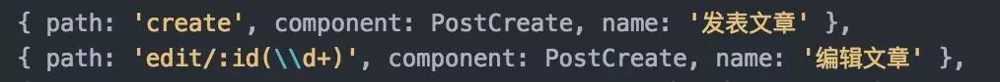

## 前言

本系列学习，基于下面这位掘金作者，讲的很详细，而且免费看，对于vue学习者非常有好处。

- 作者：花裤衩

- 链接：https://juejin.im/post/59097cd7a22b9d0065fb61d2

<!--More-->

## components

这里往往放一些全局经常会用到的组件，比如左边栏，有些组件用于规范化页面风格，比如每个页面的主体内容头部应该怎样规范等。而页面是不写在这个地方的，写在views里面。

## store

Vuex 是一个专为 Vue.js 应用程序开发的**状态管理模式**。它采用集中式存储管理应用的所有组件的状态，并以相应的规则保证状态以一种可预测的方式发生变化。Vuex 也集成到 Vue 的官方调试工具 [devtools extension](https://github.com/vuejs/vue-devtools)，提供了诸如零配置的 time-travel 调试、状态快照导入导出等高级调试功能。

但是由于Vuex的数据，在页面刷新的时候就会没有，而且本质上很多数据没必要储存在Vuex中，所以Vuex并不是必备的，甚至我们可以考虑使用Session Stroge来储存用户信息，解决用户刷信页面就需要重新登录的问题，将权限控制更多的交给后端来做，如果要用Vuex，那也要在每次刷新的时候让Vuex获取Session Stroge的信息进行重新储存。

如果是Android开发，使用Vuex就十分有用了，因为用户不可能在手机端刷新页面。

## alias

当项目逐渐变大之后，文件与文件直接的引用关系会很复杂，这时候就需要使用[alias](https://link.juejin.im/?target=https%3A%2F%2Fwebpack.js.org%2Fconfiguration%2Fresolve%2F) 了。 有的人喜欢alias 指向src目录下，再使用相对路径找文件

```js
alias: {
  'src': path.resolve(__dirname, '../src'),
  'components': path.resolve(__dirname, '../src/components'),
  'api': path.resolve(__dirname, '../src/api'),
  'utils': path.resolve(__dirname, '../src/utils'),
  'store': path.resolve(__dirname, '../src/store'),
  'router': path.resolve(__dirname, '../src/router')
}
```

## axios

Axios 是一个基于 promise 的 HTTP 库，可以用在浏览器和 node.js 中。

### 特性

- 从浏览器中创建 [XMLHttpRequests](https://developer.mozilla.org/en-US/docs/Web/API/XMLHttpRequest)
- 从 node.js 创建 [http](http://nodejs.org/api/http.html) 请求
- 支持 [Promise](https://developer.mozilla.org/en-US/docs/Web/JavaScript/Reference/Global_Objects/Promise) API
- 拦截请求和响应
- 转换请求数据和响应数据
- 取消请求
- 自动转换 JSON 数据
- 客户端支持防御 [XSRF](http://en.wikipedia.org/wiki/Cross-site_request_forgery)

```js
import axios from 'axios'
import { Message } from 'element-ui'
import store from '@/store'
import { getToken } from '@/utils/auth'

// 创建axios实例
const service = axios.create({
  baseURL: process.env.BASE_API, // api的base_url
  timeout: 5000 // 请求超时时间
})

// request拦截器
service.interceptors.request.use(config => {
  // Do something before request is sent
  if (store.getters.token) {
    config.headers['X-Token'] = getToken() // 让每个请求携带token--['X-Token']为自定义key 请根据实际情况自行修改
  }
  return config
}, error => {
  // Do something with request error
  console.log(error) // for debug
  Promise.reject(error)
})

// respone拦截器
service.interceptors.response.use(
  response => response,
  /**
  * 下面的注释为通过response自定义code来标示请求状态，当code返回如下情况为权限有问题，登出并返回到登录页
  * 如通过xmlhttprequest 状态码标识 逻辑可写在下面error中
  */
  //  const res = response.data;
  //     if (res.code !== 20000) {
  //       Message({
  //         message: res.message,
  //         type: 'error',
  //         duration: 5 * 1000
  //       });
  //       // 50008:非法的token; 50012:其他客户端登录了;  50014:Token 过期了;
  //       if (res.code === 50008 || res.code === 50012 || res.code === 50014) {
  //         MessageBox.confirm('你已被登出，可以取消继续留在该页面，或者重新登录', '确定登出', {
  //           confirmButtonText: '重新登录',
  //           cancelButtonText: '取消',
  //           type: 'warning'
  //         }).then(() => {
  //           store.dispatch('FedLogOut').then(() => {
  //             location.reload();// 为了重新实例化vue-router对象 避免bug
  //           });
  //         })
  //       }
  //       return Promise.reject('error');
  //     } else {
  //       return response.data;
  //     }
  error => {
    console.log('err' + error)// for debug
    Message({
      message: error.message,
      type: 'error',
      duration: 5 * 1000
    })
    return Promise.reject(error)
  })

export default service
```

```js
import request from '@/utils/request'

//使用
export function getInfo(params) {
  return request({
    url: '/user/info',
    method: 'get',
    params
  });
}
```

比如后台项目，每一个请求都是要带 token 来验证权限的，这样封装以下的话我们就不用每个请求都手动来塞 token，或者来做一些统一的异常处理，一劳永逸。 而且因为我们的 api 是根据 `env` 环境变量动态切换的，如果以后线上出现了bug，我们只需配置一下 `@/config/dev.env.js` 再重启一下服务，就能在本地模拟线上的环境了。

```js
module.exports = {
    NODE_ENV: '"development"',
    BASE_API: '"https://api-dev"', //修改为'"https://api-prod"'就行了
    APP_ORIGIN: '"https://wallstreetcn.com"' //为公司打个广告 pc站为vue+ssr
}
```

## 多环境

vue-cli 默认只提供了`dev`和`prod`两种环境。但其实正真的开发流程可能还会多一个`sit`或者`stage`环境，就是所谓的测试环境和预发布环境。所以我们就要简单的修改一下代码。其实很简单就是设置不同的环境变量

```js
"build:prod": "NODE_ENV=production node build/build.js",
"build:sit": "NODE_ENV=sit node build/build.js",
复制代码
```

之后在代码里自行判断，想干就干啥

```js
var env = process.env.NODE_ENV === 'production' ? config.build.prodEnv : config.build.sitEnv
复制代码
```

新版的 vue-cli 也内置了 `webpack-bundle-analyzer` 一个模块分析的东西，相当的好用。使用方法也很简单，和之前一样封装一个 npm script 就可以。

```js
//package.json
 "build:sit-preview": "cross-env NODE_ENV=production env_config=sit npm_config_preview=true  npm_config_report=true node build/build.js"

//之后通过process.env.npm_config_report来判断是否来启用webpack-bundle-analyzer

var BundleAnalyzerPlugin = require('webpack-bundle-analyzer').BundleAnalyzerPlugin
webpackConfig.plugins.push(new BundleAnalyzerPlugin())
```

## router-view

different router the same component vue。真实的业务场景中，这种情况很多。比如



 我创建和编辑的页面使用的是同一个component,默认情况下当这两个页面切换时并不会触发vue的created或者mounted钩子，官方说你可以通过watch $route的变化来做处理，但其实说真的还是蛮麻烦的。后来发现其实可以简单的在 router-view上加上一个唯一的key，来保证路由切换时都会重新渲染触发钩子了。这样简单的多了。

```js
<router-view :key="key"></router-view>

computed: {
    key() {
        return this.$route.name !== undefined? this.$route.name + +new 		Date(): this.$route + +new Date()
    }
 }
```

## 总结

要考虑的问题是很多，需要我们持续的学习。