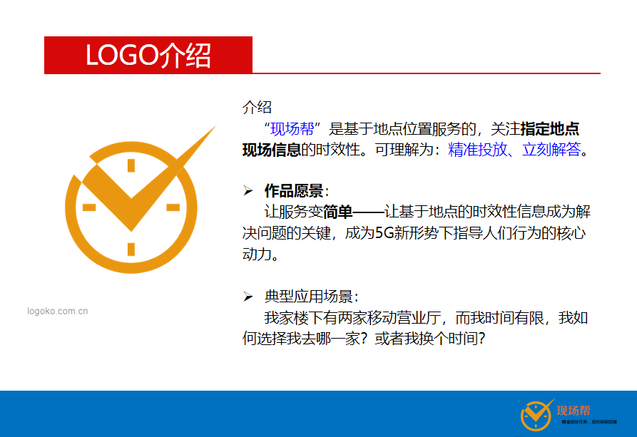
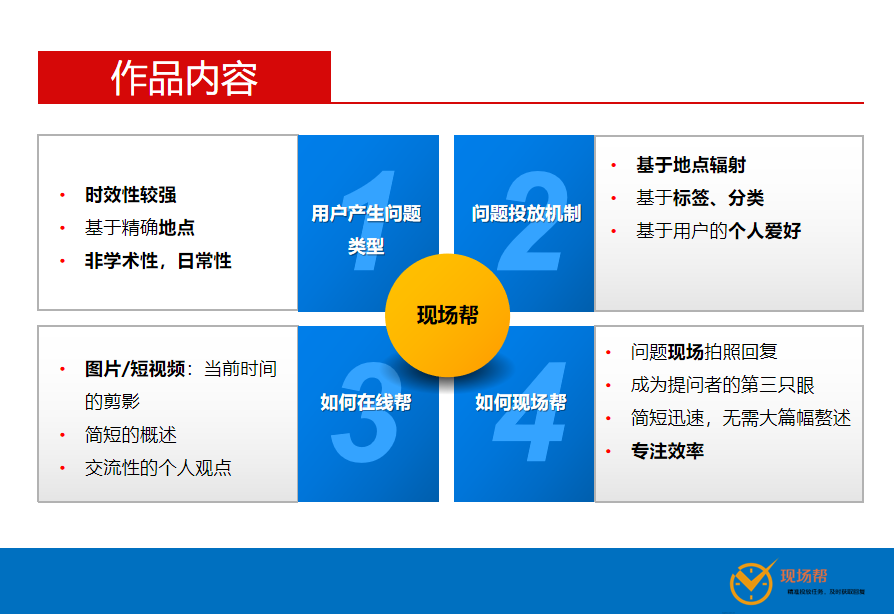
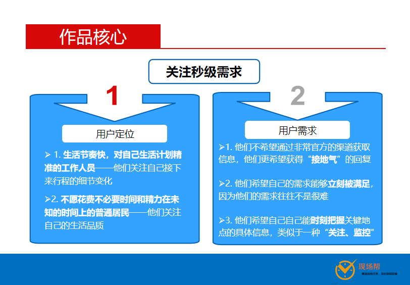
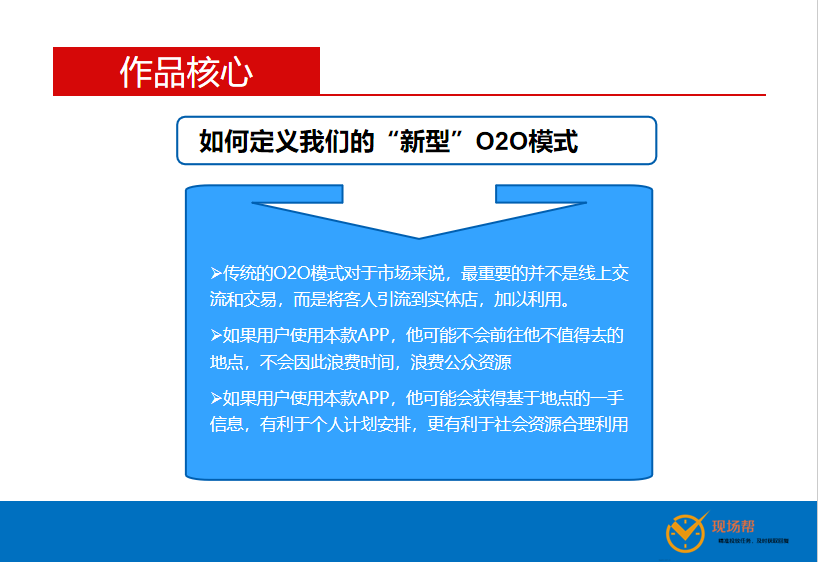
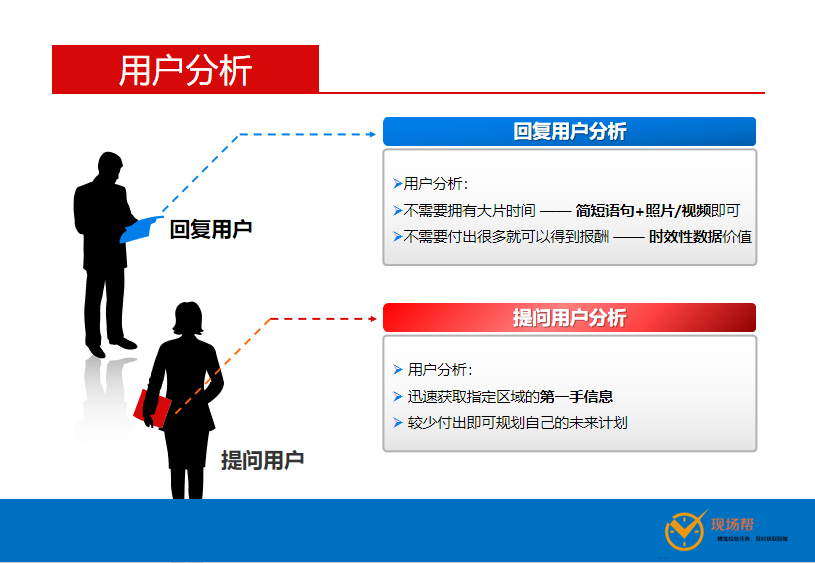
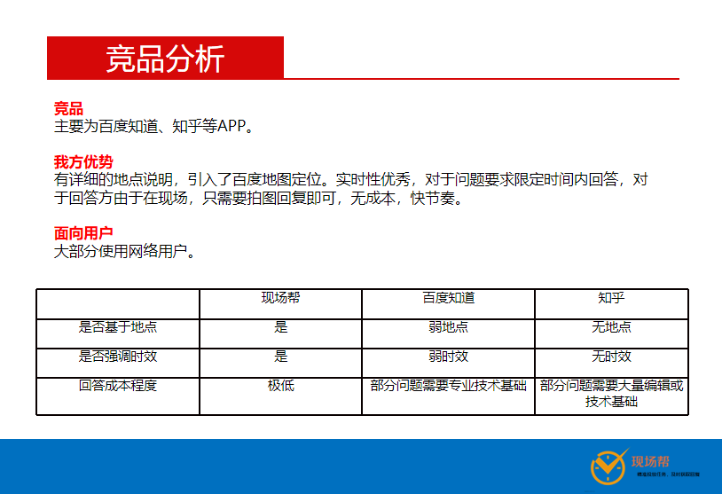

## 前言

全国计算机设计大赛-国家赛-芜湖-2019年8月8日

<!--More-->

## 1.作品核心

### 1.1关注秒级需求

#### 1.1.1用户定位

> 定位哪些用户？（作品价值？）
>
> 1. 生活节奏快，对自己生活**计划精准**的工作人员——**他们关注自己接下来行程的细节变化**
>
> 2. **不愿花费不必要时间和精力**在未知的时间上的普通居民——**他们关注自己的生活品质**

- 大城市中生活节奏较快的人员
  - **高级白领**：生活计划井井有条、上下班节奏较快
  - **快递行业**：关注时时的路况、目标地点的

- 一般小区住户
  - **一般女性**：联络当下时某地点的其他人，顺路帮忙（购物等）
  - **一般男性**：关注某些娱乐场所当下状况（网吧、健身馆）
  - **家长**：对于孩子必经的一些关键路段或学校的信息能迅速获得一手信息

#### 1.1.2用户需求

> 用户需求是什么？
>
> 1. 他们不希望通过非常官方的渠道获取信息，他们更希望获得“接地气”的回复
> 2. 他们希望自己的需求能够立刻被满足，因为他们的需求往往不是很难
> 3. 他们希望自己自己能时刻把握关键地点的具体信息，类似于一种“关注、监控”

用户需要一种小型的非官方为主的实时信息渠道。

**备注：**我们可以看到抖音上很多信息，都是非官方的，普通人贡献的，但是大家更愿意相信这种渠道的信息，因为这种信息往往没有利益引导趋向，往往最真实最贴切。

**备注：**应用领域非常广泛，但最经典的还是针对关键地点，密集人群，信息爆炸的场所。

### 1.2如何定义我们的“新型”O2O模式

> 什么是传统O2O模式？
>
> 什么是我们的“新型O2O”模式？

**传统**的O2O模式对于市场来说，最重要的并不是线上交流和交易，而是将客人引流到实体店，加以利用。

而我们对O2O**进行创新发展**，我们在注重线上基于地点实时信息共享的同时，**将客户有引导性（遵循市场原则）地引流到合适的实体地点**，从而**实现用户的引流和前期定位**，线下地点往往接受太多**无用客户**，这些客户不能带来有用的价值却占用了**他们本身的时间**和**线下场所的资源**，这对于用户和线下都是不希望看到的。而我们进行的“**新型O2O**”模式，为解决这一难题做出了调整。

- 如果用户使用本款APP，他可能不会前往他不值得去的地点，不会因此浪费时间，浪费公众资源
- 如果用户使用本款APP，他可能会获得基于地点的一手信息，有利于个人计划安排，更有利于社会资源合理利用

### 1.3如何定义我们的“新型”LBS服务

> 什么是传统LBS服务？
>
> 什么是我们的“新型LBS”模式？

**传统**的LBS服务往往基于地标、商家、机构点进行服务，他们提供更为官方的服务，如通过定位用户（GPS或移动运营商提供地点）当下地点，为他提供方圆1公里的咖啡馆、影院、图书馆等

而我们对LBS服务进行创新发展，我们认为应当发生一个转化，那就是让用户成为LBS规则的需求者，同时也让用户成为LBS规则的服务者。如果说传统LBS是**“基于地点的公众号服务”**，我们新型的LBS则是“**基于地点的人群服务**”，**简单来说，只要你指定地点附近有“人”即可进行服务，我们无需关心这些“人”是否具备服务的能力，因为这些人作为指定地点下此时此刻存在的个体，他们提供服务并无成本。**

这样，我们就可以实现LBS的**定点服务**，而不是**区域服务**。

##2.PPT内容及演讲者备注

### 2.1 作品简介

> 这个经典场景我觉得不管怎么想,**都看起来有种无用**的感觉,因为我们关注点的问题,为了升华价值,进行深入剖析

#### **演讲者备注:**

##### 作品愿景：

1. 服务变简单？免去复杂的“自由人-公众号-机器人”或者“自由人-公众号-专业的服务人员”的流程，简单到“**自由人-自由人**”的服务
2. 5G形式最核心的就是信息变得更为丰富，很多信息转瞬即逝，**信息如何保值**？掌握第一手信息的往往并不是官方，而是“现场的人”，他们掌握信息，他们**分享无成本**。

##### 经典应用场景：

1. 看似简单的场景，蕴含着**商业引导**和**个人取舍**的关键问题： 移动营业厅是**核心需求**，只有营业厅人少用户才有去的动力，但是其他因素也是市场中存在的非常重要的因素，那就是**附加服务**，移动营业厅附近可能有用户“可能”需要去的超市，这就为超市和用户带来**双向的服务与消费**的关系
2. “推荐”的核心是“大数据”，而在5G下，**每一秒的信息都是“大数据”**。而这一秒的数据可能再**下一秒就失去价值**。这就是我们所关注的**核心**。

### 2.2 作品内容

> 1. 删除了无用的PPT,精简语言
> 2. 本页面主要说一些基本的作品流程,让评委有一个直观的感受

#### 演讲者备注:

##### 在线问

1. 强调非学术性和日常性，这是作品定位的核心。
   投放机制
2. 推荐机制，算法处理，标签，分类，检索等

##### 在线帮：

1. 强调使用文字+图片/短视频的方式，这是4G/5G时代下信息趋向多维度丰富性的特点

##### 现场帮

1. 成为提问者的第三只眼，让问题解决成为“同步”到现场的的“现场快照”
2. 专注效率

### 2.3 作品核心

> 参考`1.作品核心`内容,完成本节的PPT内容

#### 2.3.1 关注秒级需求

##### 演讲者备注:

1.用户定位
- 大城市中生活节奏较快的人员
  - 高级白领：生活计划井井有条、上下班节奏较快
  - 快递行业：关注时时的路况、目标地点的
- 一般小区住户
  - 一般女性：联络当下时某地点的其他人，顺路帮忙（购物等）
  - 一般男性：关注某些娱乐场所当下状况（网吧、健身馆）
  - 家长：对于孩子必经的一些关键路段或学校的信息能迅速获得一手信息
2. 用户需求
用户需要一种小型的非官方为主的实时信息渠道。

备注：我们可以看到抖音上很多信息，都是非官方的，普通人贡献的，但是大家更愿意相信这种渠道的信息，因为这种信息往往没有利益引导趋向，往往最真实最贴切。

备注：应用领域非常广泛，但最经典的还是针对关键地点，密集人群，信息爆炸的场所。

#### 2.3.2 如何定义我们的"新型O2O"模式

##### 演讲者备注:

而我们对O2O进行创新发展，我们在注重线上基于地点实时信息共享的同时，将客户有引导性（遵循市场原则）地引流到合适的实体地点，从而实现用户的引流和前期定位，线下地点往往接受太多无用客户，这些客户不能带来有用的价值却占用了他们本身的时间和线下场所的资源，这对于用户和线下都是不希望看到的。而我们进行的“新型O2O”模式，为解决这一难题做出了调整。

#### 2.3.3 如何定义我们的“新型”LBS服务

##### 演讲者备注:

传统的LBS服务往往基于地标、商家、机构点进行服务，他们提供更为官方的服务，如通过定位用户（GPS或移动运营商提供地点）当下地点，为他提供方圆1公里的咖啡馆、影院、图书馆等

而我们对LBS服务进行创新发展，我们认为应当发生一个转化，那就是让用户成为LBS规则的需求者，同时也让用户成为LBS规则的服务者。如果说传统LBS是“基于地点的公众号服务”，我们新型的LBS则是“基于地点的人群服务”，简单来说，只要你指定地点附近有“人”即可进行服务，我们无需关心这些“人”是否具备服务的能力，因为这些人作为指定地点下此时此刻存在的个体，他们提供服务并无成本。

这样，我们就可以实现LBS的定点服务，而不是区域服务。

### 2.4 作品优势

#### 2.4.1 用户分析

##### 演讲者备注

无

#### 2.4.2 竞品分析

##### 演讲者备注

无

### 2.5 作品技术

直接查看PPT

### 2.6 作品展示

直接查看PPT