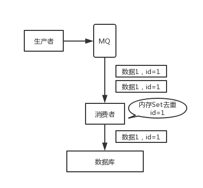

## 前言

> 特别鸣谢 [**石杉的架构笔记**](https://github.com/doocs/advanced-java)

如何保证消息不被重复消费？或者说，如何保证消息消费的幂等性？

<!--More-->

## 问题描述

举个栗子。

有这么个场景。数据 1/2/3 依次进入 kafka，kafka 会给这三条数据每条分配一个 offset，代表这条数据的序号，我们就假设分配的 offset 依次是 152/153/154。消费者从 kafka 去消费的时候，也是按照这个顺序去消费。假如当消费者消费了 `offset=153` 的这条数据，刚准备去提交 offset 到 zookeeper，此时消费者进程被重启了。那么此时消费过的数据 1/2 的 offset 并没有提交，kafka 也就不知道你已经消费了 `offset=153` 这条数据。那么重启之后，消费者会找 kafka 说，嘿，哥儿们，你给我接着把上次我消费到的那个地方后面的数据继续给我传递过来。由于之前的 offset 没有提交成功，那么数据 1/2 会再次传过来，如果此时消费者没有去重的话，那么就会导致重复消费。

如果消费者干的事儿是拿一条数据就往数据库里写一条，会导致说，你可能就把数据 1/2 在数据库里插入了 2 次，那么数据就错啦。

## 解决思路

其实还是得结合业务来思考，我这里给几个思路：

- 比如你拿个数据要写库，你先根据主键查一下，如果这数据都有了，你就别插入了，update 一下好吧。
- 比如你是写 Redis，那没问题了，反正每次都是 set，天然幂等性。
- 比如你不是上面两个场景，那做的稍微复杂一点，你需要让生产者发送每条数据的时候，里面加一个全局唯一的 id，类似订单 id 之类的东西，然后你这里消费到了之后，先根据这个 id 去比如 Redis 里查一下，之前消费过吗？如果没有消费过，你就处理，然后这个 id 写 Redis。如果消费过了，那你就别处理了，保证别重复处理相同的消息即可。
- 比如基于数据库的唯一键来保证重复数据不会重复插入多条。因为有唯一键约束了，重复数据插入只会报错，不会导致数据库中出现脏数据。

当然，如何保证 MQ 的消费是幂等性的，需要结合具体的业务来看。

**我**： 在我的应用中，保证幂等性，避免重复消费，其实就是对于一个功能子系统（如插入订单数据）而言，在插入前根据唯一标识（如订单id）进行查重，重复则更新数据。实际上我通过使用Redis的Set数据集，保证了天然的幂等性，经过Redis这一层高速缓存的天然幂等性过滤，实际入库的数据就不会存在脏数据。