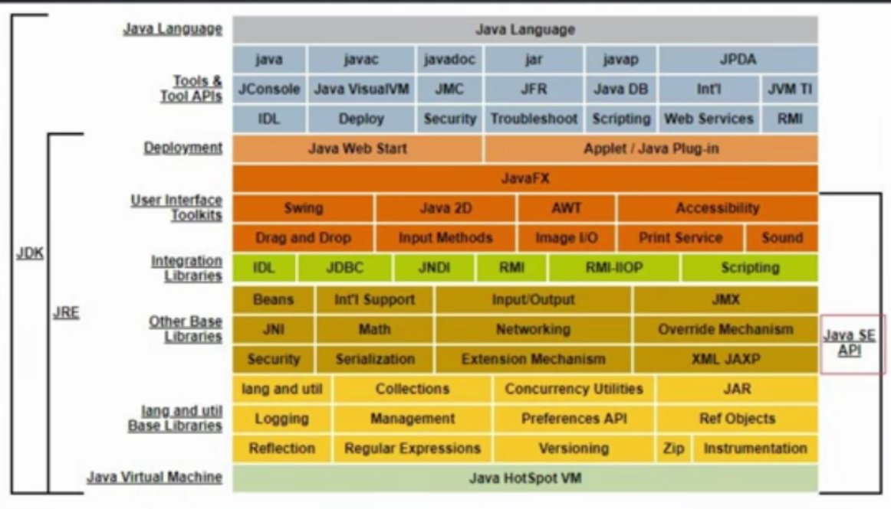
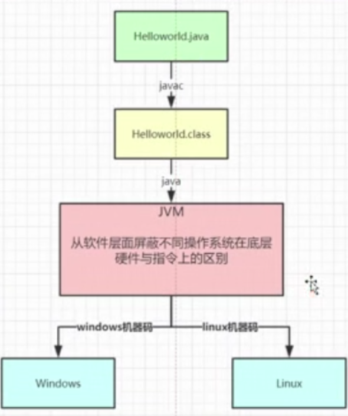
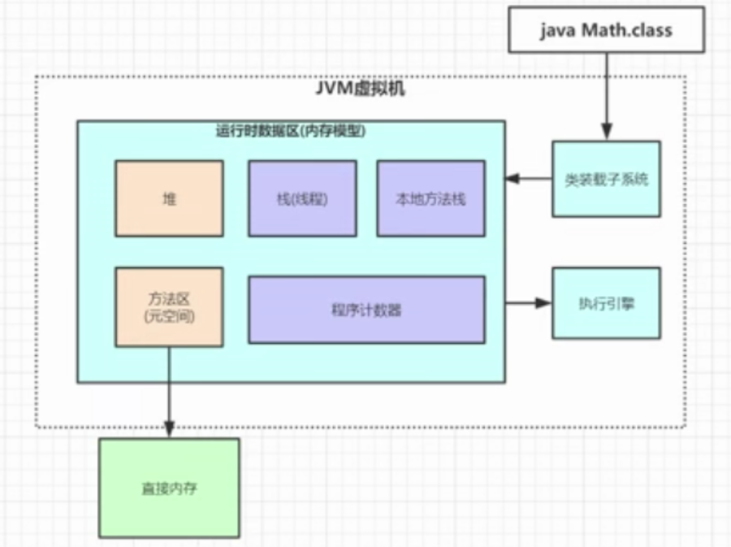
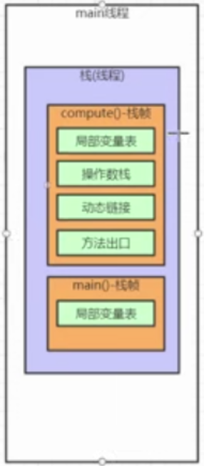

## 前言

<!--More-->

## JDK组成

最下面的Java HotSpot VM就是Java虚拟机,JDK比JRE多的其实就是一些工具类,而JRE包含了Java虚拟机和一些核心类库,Java虚拟机有很多种实现方式,IBM,Google等大公司都有其实现,现在主要以Oracle的为主

## Java文件的运行

一个Java代码,首先通过Javac编译生成字节码文件(.class),随后交予JVM进行执行,生成对应平台的二进制机器码,所以JDK有很多版本,对windows的版本,对Linux的版本等等,最终生成的机器码是不一样的,正因为一份字节码文件可以通过JVM适配不同的平台,所以Java能够实现"一次编写,到处运行"的功能

## JVM组成

### JVM包括三部分:

1. 类安装子系统
1. 执行引擎
1. 运行时数据区(内存模型)

### 栈(线程)

在main的主线程中,每个函数的局部范围都会开辟一块栈帧内存区,并保证先进后出,最上面的往往是优先级最高,作用范围最小的,里面可能有局部变量表等

