## 前言

《软件测试-基于问题驱动模式》课本复习

<!--More-->

# 第一章:软件测试入门

## 软件测试的概念

软件测试是贯穿整个软件开发生命周期对软件产品进行验证和确认的活动过程。尽快尽早的发现软件中的缺陷，也是对软件产品质量的评估从而提供质量有关的信息。

## 软件缺陷的概念

软件缺陷，即软件中存在的任何一种破坏正常运行能力的问题、错误，其结果会导致软件产品在某种程度上不能满足用户的需要，软件缺陷分为程序内部的错误和程序外部的失效；软件缺陷不仅是程序的错误，还应该包括需求、设计中存在的问题。

## 软件质量的概念

系统、组件或过程满足特定需求的程度，和满足客户/用户需求或期望的程度。质量分为内部质量、外部质量和使用质量。

## 产品/使用质量模型及其属性

1. 内部/外部质量模型及其属性

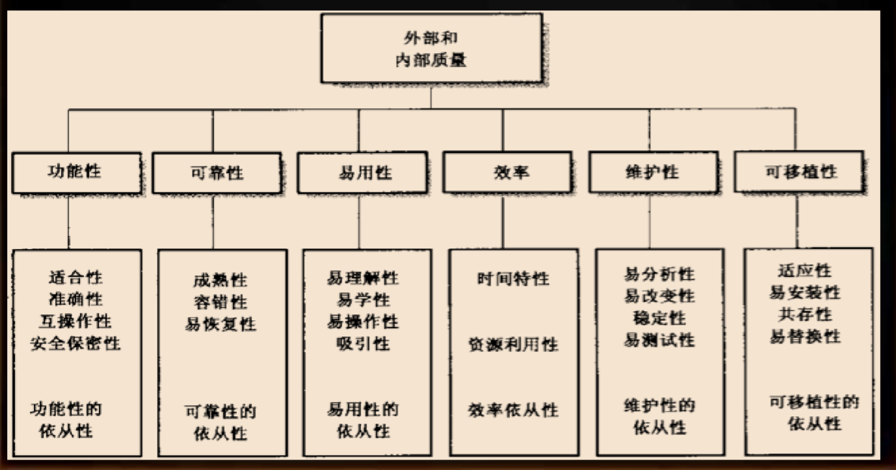

2. 使用质量模型及其属性

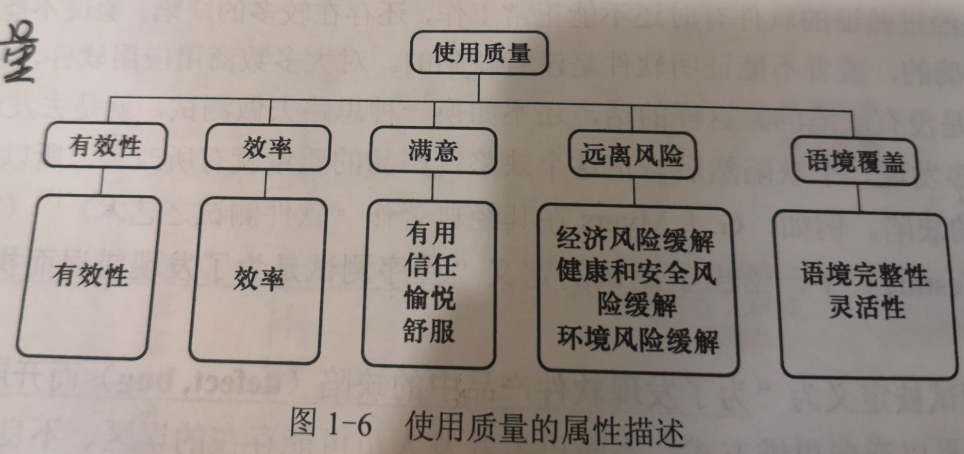

## 软件测试的价值与定义


## 辩证的理解测试

### 狭义/广义

#### 狭义的软件测试

只有动态的执行软件时进行测试

#### 广义的软件测试

包括静态测试和动态测试在内的各种测试的总称

### 静态/动态

#### 静态测试

包括需求、设计和代码等的评审。引入静态测试意义重大，能够尽早的发现问题，极大地降低软件开发成本。不需要运行软件系统，而是对软件的半成品（如需求文档、设计文档、代码）进行评审，即开展需求评审、设计评审、代码评审等活动。

#### 动态测试

需要运行软件才能完成测试的一种形式

## 软件测试的层次

一共有四层：

- 单元测试
- 集成测试
- 系统测试
- 验收测试

## 软件测试的类型

1. 按测试的对象或范围分类，如单元测试、文档测试、系统测试等）
2. 按测试目的分类，如功能测试、回归测试、性能测试、可靠性测试、安全性测试和兼容性测试等
3. 根据测试过程中被测软件是否被执行，分为静态测试和动 态测试
4. 根据是否针对系统的内部结构和具体实现算法来完成测试 ，可分为白盒测试和黑盒测试

## 软件测试和SQA的区别和联系

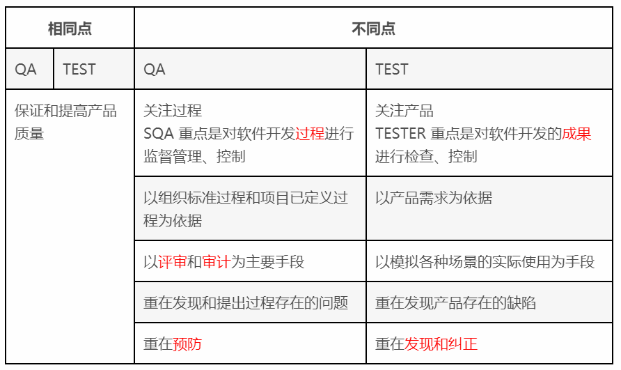

# 第二章：需求与设计评审

## 静态测试（评审）形式及其流程

评审的形式：互为评审、走查和会议评审等不同形式

## 软件需求的层次

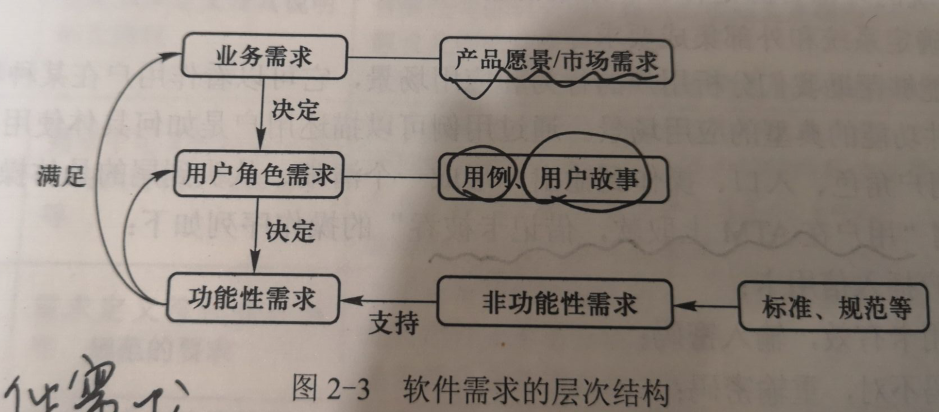

其中业务层次又包括：

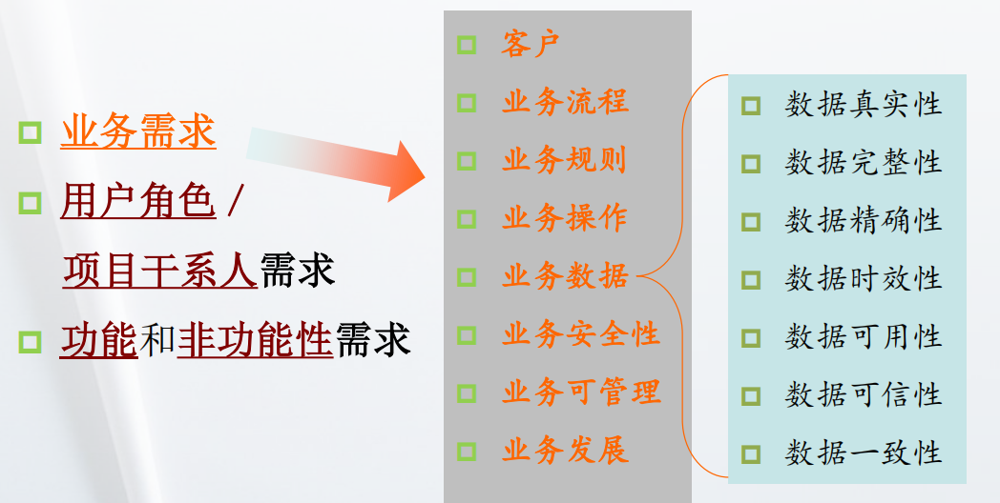

- **业务需求**：解决什么关键问题，核心的诉求是什么，达到什么目标，相当于产品的愿景。
- **用户角色需求/干系人需求**：相关利益者的需求，每个用户角色有什么特定的需求。从用户行为去分析，即对应用例和用户故事，运维、技术支持等相关人员的需求，一般也可以并入用户角色的需求。
- **功能性和非功能需求**：软件为了满足上述也无需求，及相关利益者的需求，而具备的功能和非功能性（系统）的能力。

## 需求与设计评审标准

### 正确性 

检查在任意条件下软件系统需求定义，以及其说明的正确性

### 完备性

涵盖系统需求的功能，性能，输入/输出，条件限制、应用范围等的程度，覆盖率越高，完备性越好

### 易理解性

文档的描述性被理解的容易程度，包括清晰性。

### 一致性 

所定义的需求之间没有相互排斥、冲突和矛盾，前后一致

### 易测试性 

容易进行相关测试

### 易追溯性

每一项需求定义可确定其来源

## 设计评审的层次

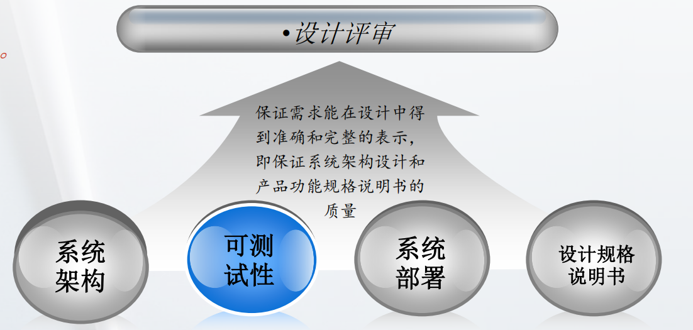

## 设计评审方法

- 从高层到底层

- 不断从测试角度去问开发 

- 借助UML等建模工具 

# 第三章：单元测试

## 单元测试的概念和主要形式

**单元测试**是针对软件的基本工作单元，进行正确性检验的 测试工作。

## 单元测试中类测试的分类

- 动态测试

  - 方法内测试
  - 方法间测试

  在测试类功能实现时，应该首先保证**类成员方法的正确性**，**类方法的正确行为**只是类能够实现要求的功能基础。

- 静态测试

  首先需要保证要测试的类有完整和正确的**说明**，并且已经在**模型环境**下进行了测试，类的规格说明使用**对象约束语言**、**自然语言**或**状态图表示**，不同语言的规范进行相应代码规范的评审，这是类的静态代码评审。

## 单元测试的方法

### 测试用例

实现设计好的测试数据、执行条件以及预期执行结果称为测试用例

### 白盒测试

通过被测单元的内部结构来设计测试用例来进行的测试

### 黑盒测试

不关注内部代码，仅从程序功能和性能上考量是否满足需求而设计测试用例来进行的测试，一般为接口测试或集成测试

### 单元代码的自动化测试的步骤

1. 设计测试用例

   从单纯分析程序结构入手，画出或者直接从详细设计文档中得到**程序流程图**，尝试设计测试用例（选用某种**覆盖方法**）**覆盖**所有的代码行。

   **覆盖方法**：

   - **语句覆盖**

     需要设计足够多的测试用例，使得程序将会执行被测方法中所有的语句，覆盖该方法的所有语句，比如程序中的if/else分支，要全部执行测试到。

     `语句覆盖是逻辑覆盖中的一种，逻辑覆盖就是通过对程序逻辑结构的遍历，实现程序覆盖的一种白盒测试技术。`

   - **条件覆盖**

     对判定条件也要进行分解，当一个判定条件中有&&或者||其他时要进行分解，对每个条件都进行测试覆盖。

     如：if(x>=3&&y==0)分解为

     - x>=3为真/假
     - y==0为真/假

   - **分支覆盖**(判定覆盖)

     通过设计执行足够多的测试用例，使得程序中的每个**判定表达式**的值为真和为假的分支都要至少执行依次测试

   - **多重条件覆盖**(条件组合覆盖)

     是为了解决**短路操作符**，使得每个条件都执行到，参照下面备注的例子，就是让y==0也能执行到，此时x>=3是成立的，也就是x>=3能否成立都要安排测试用例，以保证y==0能够被测试到，进行条件的全覆盖测试。

   - **路径覆盖**

     比如有两个if/else条件，那么就是2×2=4中路径，每一条路径与后边路径的组合都要覆盖到。

2. 编写测试代码

   编写测试脚本

3. 执行测试

   执行测试代码即可

```
1.备注：回归测试：
是指修改了旧代码后重新进行测试，测试代码不变，以确认修改后的代码没有产生新的错误，或导致其他代码发生错误，就叫回归测试

2.备注：短路操作符
出现类似if(x>=3 && y==0)这样的判断条件时，当编译器执行到x>=3不成立时，就不会去判断y==0这一条件，直接跳过，即便有错，也检查不到了。
```

# 第四章：持续集成测试

## 集成测试的概念

一种旨在暴露**单元接口之间**、**组件/系统间**交互或协同工作时所存在的缺陷的测试。

## 集成测试的层次

1. 软件单元与软件单元的集成测试 
2. 软件子系统和子系统的集成测试 
3. 软件系统和第三方系统的集成测试 
4. 软件系统和硬件的集成测试 

## 集成测试的模式

### 非渐增式测试模式（已完成测试的模块）

先分别测试每个模块，再把所有模块按设计 

要求放在一起组成所要的程序，如大棒模式(Big-bang Integration)

### 渐增式测试模式（已完成测试的模块）

把下一个要测试的模块同已经测试好的模块结合起 

来进行测试，测试完以后再把下一个已测试的模块结合进来测试… 

### 持续集成（针对新增的代码）

每日新增的代码，集成到最新的项目中时，就会进行测试，使得项目在每天都会有一次或多次的测试过程。

## 集成测试的特点

集成测试侧重于对**接口**的测试，数据驱动脚本。

- 接口之间传递的参数是否 一致(个数、属性、量纲) 
- 全局变量引用是否一致 
- 数据流一致性处理 
- 缓冲区数据的处理

## 接口测试要点

- 接口中所有的参数的不同类型的有效值都要被测试 

- 参数的每个错误类型都要准备一个异常用例

  如缺省值、类型错误、范围错误、参数超过最大位数、无效值、 参数的关联性检查等 

- 把每个参数单独作为条件来进行测试，再进行多条件 

关联组合测试

## 集成测试发展历程

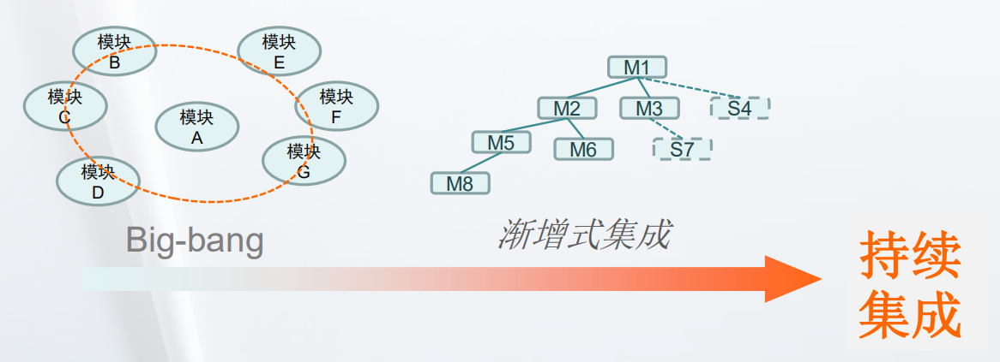

## 持续集成的内涵（内容）

- 持续检查（用工具扫描分析代码） 

- 持续构建（Build） 

- 持续部署 

- 持续验证、测试 

- 持续集成环境（基础设施） 

- 持续报告

## 测试金字塔

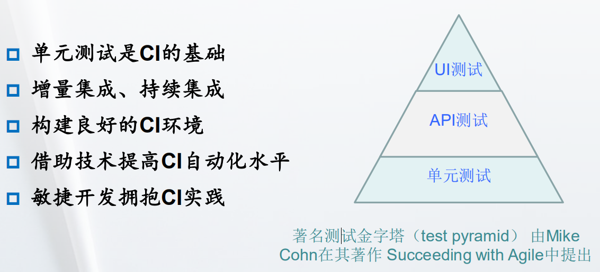

## 自动化测试的过程

1. **自动部署**

   方法：

   - 借助插件：deploy plugin

   - 编写脚本：shell脚本、winsows批处理、python脚本等

2. **构建前实现自动静态分析**

   方法和自动部署一样，自动静态测试报告- Sonar工具生成报告

3. **构建后实现自动验证**
   - 系统功能
   - 性能测试

完成测试要依赖相应的测试工具，还需要做相应的配置。

## 持续集成过程使用到的工具

1. 代码库/版本管理工具：
   - Git
   - SVN
   - CVS
2. 构建工具
   - Ant
   - Maven
   - Gradle

3. 代码静态分析工具
   	- FindBugs
   	- PMD

4. 测试工具
   - JUnit
   - Selenium

5. 持续集成调度工具
   - Jenkins
   - Travis CI

# 第五章：系统功能测试

## 系统功能测试的内容

- 功能
- 逻辑
- 接口
- 界面
- 数据
- 操作
- 平台

## 软件需求的层次


**业务需求：**

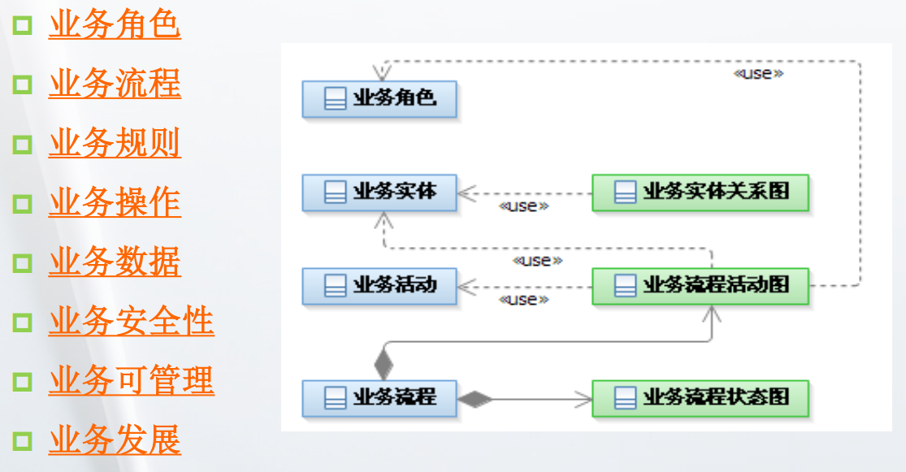

## 测试用例设计方法

### 等价类划分方法

**等价类是某个输入域的子集，在该子集中每个输入数据的作用是等效的。**将输入数据分成若干个子集，从每个子集选取一个代表性的数据作为测试用例。

基于对输入或输出的情况的评估，然后划分成两个或更多的子集来进行测试，即他所有可能的输入数据（有效的或者无效的）划分成若干个等价类，从每个等价类中选择一定的代表值进行测试，如果用这个等价类中的代表值作为测试用例未发现程序错误，那么该类中其他的数据（测试用例）也不会发生程序的错误。

- 有效等价类

  完全满足程序规格说明、有意义的输入数据所构成的集合。

  **意义**：检验程序是否满足规格说明所规定的功能和性能。

- 无效等价类

  不满足程序规格说明、无效的输入数据所构成的集合

  **意义**：可以测试程序/系统的容错性——对异常输入情况的处理。

`在程序设计中，不仅要保证所有有效的数据输入能产生正确的输出，还要保证错误的输入或者无效输入中能够有异常保护`

### 边界值分析方法

取边界值进行测试分析，取最靠近边界的两个值作为测试的数据。

### 决策表方法

借助表格方式完成对输入条件的组合设计，已达到完全组合覆盖的测试效果。

比如在某一网页登录过程中：

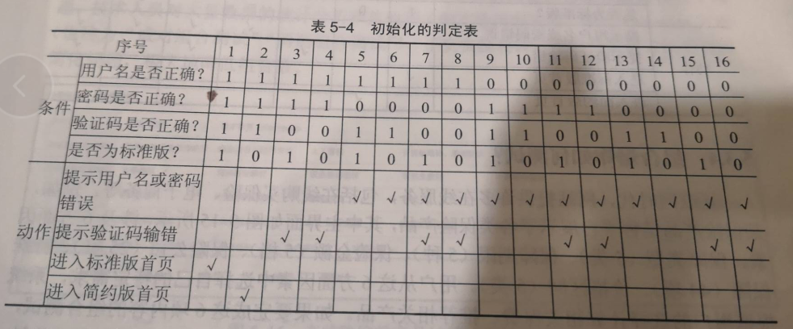

上述判定表可以看出来用户名、密码、验证码有一个输入错误就和标准版没有关系了，所以我们还可以进行判定表判定条件的优化：

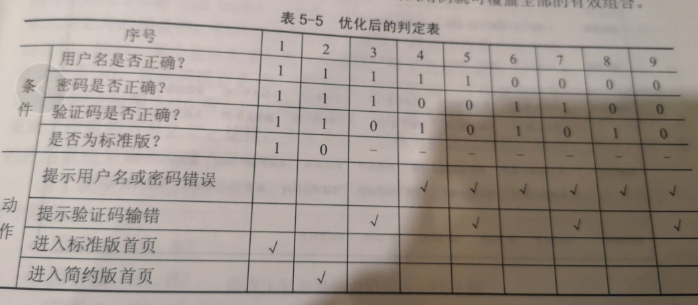

继续看，我们发现用户名或密码有一个错误，只需要考虑验证码，于是我们还可以优化：

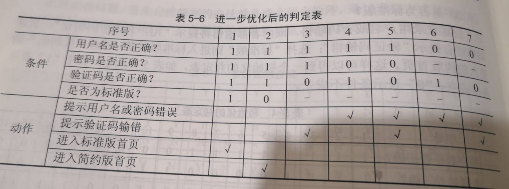

## 决策表测试爆炸时的优化方法

### 两两组合方法（Pairwise）

### 正交试验设计法

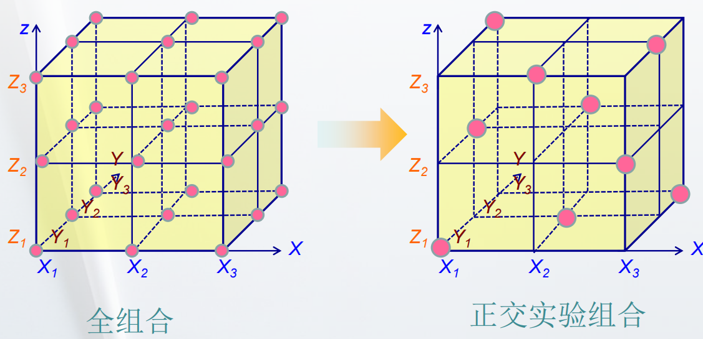

## 基于用例/场景的测试方法

基于一个核心场景，考虑不同的条件，或者不同的测试数据，进行分析设计用例观察对应的结果。

如：用户登录时，是否是第一次登录，密码长度，用户名长度等等

## 回归测试的策略

### 基于风险策略来选择回归测试用例

`优先变动大的代码进行测试`

即判断哪些区域受修改的代码影响的可能性大，受到影响的可能性越大，越要优先考虑。如果测试用例没有收到影响，这些用例就不选择。

### 基于操作剖面选择测试

`优先测试较为重要的，使用频繁的功能`

如果测试用例的构造是基于用户功能特性组织的，测试用例的分布情况反映了系统的实际使用情况，则选择这种策略。优先选择那些最重要的，或者最频繁使用的功能所关联的测试用例，有助于尽早发现那些对质量有明显影响的故障，而放弃次要功能关联的测试用例。

### 采用代码相依性（相互依赖的关系）分析

`优先测试和变动代码有关联的代码`

了解代码依赖的关系，建立代码和测试用例的映射关系，这样但某些代码做了修改时，就能过根据代码的相依性了解到哪些代码收到了影响，再根据代码和测试用例的映射关系来选择回归测试用例，这样的策略（方法），更客观更准确。

## 最常用的功能测试工具

### 组合测试的工具

- CTE-XL
- ACTS

### 面向接口的Web测试工具

- JMeter：一般是性能测试用具，也可以做面向接口的功能测试
- SoapUI：面向接口的功能测试工具

### Web自动化测试工具

- Selenium+WebDriver工具

# 第六章：系统性能测试

## 性能测试的概念和目标

**性能测试**（performance test）就是为了发现系统性能问题或获 取系统性能相关指标而进行的测试。一般在**真实环境**、**特定负载** 条件下，通过**工具模拟**实际软件系统的运行及其操作，同时监控性能各项指标，最后对测试结果进行分析以确定系统的性能状况。 

- 获取系统性能某些指标数据 

- 为了验证系统是否达到用户提出的性能指标 

- 发现系统中存在的性能瓶颈，优化系统的性能 

## 性能测试的类型

### 性能基准测试

在系统**标准配置**下获得有关的性能指标数据，作为将来性能改进的**基线(Baseline)** 

### 性能验证测试

验证系统**是否达到事先已定义**的系统性能 指标、能否满足系统的性能需求 

### 性能规划测试

在**多种特定**的环境下，获得不同配置的系统性能指标，从而决定系统部署的软硬件配置选型 

### 容量测试

可以看作性能的测试一种，因为**系统的容量可以看作是系统性能指标之一** 

## 压力/负载测试

**压力测试** (Stress test)，也称为强度测试、负载测试。压力测试是模拟实际应用的软硬件环境 

及用户使用过程的高负载、异常负载、超长时间运行，以检查程序对异常情况的抵抗能力，找出 

**性能瓶颈、不稳定或不可靠等问题** 

- 并发性能测试 （**ramp-up**）

  - **稳定性压力测试**

    在选定的高负载下，持续运行24H以上的压力测试。这类测试可以归为性能测试范围内，其质量标准是各项性能指标在指定范围内，而且无内存泄漏，无系统崩溃，无功能性故障。

  - **破坏性压力测试**

    通过不断加载的手断，快速造成系统的崩溃，让问题尽快的暴露出来，具有明显的破快特征，是对稳定性压力测试的补充，更容易暴露导致系统问题的真正原因，可以喝容量测试结合起来进行，另一个目的是使得系统出故障，然后检验系统是否能够恢复，如果能恢复，其恢复的时间有多长，根据这个结果可以分析出系统的可恢复性是否满足设计的要求。

- 疲劳强度测试 

  - **渗入测试**（soak test）

    通过长时间运行，使问题逐渐渗透出来，从而发现内存泄漏、垃圾收集（GC）或系统的其他问题，以检验系统的健壮性。

  - **峰谷测试**（peak-rest test）

    采用高低突变加载方式进行，先加载到高水平的负载，然后急剧降低负载，稍微平息一段时间， 再加载到高水平的负载，重复这样过程，容易发现问题的蛛丝马迹，最终找到问题的根源。

- 大数据量测试 

  - **独立的数据量测试** 

    针对某些系统存储、传输、统计、查询等业务进行大数据量测试 

  - **综合数据量测试** 

    和压力性能测试、负载性能测试、并发性能测试、疲劳性能测试相结合的综合测试方案 

## 负载

- 每次请求发送的数据量 (Request Per Second, **RPS**) 

- **并发连接数** (Simultaneous Connections, SC)  

-  **思考时间**（thinking time），用户发出请求之间的间隔时间 

- *RPS + SC + Thinking Time* ***= Concurrent users***

## 负载/加载模式

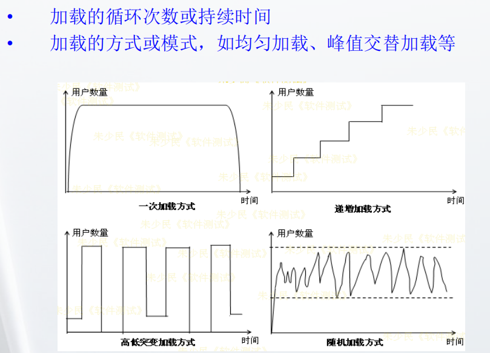

## 主要性能指标

- 系统/事务平均响应时间（Average System/Transaction Response Time） 

- 事务/交易处理效率（Transactions per second，TPS） 

- Page View (PV): 用户向Server发送请求，Server处理这样一次真实的请求 

- 连接时间（Connect Time）、发送时间（Sent Time） 

- 处理时间（Process Time）、页面下载时间 

- **吞吐率（Throughput）每秒服务器处理的HTTP申请数** 

- 每秒点击次数(Hits per Second) 
- 每秒SSL连接数 (SSLs Per Second) 
- 内存和CPU使用率 

## 性能测试设计和执行过程

首先确定模拟并发的用户数量（往往根据详细设计Base Line），选定加载方式（一次加载，递增加载，高低突变，随机加载），模拟用户操作（使用BadBoy录制脚本可以导出成JMeter的测试脚本），使用性能测试工具（JMeter）设计脚本，在工具中配置并发的线程数（模拟的用户数），配置加载方式，进行测试，得到测试报告（吞吐量，异常率等等）。

## 性能测试工具

**JMeter** (http://jmeter.apache.org) 性能测试工具 

**Apache Flood** （http://httpd.apache.org/test/flood/）Web性能测试工具 

**Gatling**(http://gatling-tool.org )Scala－based的Web性能测试工具 

**Grinder**（http://grinder.sourceforge.net/）分布式Web性能测试工具 

**nGrinder**（http://naver.github.io/ngrinder/ ）企业级Web性能测试工具 

**Siege**（http://www.joedog.org/JoeDog/Siege）Web压力测试和评测工具。 

**DBMonster** (http://sourceforge.net/projects/dbmonster/ )数据库压力测试工具 

# 第七章：系统安全性测试

## 安全性测试的概念

这里的“安全性”是指信息安全，指计算机系统或网络保护用户数据隐秘，完整，保护数据正常传输和抵御黑客、病毒的能力，而不是指系统整体的安全性。

## 安全测试的基本方法

### 安全漏洞测试方法

#### SAST静态应用安全测试

只不运行被测试程序，仅仅通过分析检查应用软件源代码或字节码，以发现应用软件的安全性漏洞。

#### DAST动态应用安全测试

通过运行程序来检查应用软件的安全性问题，侧重从系统外部接口来进行针对性的测试，暴露应用程序接口的安全性漏洞，测试发现的问题，一般能够直观的展示出来，测试手段包括：手工的渗透测试，DAST的工具的动态扫描检查和两者的结合。

#### IAST交互式应用安全测试

前两者有一定局限性，如SAST误报率比较高，无法进行业务逻辑的相关安全性测试。IAST整合了前两者的方法，降低了误报率，发送更多安全漏洞，提高测试效率。操作难度比较大。

#### RASP运行时应用自我保护

重写软件让软件可以在运行时被监控，可以检测到应用程序在运行时可能遇到的安全风险（如试图往内存中写入大量数据、未经授权试图访问数据库），从而自动发送警告信息，或实时中止会话。

#### 模糊测试方法

使用大量半随机的数据（对数据进行变异或由模糊控制器自动产生数据），作为应用程序的输入，以程序是否出现异常行为/结果为标志，来发现应用程序中可能存在的安全漏洞。

### 安全性功能测试方法

参考第五章

### 静态代码分析方法

### 动态渗透测试方法

## 安全软件开发生命周期（7个接触点）

1. 滥用案例
2. 安全需求
3. 体系结构风险分析
4. 基于风险的安全性测试
5. 代码评审
6. 渗透测试（**OWASP ZAP**）
7. 安全运维

## 五个安全级别中各级别要做哪些安全测试

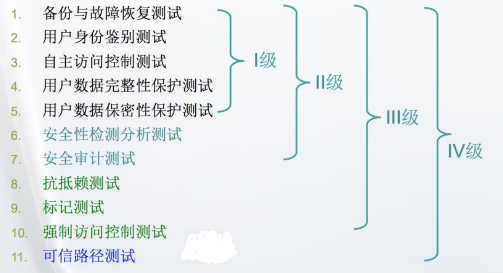

# 第八章：移动APP的测试

## 移动应用的特点

- Android/iOS native & Web View 混合 

- 更新很快 

- 对用户体验要求高 

- 网络连接不稳定 

- 降低流量 

- 降低功耗

## 移动应用主要做哪些测试

- 兼容性测 

- 交互性测试 

- 用户体验测试 

- 耗电量测试 

- 网络流量测试 

- 网络连接测试 

- 性能测试 

- 稳定性测试

## 移动应用的专项测试

- 耗电量测试
- 流量测试

## 移动应用端的性能测试

- web前端的性能测试
- 移动App端native性能测试
- 后台服务器性能测试

## 移动应用端测试工具

### 自动化测试工具

Android

- Calabash
- Robotium
- Appium
- UI AutoMator

IOS

- UI Automation
- Frank

### 专项测试工具

Android

- GSam Battary Monitor Pro  电量测试

IOS

- Xcode Instruments的两个工具

### 性能测试工具

略

# 第九章：基于模型的软件测试

## 基于模型的测试方法（MBT）的概念

通过构建能够正确描述被测软件系统功能特性的模型，然后基于这个模型，产生测试用例，并执行这些测试用例的过程。

## 基本原理

1. 为被测试系统（SUT）建模
2. 基于模型产生测试用例
3. 将抽象的测试具体化使得测试用例具有可执行性
4. 执行测试
5. 分析测试结果

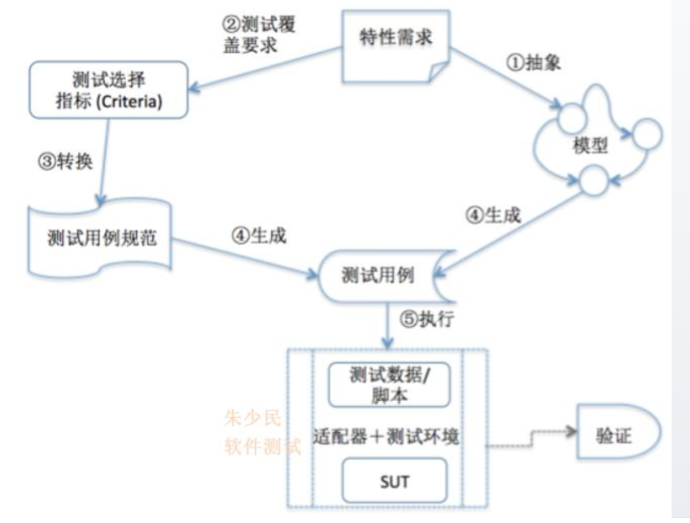

## 有限状态机

有限状态机（ Finite State Machine ，FSM）是对象行为建 模的工具，以描述对象在其生命周期内所经历的状态序列， 以及如何响应来自外界的各种事件

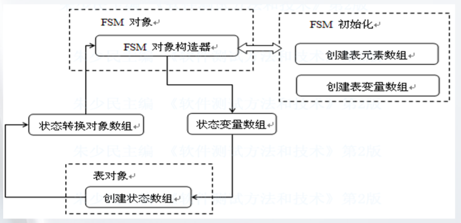

## 因果图

不能根据输入条件的组合，直接确定所产生的结果，需要进行因果分析因果分析是通过因果图来完成因果图就是逻辑分析的图形化方法。

**因果图的基本关系**：

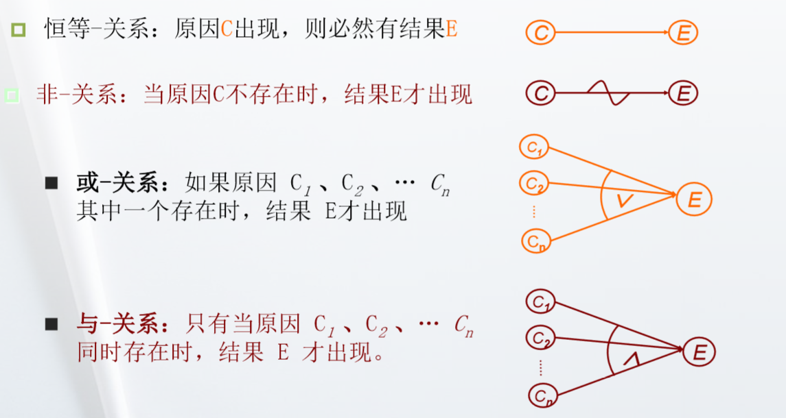

# 第十章：测试与缺陷管理

## 测试计划包括哪些内容

- 明确测试目标
- 分析与确定测试范围
- 识别测试项及其优先级
- 识别测试风险，采取相应对策
- 测试工作量估算
- 测试资源、进度等安排
- 测试阶段出入准则

**前三者是测试需求分析**

## 测试套件/用例的概念

## 缺陷的生命周期

### 软件缺陷的生命周期

- 一个软件缺陷被 发现、报告到这个缺陷被修复、验证 直至最后关闭的完整过程

- 缺陷生命周期是各类开发人员一起参 与、协同测试的过程

- 软件缺陷一旦发现，应进入严密监控 之中，直至其关闭，及时修正缺陷， 缩短软件测试的进程，提高软件质量、 减少成本

### 基本的缺陷生命周期

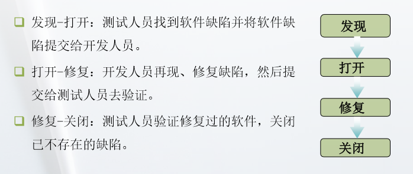

## 缺陷的基本属性

- 严重性（severity）衡量缺陷对客户满意度的影响程度 示例：致命的/fatal、严重的/critical、一般的/major、微小的/minor
- 优先级 (Priority)：指缺陷被修复的紧急程度

其他属性：

- 缺陷标识（ID）
-  缺陷类型（type），如功能、UI、性能、文档
- 缺陷产生可能性（frequency）/可再现的概率 
- 缺陷来源（source）：需求、设计、编码 
- 缺陷原因（cause）：数据格式、计算错误、接口参数、 变量定义与引用等 
- 附加信息：Trace Log／图片／录制这个操作过程

## 缺陷的两类（不同维度）基本分析

- 测试对象剖面的风险

  测试对象比较复杂，在测试的广度和深度。

- 测试操作剖面的风险

  测试操作过程中存在的各种风险，如测试环境和真实环境差异较大，测试流程不够完善导致测试执行难以控制、回归测试中以空间换时间的策略等。

`风险识别的有效方法是通过头脑风暴、缺陷分析等方法把存在的风险都列出来，建立风险项目检查表。在测试过程中按照风险内容进行逐项检查、逐个确认，确定当前项目存在的潜在风险。`

## 控制风险的对策

1. 消除执行风险
2. 降低进度风险
3. 减少人员风险