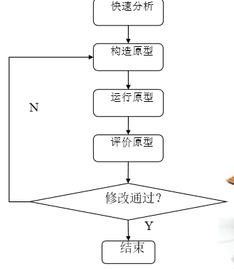

# 前言

软件项目管理相关内容

<!--More-->

# 第一章：概述

## 项目管理的生命周期

项目管理的生命周期——“启动、计划、执行、控制、结束”演进顺序

## 项目的概念

**项目是为完成某个独特的产品或服务所做的一次性任务**： 

- 目标性，其结果只可能是一种期望的产品或服务。 

- 独特性，每一个项目都是唯一的。 

- 一次性，有确定的起点和终点。 

- 约束性，每一个项目的资源、成本和时间都是有限的。 

- 关联性，所开展的活动是密切相互关联的。 

- 多方面性，一个项目涉及多个相关利益者 

- 不可逆转性。不论结果如何，项目结束了，结果也就确定了。 

## 项目-项目集-项目组合三者关系

简单来说就是：多个项目构成项目集，项目集进行组合构成项目组合

## 项目管理的定义

项目管理，简单地说就是对项目进行的管理，即有计划地有序的有控制的做事。

**项目管理就是以项目为对象的系统管理方法，通过一个特定的柔性组织，对项目进行高效率的计划、组织、指导和控制，不断进行资源的配置和优化，不断与项目各方沟通和协调，努力使项目执行的全过程处于最佳状态，获得最好的结果。项目管理是全过程的管理，是动态的管理，是在多个目标之间不断地进行平衡、协调与优化的体现。**

参考：

## 项目管理的构成和约束因素

## **项目管理本质**

## 项目管理的对象-3P

### People 人员

必须被组织成有效率的团队，他们的潜力需要被激发出来，我们要为项目团队及其成员建立有效的沟通途径和方法，以实现人员之间，团队之间，管理者和被管理者之间的有效沟通，有效的团队应建立合适的组织结构和工作文化，并通过一系列活动，提高团队的凝聚力和战斗力，贡献团队的目标和文化，并最终圆满的完成任务。

### Problem 问题

在项目管理里表现为流程不清楚或控制不严密，应用领域知识不足，需求不断变化和不一致，沟通不流畅等，其解决办法是找出引起问题的根本原因在哪里，然后针对问题本质找到解决办法，以求彻底解决问题，如果项目管理者具有缺陷预防意识，对问题具有预见性，能够避免问题的发生，防范风险，防患于未然，项目的成本就会大大降低，项目成功的机会就会更大。

### Process 过程

必须适应于人员的需求和问题的解决，人员的需求主要体现在能力、沟通、协调等上，问题能够在整个项目实施过程中得到预防、跟踪、控制和解决，也就是说一套规范且有效的流程是保证项目平稳顺利运行的基础。

## 项目管理成功要素

**1.** **制定计划**：预估和确定项目的工作量大小、所需资源和进度、风 险应对措施等； 

**2.** **建立组织**：建立项目组，并有明确的角色定义和任务分工； 

**3.** **配备资源**：任用各种层次的技术人员和管理人员，以及准备所需 的软硬件； 

**4.** **监控执行**：协调项目各方人员，监控各种风险，督促项目进展， 随时检查实施情况，确保项目按计划进行，按时、按质完成任务 

**5.** **总结提高**：项目完成后，及时进行总结，吸取教训，分享经验， 丰富组织的项目管理数据库或知识库。

## 项目管理基本方法

1. **阶段化管理 ：**将项目的生命周期分为若干个阶段，再根据不同段所具有的不同特点来进行针对性的管理。
2. **量化管理 ：**针对影响项目成功的因素制定指标、收集数据、分析数据，从而完成对项目的控制和优化。
3. **优化管理**：分析项目每部分所蕴涵的知识，不断吸取教训、总结经验，将知识和实践更好地融合在一起，从而对项目的计划、实施办法等进行优化，获得项目的最佳效益。

## 项目管理基本模型

**1. 组队模型**用于解决人力资源管理，包括明确相互依赖的角色和责任、沟通机制等；
**2.过程模型**为了解决软件开发过程管理，包括时间管理、基于里程碑的阶段划分、阶段性成果及其基线的管理，保障项目的顺利实施；
**3.应用模型**是具体应用领域的需求管理和变更管理等，并在用户、业务和数据三个层面上，定义协作的、分布的、可重用的业务逻辑网络。

## 软件项目管理的知识体系

- PMBOK
- PRINCE2
- WWPMM

## 软件项目管理的不同之处

1. 软件项目是设计型项目
2. 软件过程模型
3. 需求变化频繁
4. 难以估算工作量
5. 主要的成本是人力成本
6. 以人为本的管理

## 项目角色和职能

## 软件项目的分类

- 按**规模**划分比较简单，可分为大型项目、中小型项目等。
- 按软件**开发模式**划分，可分为组织内部项目、直接为用户开发的外部项目和软件外包项目。
-  按产品不同的**交付类型**可分为产品型项目、一次型项目。
-  按软件**商业模式**划分，可分为软件产品销售、在线服务两种模式，或者分为随需（ondemand/SaaS）服务模式和内部部署(on-premise/on-Site)模式。
- 按软件**发布方式**可分为新项目、重复项目（旧项目），也可分为完整版本、次要版本或服
  务包(service pack)、修正补丁包 (patch)等。
- 按**项目待开发的产品**进行分类，如COCOMO模型中，可分为组织型、嵌入型和半独立型。
-  按**系统架构**分，可分B/S、C/S多层结构，也可分集中式系统和分布式系统，或者分为面向
  对象、面向服务、面向组件等类型。
-  按**技术**划分，可分为Web应用、客户端应用、系统平台软件等，也可分为J2EE、.Net 等
  不同平台之上的项目。

# 第二章：项目准备和启动

## 项目建议书

项目建议书 (project proposal )，顾名思义，就 是项目立项申请报告。它可 以比较简要，也可以比较详 尽，而重点是如何向有关的 投资方或上级阐述立项的必 要性。

## 项目建议书的内容

- 项目的背景
- 项目的意义和必要性
-  项目产品或服务的市场预测
-  项目规模和期限
-  项目建设必需的条件、已具备和尚不具备的条件分析
-  投资估算和资金筹措的设想
-  市场前景及经济效益初步分析
-  其它需要说明的情况

## 可行性分析因素

## 可行性分析方法

## 投标两个阶段

- 第一个阶段是参加竞标的供应商在规定的时间内提交投标书。
- 第二个阶段是需求方（客户）对投标书进行评估，得出竞标结果。

## 合同种类

- 固定总价合同
- 费用偿还合同
- 时间和材料合同
-  功能点计费合同

## 合同评审过程

- 制定合同
- 评审合同
- 签订合同

##  软件开发模型

- 瀑布模型 

  开发过程是通过一系 列软件活动顺序展开 的，从系统需求分析 开始直到产品发布和 维护，每个活动都会 产生循环反馈。

  

- 快速原型实现模型 

  

- 增量模型到敏捷方法 

  

- 极限编程 

  是一种软件工程方法图，是敏捷软件开发中最有成效的集中方法学之一。基本思想是“沟通、简单、反馈、勇气”，他与传统方法学的不同在于：他更强调可适应性，而不是可预测性，XP项目一开始就是手机用户故事，用户故事由用户编写，是一段与技术无关的文本，其目的在于提供一些特殊场景的详细描述，而不是用于估计系统的复杂性，用户故事的所有细节，必须在她实现之前得到客户的确认，紧接着就是制定发布计划，发布计划确定在系统的哪个发布版本中有哪些用户故事需要实现，每个发布版本都需要经过好几次迭代，每次迭代实现一些用户故事，一次迭代包括如下阶段：

  - 计划

    选择要实现的用户故事及其要明确的细则

  - 编码

    实现用户故事

  - 测试

    至少每个类都要有相应的单元测试

  - 验收测试

    如果测试成功，新功能开发完成，如果失败，则进入下一次迭代

- 行为驱动开发

  BDD，是一种敏捷开发的技术，他鼓励软件项目中的开发者QA和非技术人员或商业参与者直接的协作，做法包括：P42

- 功能驱动开发

  PDD，针对中小型软件项目的开发模式，是一个模型驱动的快速开发过程，他强调的是简化、实用，易于被开发团队接受，适用于需求经常变动的项目。开发分为四个阶段：

  - 开发一个全局模型
  - 建立功能列表
  - 依据工农能指定计划
  - 依据功能进行设计和实现

- 敏捷开发模型Scrum

  通过不断迭代开发和增量发布，最终交付符合用户价值的产品。

## 软件开发模型的特点

## 敏捷开发的三种角色

- 产品负责人

  负责维护产品需求的人，代表利益相关者的利益

- Scrum Master

  为Scrum过程负责的人，确保Scrum的正确使用，并使得Scrum的收益最大化，负责扫除阻碍项目进展的问题

- 开发团队

  自我管理开发的人组成的跨职能团队，建议一个Scrum团队5-9人，大于9人，使用SOS（Scrum Of Scrums）模式。

## 敏捷开发的五个活动

- ①计划会( Sprint Planning Meeting ):在每个冲刺之初，由产品负责人讲解需求，并由刑团队进行估算的计划会议。
- ②每日立会( Daily Standup Meeting ):团队每天进行沟通的内部短会，因一般只有15分且站立进行而得名。
- ③评审会( Review Meeting ):在冲刺结束前给产品负责人演示并接受评价的会议。
- ④回顾会( Retrospective Meeting ):在冲刺结束后召开的关于自我持续改进的会议。
- ⑤迭代(Sprint):一个时间周期( 通常在2周到1个月之间)，开发团队会在此期间内完成所承诺的一组需求项的开发。

## 项目组织结构

- 智能型：经营活动按照职能划分成部门。项目功能都在本职能部 门内部讨论完成再递交到下一个部门。如果完成期间涉及其他职 能部门的问题，只能报告给本职能部门经理，由各职能部门经理 进行协调和沟通。
- 纯项目型：项目经理拥有领导权，项目内所有成员直接向项目经 理汇报。每个项目就是一个独立自主单位。它就如同一个子公司 那样运作，拥有完整的人员配备-像技术人员，行政人员，财务 人员等。
- 矩阵型：它是职能型和纯项目型的结合体。但是项目内的成员受 项目经理和职能经理双重领导。

## 软件项目的组织架构

## 项目决策层，管理层和执行层之间的关系

## QA与QC

-  QA-质量保证，通过建立和维持质量管理体系来确保产品质量没有问题， 是过程质量审计者。在我们软件开发过程中，QA也就是质量组成员。 QA所关注的是软件产品质量保证体系。
- QC-质量控制，检验产品的质量，保证产品符合客户的需求；是产品质 量检查者。在我们软件开发过程中，QC其实就是测试组成员。QC所关 注的是产品，而非系统（体系）。

## 软件项目干系人

其实就是软件项目干系人（stakeholders），是指积极参与项目或 其利益在项目执行中或成功后受到积极或消极影响的组织和个人

# 第三章：项目计划

## 什么是项目计划？

计划是事先确定项目的目标和实现目标所需要的原则、方法、 步骤和手段等完整方案的管理活动。 软件项目计划（Software Project Planning）的目的是制 定一套软件项目实施及管理的解决方案，其主要工作包括确 定详细的项目实施范围、定义递交的工作成果、评估实施过 程中主要的风险、制定项目实施的（时间）进度计划、成本 和预算计划、人力资源计划等

## 软件项目计划的作用

- 指导软件项目实施
- 得到项目相关干系人的承诺
-  获得资源的承诺
-  明确项目人员的分工和工作责任
-  及早了解项目存在的问题和风险
-  获得组织在项目预算上的承诺
-  是软件项目实施结果评估的依据
-  软件项目实施过程的文档化

## 项目计划的内容

- 目标
- 策略
- 流程
- 标准
- 质量
- 进度安排 
- 预算 
- 资源 
- 风险 
- 配置管理

## 项目计划主要内容说明

- 目标与范围 ：范围规划、定义及其任务工作分解结构
- 项目估算：采用恰当的评估技术，完成资源估算、活动持续时间估 算以及费用估算
-  风险：一般性风险和特定产品的风险都应该被系统化地标识出来， 并建立风险条目检查表
- 资源 ：人员、硬件、网络、软件等需求和安排，还包括项目组成员 的角色、责任和具体分配的任务
-  进度安排：任务排序、里程碑设置等
- 跟踪和控制机制：QA、变更控制、项目成员报告等

## 项目计划的方法

1. 滚动计划方法 

   按照“近细远粗”的原则制定一定时期内的计划，然后按照计划的执 行情况和环境变化，逐步细化、调整。

   滚动计划方法的要点：

   - 分而治之：分为多个阶段，针对不同的阶段制定不同的计划。

   - 逐步求精：随着时间的推移，预测计列逐步变成实施计划。
   - 动态规划：以计划的“变（调整）”来主动适应用户需求和软件开 发环境的变化，即“以变应变”。
   - 和谐过渡：可以解决生产的连续性与计划的阶段性之间的矛盾

2. WBS方法 

   WBS方法是（Work Breakdown Structure，工作分解结构）一 种将复杂的问题分解为简单的问题，然后再根据分解的结果进行计划的方法。

   WBS步骤

   - 分解工作任务 

   - 定义各项活动/任务之间的依赖关系
   - 安排进度和资源

3. 网络计划技术

   网络计划方法是一种应用网络模型直观地表示软件开发众多工 作（工序）之间的逻辑关系与时间关系，对完成软件工程项目所需时 间、费用、资源进行求解和优化的计划方法，其基本类型是关键路线 法/计划评审技术（CPM／PERT）。

## 敏捷开发的滚动计划方法

- 产品愿景（Vision），相当于产品最终要实现的目标，是一个长期努力的目标，可 以理解为商业战略上的目标。
- 产品路线图（Roadmap）：是一个中长期（3-5年）的产品规划，通过这个路线 图分阶段来实现上述的产品愿景。
- 发布计划（Release Planning）：短期（如一年）产品发布计划，根据产品路线图， 通过发布计划实现其第一个关键的里程碑。
- 迭代计划（Sprint Planning）：根据发布计划，来规划当前迭代要完成的目标和任 务，包括具体的人员和进度安排。
- 每日计划（Daily Planning）：就是第二章介绍的Scrum站立会

## 软件项目的特点

- 软件开发是在不断探索、研究中进行
- 最佳实践还不够成熟
- 软件的自动化对工具的依赖性也非常突出
- 软件构造过程实际是一设计过程，每一个软件产品都不同
- 由于软件是设计过程，自动化程度比较低
- 软件变化不容易实现，而软件变化又是不可避免的
- 软件的变化，进一步引起相关文档的频繁修改

## 软件项目的问题

- 时间紧迫性 
- 项目独特性
-  软件项目的不确定性 
-  软件项目管理可视性差 
-  软件项目生产力依赖于软件人员的潜力挖掘

## 软件计划的错误倾向

- 对计划不重视
- 片面计划
- 计划没有考虑足够的风险
- 计划过于粗糙

## 计划的原则

-  目标性原则
- 预防性原则
- 客观性原则
- 系统性原则
- 适应性原则

## 制定计划的要点

- 目标导向。如果一开始对项目的目标没有理解清楚，项目计划就会出现 偏离，而项目实施时偏离就更厉害
- 重视与客户的沟通，为最后项目验收打下良好的基础
- 收集足够的信息，掌握信息越多，制定计划更科学、更客观
- 客观且实用，只有“知已知彼”才能做出合理的、客观的项目计划
- 先从下至上计划，然后再从上向下计划，构成一个完整的循环过程
- 关注计划过程，随机应变，因势利导，不断调整和修改计划，以保证 完成项目的目标
- 计划的层次性，如分为主计划、子计划

## 软件项目范围

- 软件产品规范，即一个软件产品应该包含哪些功能特性，这就是产品 需求文档（Product requirement document，PRD）所描述的。 更具体的要求就是功能规格说明书， 但这是在计划过程中或之后产生。一般在确定PRD的过程中，就开始 进行项目计划。
- 项目工作范围，即为了交付具有上述功能特性的产品所必须要做的工 作。工作范围在一定程度上是产生项目计划的基础。

## 资源计划

- 项目资源计划，是指通过分析和识别项目的资源需求， 确定出项目需要投入的资源。

- 资源计划包括人力资源计划、软硬件资源计划。
- 项目资源计划重点在人力资源计划，采用有效的方法 进行人力资源计划。

## 进度计划制定原则

- 项目的实际参与人员制定进度
- 尽可能地先安排难度高的任务，后安排难度低的事
- 进度前面紧，后面松，比较好
- 项目进度中都会设置若干个里程碑
- 进度表中必须留有缓冲时间
- 发现项目应交付的期限不合理，应调整进度
- 当需求发生变化时，就要重新评估进度表

## 成本构成

### 按费用分类：

- 力资源成本
-  资产类成本
-  管理费用
-  项目特别费用 软件项目

### 按成本：

- 直接成本是项目本身的任务所引起的成本，包括为该项目购买的设 备和软件工具、参与该项目工作的人员工资等。
- 间接成本是许多项目共享的成本，例如办公楼的租金、水电费用、 公司管理费用、网络环境和邮件服务等各种间接费用。

## 成本计划

- 费用预算，在成本估算基础之上，针对各项成本来估算可能产生 的其他费用，从而确定费用预算
- 费用控制是为了保证实际发生的费用低于预算。一般会采用阶段 性控制和单项费用控制相结合的方法，更关键是需求变更控制和 质量控制。

## 风险计划

- 风险识别、风险评估和风险对策计划

- 风险计划并不是在资源计划、进度计划和成本计划之后再制定，而是 和这些计划同时进行，因为软件项目的风险会来自于各个方面，包括 人力资源风险、进度风险和成本风险等，而且在如何应对风险或针对 风险采取相应的对策时，对资源计划、进度计划都有影响

## 质量计划内容

- 质量目标，包括功能特性和非功能性特性的质量要求； 
-  质量目标分解，总体质量目标分解到各个阶段或各项任务 
-  相关标准和规范 
-  组织保证机制，包括确定责任人、质量保证人或管理人员 
- 质量属性满足的优先级和成本效益分析 
- 质量控制策略，包括测试覆盖率、代码评审的频率等； 
- 质量特性的相互依赖关系的分析，确定质量特性的优先级 
- 潜在的质量问题分析，并找出应对策略
-  流程评审、测试计划和测试用例评审等方面的具体要求； 
-  其它质量保证或控制措施、质量相关活动。

## 项目计划工具

- P3
- DotProject

# 第四章：项目估算

##  项目估算的基本内容 

- 规模估算 (size estimation)：如代码行数、功能点数、对象点或特征 点等
- 工作量估算(workload ～)：任务分解并结合人力资源水平来估算
-  进度估算(schedule ～)：通过工作量估算、有效资源分配等对项目 进度给出正确的评估。
- 风险估算(risk ～)：一般通过 风险发生的“概率和所带来的损失”来 评估风险。
-  其他估算，如需求稳定因子、资源利用效率、文档复审水平等

## 估算的基本内容及其关系

## 基本估算方法

- 分解方法：采用“分而治之”的策略，对软件项目进行分 解，再采用逐步求精的方式进行估算，最后通过累加获得 整体的估算结果 
-  算术模型，通过估算模型来产生估算 
-  专家判断或经验法，如德尔菲法(Delphi technique) 
-  比例法是基于类比的估算技术，根据过去类似的项目，直 接进行类比获得当前项目的估算结果。

## WBS估算法

- 自顶向下估算模式，首先估算出项目一级的工作量，然后层层往下分 摊，把上一层工作量分摊到下一层的阶段、活动或任务。通常使用 FPA方法或 COCOMO II 来估算项目一级的工作量
- 自底向上估算模式，要求先估算出底层任务/活动一级的工作量，然后 层层向上汇总到阶段和项目级。通常使用 QIF 估算方法或专家判断来 估算项目低层 WBS 元素的工作量

##  软件规模估算

- 德尔菲法 

  

-  代码行估算方法

  LOC指所有可执行的源代码行数，包括控制语句、数据 定义、数据类型声明、等价声明、格式声明等

-   功能点分析方法

  功能点分析法(FPA)是在需求分析阶段基于系 统功能的一种规模估算方法，其国际标准

  **功能点计算元素**

  - 外部输入数(EI)：计算每个用户输入
  -  外部输出数(EO)：计算每个用户输出(报表、屏幕、出错信息 等) 
  - 内部逻辑文件(ILF)：计算每个逻辑的主文件，如数据的一个 逻辑组合 
  - 外部接口文件(EIF)：计算所有机器可读的接口，如磁带或磁 盘上的数据文件。 
  -  外部查询数(EQ)：一个查询被定义为一次联机输入，它导致 软件以联机输出的方式产生实时的响应

  

- 标准构件法

软件由若干不同的“标准构件”组成，这些构件对于一个特定的应用领域而言是通用的。项目计划者估算每一个标准构件的出现次数，然后使用历史项目数据来确定每个标准构件交付时的大小。

- 综合讨论
  - 一般在项目层次上，缺少可比性，但在模块或组件层次 上、阶段性任务上具有可比性，可以基于历史数据来进 行比较来获得数据
  - 在实际估算工作中，一般先采用分解的方法，将项目分 解到某个层次上，然后再采用对比分析方法和经验方法
  -  任何估算方法都要结合实际来考虑

## 工作量估算

- COCOMO方法

  构造性成本模型(COCOMO：constructive cost model)是一种精确、易 于使用的基于模型的成本估算方法：

  - 基本COCOMO模型，静态单变量模型，用已估算出来的源代码行数 (LOC)为自变量的函数来计算软件开发工作量。 
  - 中间COCOMO模型，在用LOC为自变量的函数计算软件开发工作量的 基础上，再用涉及产品、硬件、人员、项目等方面属性的影响因素 来调整工作量的估算。 
  -  详细COCOMO模型，包括中间COCOMO模型的所有特性，但用上述各种 影响因素调整工作量估算时，还要考虑对软件工程过程中分析、设 计等各步骤的影响。

  COCOMO基本变量

  - DSI(源指令条数)，定义为代码行数，包括除注释行 以外的全部代码。若一行有两个语句，则算做一条 指令。KDSI即为千代码行数。 
  - MM(估算单位为人月)表示开发工作量。 
  -  TDEV(估算单位为月)表示开发进度，由工作量决定。

  COCOMO模型影响因素

  - 产品因素：软件可靠性、数据库规模、产品复杂性。
  -  硬件因素：执行时间限制、存储限制、虚拟机易变性、环境周 转时间。
  -  人的因素：分析员能力、应用领域实际经验、程序员能力、虚 拟机使用经验、程序语言使用经验。
  - 项目因素：现代程序设计技术、软件工具的使用、开发进度限 制

- 多变量模型

  通过用例来描述系统的需求更清楚，可以在功能点和用例之间 建立良好的映射关系，项目的估算会更准确些。

- 基于用例的工作量估计

  用例的层次

  - 集成系统，由多个系统构成综合系统；
  - 独立的系统，由多个子系统组成；
  -  子系统，由多个模块或组件构成；
  - 模块/组件，由多个类组成，例如可假定平均8个类构成一个组件。
  -  类，无需用例来描述。

  用例估算方法

  - 基于用例的估算，最好还是和 WBS方法结合起来使用

  -  一般认为用例的数量在10－50 个范围比较合适，而每个用例可 以带有几十个相关场景
  - 假定每一层的每一个组件平均有 10 个用例
  - 考虑总的工作量规模时，需要对个别用例的小时数做进一步调整

- IBM RMC估算方法

  RMC 的工作量估算采用的是 QIF（定量影响因子）估算方法和 自底向上估算模式，对项目的任务、活动、阶段、子项目、项目 等进行自底向上的层层估算

  - 可以定义多个估算模型
  -  每个估算模型可以定义任意数量的估算因子
  - 每个估算因子都会关联估算公式
  -  使用估算公式来计算该估算因子对应的工作量 

  IBM RMC估算步骤

  - 创建估算模型，定义相关的估算因子；
  - 把估算模型的估算因子应用到 WBS 底层元素，计算出它 们的工作量；
  - 层层向上汇总，计算出项目 WBS 上层元素（包括项目本 身）的工作量。

-  不同场景的估算法

  - 合同签订之前，了解的需求比较有限，只能了解到项目的总 体需求，主要采用“类比分析和经验判断”等方法

  - 基于WBS估算的多维验证，获得类似项目的历史数据、软件 生命周期的生产率数据和详细需求，从而可以从不同的路径 来估算工作量，获得多个结果，这些结果可以互相印证，以 发现估算过程中的不合理之处，使估算 更准确。
  -  需求变更的工作量估计，关键是需求变更的波及范围分析

## 软件项目类型

- 组织型：指项目需要有丰富的专业经验，同时需求具有灵活性。 这样的项目可以由小团队进行开发。如开发业务系统和数据处 理系统的项目都是组织型项目。
-  嵌入型：指要求较少的专业知识，但对接口、可靠性等有严格 的要求，并有外部条件的限制。例如开发实时系统或大型操作 系统的项目就是嵌入型项目。
- 半独立型：指需要适中的专业知识，与嵌入型项目相比外部限 制相对较为宽松的项目。如开发数据库管理系统和库存产品控 制系统的项目就是半独立型项目

## 资源估算基本过程

- 根据WBS进行估算
-  由工作量和开发周期来估算
-  资源特征描述
-  资源分配给任务
-  定义项目角色
-  人员分配

## 工期估算方法

-  常用方法是专家（经验）估算法、基于历史数据的类比法

- 当面临高度不确定性任务时，可以采用三点估算法来进行 工期估算

   **计划时间 =（T乐观 + 4×T可能 + T悲观）/6**

- 工期估算中还要预留一定比例作为冗余时间以应付 项目风险。随着项目进展，冗余时间可以逐步减少。 在分析标识项目活动的时候，活动资源和历时的分 析其实是同时进行的。

## 特殊场景 

**工期估算（日） = 工作量估算（人日） / 人员数量（人）**

- 使用这个公式时，避免人月估算的错误。要对每个人的能力进 行分析，确定他们自己的等价关系，这样，“人员数量”不是 人员的自然数量，而是更客观反映人力的等价数量
- 按照历史数据来估算开发周期，其准确度是可以接受的
- 在实际使用历史数据估算法时，组织应建立一个历史项目数据 库是必要的

##  成本估算方法

同样可以使用专家评估办法、经验法、比例法和WBS方法等

- 成本估算过程中，要紧密结合项目进度计划。
- 避免过于乐观或者过于保守的估算。
- 在费时较长的大型项目中，还应考虑到今后的职工工资结 构、设备费用以及管理费用是否发生较大变化等
- 在有新员工的项目中，还应考虑其培训成本
- 人力资源成本是随着团队开发效率的变化而变化的