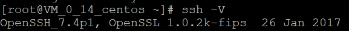
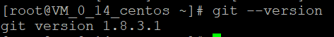
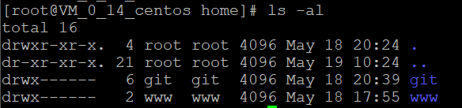

## 前言

在自己的服务器上部署Git服务器，是一件非常重要的事情，当你有项目需要自动部署到服务器上的时候，在服务器上建立仓库，一键push上去，而不是手动打包文件夹复制咱去，这是一个非常便捷的过程，本节内容服务于“如何将Hexo上传到服务器上并实现自动部署”。

<!--More-->

## 服务器环境

我使用的是CentOs 7.X版本 64位，6.X版本已经放弃维护，不建议大家使用。

因为CentOs已经内置了`OpenSSH`，如果你的系统没有，需要自行下载，查看ssh的版本的方式是`ssh -V`，请注意，在linux中大小写是敏感的，如果你的V小写，是不能正确得出结果的。下面是我的输出结果：



课件我已经有了OpenSSL环境。

## 安装Git

首先我要说的是Git，Github，GitLab的区别，并不是所有人都知道这个区别的。

- Git：是一个版本控制系统，版本控制是一种记录一个或若干文件内容变化，以便将来查阅特定版本修订情况的系统。有了版本控制系统，就可以不用担心文件丢失，不小心误修改文件等等“事故”，而且你可以随便回到历史记录的某个时刻。
   SVN, CVS这类早期的集中式版本控制系统，都有一个单一的集中管理的服务器，保存所有文件的修订版本，而协同工作的人们都通过客户端连到这台服务器，取出最新的文件或者提交更新。

  **为什么选用分布式版本控制系统？**

  我们现在使用的大多都是像Git这样的分布式版本控制系统，因为客户端并不只是获取最新的版本文件，而是吧代码仓库完整的镜像下来。一旦服务器发生故障，事后可以使用任何一个镜像出来的本地仓库进行回复，因为每一次的提取操作，实际上都是一次对代码仓库的完整备份。

  **记住一个人**

  Linus Torvalds，他不当开创了Linux操作系统，还开发了Git，而现在的Android底层就是基于更改过的Linux系统。这是他的github地址：https://github.com/torvalds  上面有Linux的源码！你难道不感兴趣？

- GitHub：这个大家就更熟悉了，他是在线的基于Git的打码托管服务，大家几乎每天都在用。

- Gitlab：很多人把这个和GitHub混为一谈，难以区分，其实很简单，首先他们都是基于Web的版本控制界面，服务于互联网，github可以直接注册使用，二gitlab需要部署到服务器，一个是别人的，一个是自己的。

讲了这么多，我们可以开始安装Git了。

```bash
yum install -y git
```

如此简单，验证是否安装成功，我们只需要输入

```bash
git --version
```

这是我实际操作的截图



既然是版本控制，那么就涉及谁去进行这个控制，我们就需要设置专门管理git的账号。

```bash
# 添加git账户
adduser git

# 修改git的密码
passwd git
# 需要根据提示输入两次

# 查看是否安装成功
cd /home
ls -al
```

我的效果图：



## git的权限管理

这就是我们重点要讲的，因为我是个人开发，我在一个小的外包公司做开发的时候，由于团队不大，使用的也都是SSH公钥进行管理，但是如果大一点的团队，就建议使用`gitolite`或者`gitosis`进行管理，一个是Perl开发，一个是Python开发，这里就不赘述了，因为我们用到的是SSH公钥部署。

我们进行一下操作：

```bash
# 进入到git账户的主目录
cd /home/git

# 创建.ssh目录，当然如果你已经有了，当我没说
mkdir .ssh
cd .ssh

# 创建权限keys文件
touch authorized_keys

# 5. 设置权限，此步骤不能省略，而且权限值也不要改，不然会报错。
$ chmod 700 /home/git/.ssh/
$ chmod 600 /home/git/.ssh/authorized_keys
```

随后我们需要把本地的id_rsa.pub文件的内容复制到authorized_keys，如何生成本地SSH秘钥我已经介绍过了，在我之前的博客，关于Hexo如何部署到Github Pages的内容中建国，可以参考。

文件传输到服务器上后如何复制内容到权限keys文件中可以参考命令：

`cat id_rsa.pub >> authorized_keys`

我们在本地使用`ssh git@服务器地址`的方式就可以使用git账号登录服务器，当然这并不安全。

**允许使用这种方式登录服务器这很不安全，一定要关闭，这一点我之后会讲**

## 创建Git仓库

如果我们要创建一个git仓库那么很简单，使用--bare表示创建一个裸仓库，工作区没有文件。

```bash
git init --bare 
```

本地就可以通过一下方式进行clone等操作

```bash
git cline git@服务器地址ip
```

## 禁止客户端shell登录

修改`/etc/passwd`文件

```bash
vim /etc/passwd
```

找到这句话：

```bash
git:x:1000:1000::/home/git:/bin/bash

# 改成
git:x:1000:1000::/home/git:/bin/git-shell

# ! :wq 即可
```

## 为什么不直接用GitLab

没说不可以，而且很好，不过建议2G一下内存的服务器不要使用，博主我就是因为穷买不起好的服务器，所以才这样过的。

疯狂暗示打赏？？