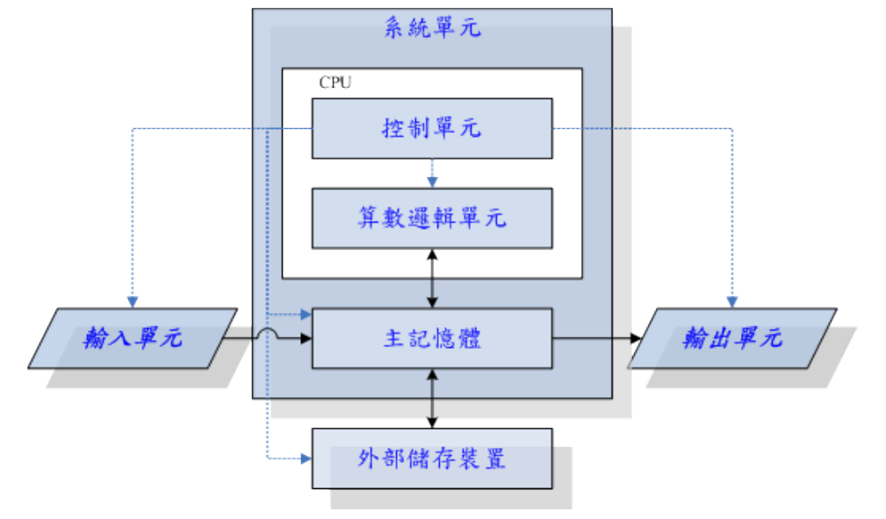
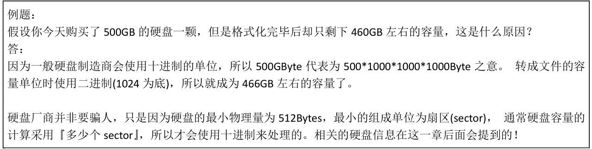
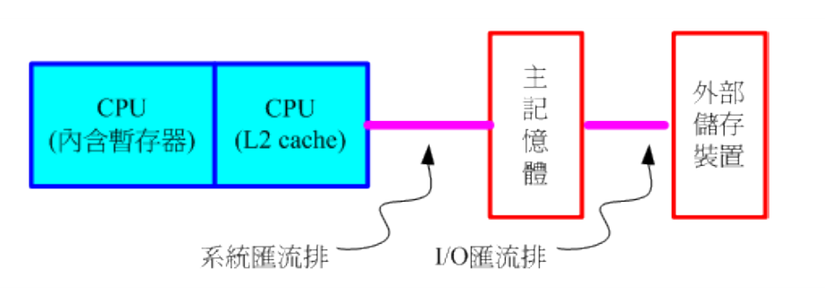

## 0.1 计算机：辅助人脑的好工具

### 0.1.1 计算机硬件的五大单元

1. 首先我们需要知道什么叫**计算器** ：

接受用户输入指令与数据，经由中央处理器的数学与逻辑单元运算处理后， 以产生或储存成有用的信息。

1. 计算机硬件的5大单元

计算机是由几个单元所组成的，包括输入单元、 输出单元、CPU 内部的控制单元、算数逻辑单元与主存储器五大部分。

<!--More-->

整部主机的重点在于中央处理器 (Central Processing Unit, CPU)，CPU 为一个具有特定功能的芯片，里头含有微指令集，如果你想要让主机进行什么特异的功能，就得要参考这颗 CPU 是否有相关内建的微指令集才可以。 由于 CPU 的工作主要在于管理与运算，因此在 CPU 内又可分为两个主要的单元，分别是： 算数逻辑单元与控制单元。 其中算数逻辑单元主要负责程序运算与逻辑判断，控制单元则主要在协调各周边组件与各单元间的工作。

**CPU读取的数据都是从主储存器中来的**

看下图的计算机五大单元结构图，就非常好理解：

输入单元也就是我们常见的外部设备，比如鼠标键盘等等，输入的信号都会进入主储存区，而我们硬件中的数据要想进入CPU运算，也要先进入主储存区，可见这一部分是多么的重要。

### 0.1.2 CPU架构

1. 前面说过CPU会包含一些微指令集，所以按照微指令是否复杂分为了两种CPU架构：

- 精简指令集 RISC

微指令集较为精简，每个指令的运行时间都很短，完成的动作也很单纯，指令的执行效能较佳； 但是若要做复杂的事情，就要由多个指令来完成。常见的 RISC 微指令集 CPU 主要例如甲骨文 (Oracle) 公司的 SPARC 系列、 IBM 公司的 Power Architecture (包括 PowerPC) 系列、与安谋公司 (ARM Holdings) 的 ARM CPU 系列等。**，目前世界上使用范围最广的 CPU 可能就是 ARM 这种架构的呢**

- 复杂指令集 CISC

与 RISC 不同的，CISC 在微指令集的每个小指令可以执行一些较低阶的硬件操作，指令数目多而且复杂， 每条指令的长度并不相同。因为指令执行较为复杂所以每条指令花费的时间较长， 但每条个别指令可以处理的工作较为丰富。常见的 CISC 微指令集 CPU 主要有 AMD、Intel、VIA 等的 x86 架构的 CPU。由于 AMD、Intel、VIA 所开发出来的 x86 架构 CPU 被大量使用于个人计算机(Personal computer)用途上面， 因此，个人计算机常被称为 x86 架构的计算机！那为何称为 x86 架构(注 8)呢？ 这是因为最早的那颗 Intel 发展出来的 CPU 代号称为 8086，后来依此架构又开发出 80286, 80386...， 因此这种架构的 CPU 就被称为 x86 架构了。在 2003 年以前由 Intel 所开发的 x86 架构 CPU 由 8 位升级到 16、32 位，后来 AMD 依此架构修改新一代的 CPU 为 64 位， 为了区别两者的差异，因此 64 位的个人计算机 CPU 又被统称为 x86_64 的架构喔！一般 32 位的 CPU 所能读写的最大数据量，大概就是 4GB 左右。

### 0.1.3  其他单元的设备

- 系统单元：系统单元包括 CPU 与内存及主板相关组件。而主板上头其实还有很多的连接
  界面与相关的适配卡，包括鸟哥近期常使用的 PCI-E 10G 网络卡、 磁盘阵列卡、还有显示适配器等等。尤其是显示适配器，这东西对于玩 3D 游戏来说是非常重要的一环，他与显示的精致度、色彩与分辨率都有关系。
- 记忆单元：包括主存储器 (main memory, RAM) 与辅助内存，其中辅助内存其实就是大家常听到的『储存装置』啰！包括硬盘、软盘、光盘、磁带等等的。
- 输入、输出单元：同时涵盖输入输出的设备最常见的大概就是触摸屏了。至于单纯的输入设备包括前面提到的键盘鼠标之外，目前的体感装置也是重要的输入设备喔！ 至于输出设备方面，除了屏幕外，打印机、音效喇叭、HDMI 电视、投影机、蓝芽耳机等等，都算喔！

### 0.1.4 运作流程

我们形象的按照人的机制来比喻一下：

- **CPU**=脑袋瓜子：每个人会作的事情都不一样(微指令集的差异)，但主要都是透过脑袋瓜子来进行判断与控制身体各部分的活动；
- **主存储器**=脑袋中放置正在被思考的数据的区块：在实际活动过程中，我们的脑袋瓜子需要有外界刺激的数据 (例如光线、环境、语言等) 来分析，那这些互动数据暂时存放的地方就是主存储器，主要是用来提供给
  脑袋瓜子判断用的信息。
- **硬盘**=脑袋中放置回忆的记忆区块：跟刚刚的主存储器不同，主存储器是提供脑袋目前要思考与处理的信息，
  但是有些生活琐事或其他没有要立刻处理的事情， 就当成回忆先放置到脑袋的记忆深处吧！那就是硬盘！
  主要目的是将重要的数据记录起来，以便未来将这些重要的经验再次的使用；
- **主板**=神经系统：好像人类的神经一样，将所有重要的组件连接起来，包括手脚的活动都是脑袋瓜子发布命令后， 透过神经(主板)传导给手脚来进行活动啊！
- **各项接口设备**=人体与外界沟通的手、脚、皮肤、眼睛等：就好像手脚一般，是人体与外界互动的重要关键！
- **显示适配器**=脑袋中的影像：将来自眼睛的刺激转成影像后在脑袋中呈现，所以显示适配器所产生的数据源也是 CPU 控制的。
- **电源供应器 (Power)**=心脏：所有的组件要能运作得要有足够的电力供给才行！这电力供给就好像心脏一样。如果心脏不够力， 那么全身也就无法动弹的！心脏不稳定呢？那你的身体当然可能断断续续的～不稳定！

### 0.1.5 计算机用途的分类

- **超级计算机(Supercomputer)**
  超级计算机是运作速度最快的计算机，但是他的维护、操作费用也最高！主要是用于需要有高速计算的计划中。 例如：国防军事、气象预测、太空科技，用在模拟的领域较多。详情也可以参考： 国家高速网络与计算中心 http://www.nchc.org.tw 的介绍！ 至于全世界最快速的前 500 大超级计算机，则请参考：http://www.top500.org。
- **大型计算机(Mainframe Computer)**
  大型计算机通常也具有数个高速的 CPU，功能上虽不及超级计算机，但也可用来处理大量资料与复杂的运算。 例如大型企业的主机、全国性的证券交易所等每天需要处理数百万笔数据的企业机构， 或者是**大型企业的数据库服务器**等等。
- **迷你计算机(Minicomputer)**
  迷你计算机仍保有大型计算机同时支持多用户的特性，但是主机可以放在一般作业场所， 不必像前两个大型计算机需要特殊的空调场所。通常用来作为**科学研究**、**工程分析**与**工厂的流程管理**等。
- **工作站(Workstation)**
  工作站的价格又比迷你计算机便宜许多，是针对特殊用途而设计的计算机。在个人计算机的效能还没有提升到目前的状况之前， 工作站计算机的性能/价格比是所有计算机当中较佳的，因此在学术研究与工程分析方面相当常见。
- **微电脑(Microcomputer)**
  个人计算机就属于这部份的计算机分类，也是我们本章主要探讨的目标！体积最小，价格最低，但功能还是五脏俱全的！ 大致又可分为**桌上型**、**笔记型**等等。

### 0.1.6  计算机上面常用的计算单位 ( 容量、速度等)

- **容量单位** 

`1 Byte = 8 bit `

`1 k = 1024 Byte `

`1 M = 1024 K`

- 速度单位

Hz 其实就是秒分之一，CPU 的指令周期常使用 MHz 或者是 GHz 之类的单位，网络使用的是 bit 为单位，因此网络常使用的单位为 Mbps 是 Mbits per second，亦即是每秒多少 Mbit

**Tips：**

## 0.2  个人计算机架构与相关设备组件

### 0.2.1  执行脑袋运算与判断的 CPU

**什么是频率呢？**

简单的说， 频率就是 CPU 每秒钟可以进行的工作次数。 所以频率越高表示这颗 CPU 单位时间内可以作更多的事情。举例来说，Intel 的 i7-4790 CPU 频率为 3.6GHz， 表示这颗 CPU 在一秒内可以进行 3.6x10 9 次工作，每次工作都可以进行少数的指令运作之意。

**什么是外频？什么是倍频？**

所谓的外频指的是 CPU 与外部组件进行数据传输时的速度，倍
频则是 CPU 内部用来加速工作效能的一个倍数， 两者相乘才是 CPU 的频率速度

**什么是字组大小（Word Size）**

CPU 每次能够处理的数据量称为字组大小(word size)， 字组大小依据 CPU 的设计而有 32 位与 64 位。我们现在所称的计算机是 32 或 64 位主要是依据这个 CPU 解析的字组大小而来的！早期的 32 位 CPU 中，因为 CPU 每次能够解析的数据量有限， 因此由主存储器传来的数据量就有所限制了。这也导致 32 位的 CPU 最多只能支持最大到 4GBytes 的内存。

**什么是超线程（Hyper-Threading, HT）**

在每一个 CPU内部将重要的缓存器 (register) 分成两群， 而让程序分别使用这两群缓存器。也就是说，可以有两个程序『同时竞争 CPU 的运算单元』，而非透过操作系统的多任务切换！ 这一过程就会让 CPU 好像『同时有两个核心』的模样！因此，虽然大部分 i7 等级的 CPU 其实只有四个实体核心，但透过HT 的机制， 则操作系统可以抓到八个核心！并且让每个核心逻辑上分离，就可以同时运作八个程序了。

### 0.2.2 内存

**主储存器的作用？**

CPU 所使用的数据都是来自于主存储器(main memory)，不论是软件程序还是数据，都必须
要读入主存储器后 CPU 才能利用。 个人计算机的主存储器主要组件为动态随机存取内存(DynamicRandom Access Memory, DRAM)， 随机存取内存只有在通电时才能记录与使用，断电后数据就消失了。因此我们也称这种 RAM 为挥发性内存。

所以主储存器的容量是非常重要的，以服务器来说，主存储器的容量有时比 CPU 的速度还要来的重要的。

**什么是第二层快取？**

CPU 内的第二层高速缓存。 我们现在知道 CPU 的数据都是由主存储器提供，但 CPU 到主存储器之间还是得要透过内存控制器啊！ 如果某些很常用的程序或数据可以放置到 CPU 内部的话，那么 CPU数据的读取就不需要跑到主存储器重新读取了！ 这对于效能来说不就可以大大的提升了？这就是第二层快取的设计概念。第二层快取与主存储器及 CPU 的关系如下图所示：

简而言之，CPU的储存是非常珍贵的，我们不能把应用数据常驻在CPU中，但是每次透过控制器取数据到CPU中就会出现时间全耗费在这个过程，相比CPU的速度，这个过程更为耗时，我们使用第二层快取的设计，设计二层高速缓存区，就可以平衡这种速度不匹配的问题。

**那为什么不全部做成高速缓存呢？**

因为第二层快取(L2 cache)整合到 CPU 内部，因此这个 L2 内存的速度必须要 CPU 频率相同。 使用DRAM 是无法达到这个频率速度的，此时就需要静态随机存取内存(Static Random Access Memory,SRAM)的帮忙了。 SRAM 在设计上使用的晶体管数量较多，价格较高，且不易做成大容量，不过由于其速度快， 因此整合到 CPU 内成为高速缓存以加快数据的存取是个不错的方式喔！新一代的 CPU都有内建容量不等的 L2 快取在 CPU 内部， 以加快 CPU 的运作效能。

`其实原因还是因为贵，如果对于对速度要求非常高的应用，全部使用高速缓存实现，通过提高成本的方式，还是值得的。`

